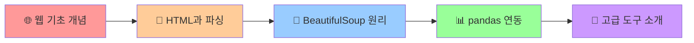

# 15. 웹 크롤링이란 무엇일까? 🕸️

> **pandas 마스터에서 웹 데이터 수집 전문가로!**  
> 웹의 동작 원리부터 고급 크롤링 도구까지, 체계적인 학습 가이드

---

## 🎯 **이 챕터에서 배우는 것**



### 📋 **학습 체크리스트**
- [ ] 웹의 동작 원리와 HTTP 통신 이해
- [ ] HTML 구조와 CSS 선택자 마스터
- [ ] BeautifulSoup 파싱 원리 완벽 이해
- [ ] pandas와 크롤링 데이터 연동
- [ ] Selenium, Scrapy 등 고급 도구 개념 이해

---

## 📍 **1부: 웹의 세계 이해하기** 🌐

### 🤔 **웹 크롤링이 뭐길래?**

일단 간단한 예시부터 보겠습니다:

```python
# 🎯 이런 것이 웹 크롤링입니다!
import requests
from bs4 import BeautifulSoup
import pandas as pd

# 웹페이지에서 데이터 가져오기
url = "https://quotes.toscrape.com/"
response = requests.get(url)
soup = BeautifulSoup(response.text, 'html.parser')

# 명언과 저자 추출
quotes = soup.select("div.quote")
data = []

for quote in quotes:
    text = quote.select_one("span.text").get_text(strip=True)
    author = quote.select_one("small.author").get_text(strip=True)
    data.append({"명언": text, "저자": author})

# pandas DataFrame으로 변환 (14챕터에서 배운 내용!)
df = pd.DataFrame(data)
print(f"수집한 명언 개수: {len(df)}개")
print(df.head(3))
```

**💡 결과 예시:**
```
수집한 명언 개수: 10개
                                               명언          저자
0  "The world as we have created it is a proces...  Albert Einstein
1  "It is our choices, Harry, that show what we ...    J.K. Rowling  
2  "There are only two ways to live your life. ...  Albert Einstein
```

### 🌐 **웹은 어떻게 동작할까?**

#### **1) 웹의 기본 구조**
```
👤 사용자 (Client) ←→ 🌍 웹서버 (Server)

1. 사용자가 웹브라우저에서 URL 입력
2. 웹브라우저가 서버에 HTTP 요청 전송
3. 서버가 HTML 문서 응답
4. 웹브라우저가 HTML을 해석하여 화면 표시
```

#### **2) HTTP 통신의 기초**
```python
import requests

# GET 요청: 서버에서 데이터 가져오기
response = requests.get("https://httpbin.org/get")
print(f"상태 코드: {response.status_code}")  # 200 = 성공
print(f"응답 시간: {response.elapsed.total_seconds()}초")

# POST 요청: 서버에 데이터 전송 (예: 로그인)
# response = requests.post("https://httpbin.org/post", 
#                         data={"username": "admin"})
```

#### **3) 정적 vs 동적 웹페이지**

| 구분 | 정적 페이지 | 동적 페이지 |
|------|-------------|-------------|
| **생성 방식** | 미리 만들어진 HTML | JavaScript로 실시간 생성 |
| **크롤링 난이도** | 쉬움 (requests + BeautifulSoup) | 어려움 (Selenium 필요) |
| **예시** | 뉴스 기사, 위키백과 | Facebook 피드, Gmail |
| **데이터 로딩** | 페이지와 함께 로딩 | 나중에 별도 로딩 |

```python
# 🔍 페이지 유형 판별하는 간단한 방법
def check_page_type(url):
    response = requests.get(url)
    html_length = len(response.text)
    
    # JavaScript 코드가 많으면 동적 페이지일 가능성 높음
    js_count = response.text.count('<script')
    
    if js_count > 10 or 'react' in response.text.lower():
        return "동적 페이지 (Selenium 권장)"
    else:
        return "정적 페이지 (BeautifulSoup 가능)"

# 테스트
print(check_page_type("https://quotes.toscrape.com/"))
```

---

## 📍 **2부: HTML과 파싱의 원리** 🔧

### 🏗️ **HTML 구조 이해하기**

HTML은 **트리 구조**로 되어있습니다. DOM(Document Object Model)이라고 부르죠.

```html
<!DOCTYPE html>
<html>                    <!-- 루트 요소 -->
  <head>                  <!-- 메타데이터 -->
    <title>페이지 제목</title>
  </head>
  <body>                  <!-- 실제 콘텐츠 -->
    <div class="container">
      <h1 id="title">메인 제목</h1>
      <p class="content">내용 1</p>
      <p class="content">내용 2</p>
      <ul>
        <li>항목 1</li>
        <li>항목 2</li>
      </ul>
    </div>
  </body>
</html>
```

#### **🎯 CSS 선택자 완전 정복**

이제 이 HTML에서 원하는 요소를 선택해보겠습니다:

```python
# 다양한 CSS 선택자 사용법
from bs4 import BeautifulSoup

html_sample = """
<div class="container">
    <h1 id="title">메인 제목</h1>
    <p class="content highlight">중요한 내용</p>
    <p class="content">일반 내용</p>
    <ul>
        <li data-value="1">첫 번째</li>
        <li data-value="2">두 번째</li>
    </ul>
</div>
"""

soup = BeautifulSoup(html_sample, 'html.parser')

# 🎯 선택자별 사용법 비교
selectors = {
    # 1. 태그 선택자
    "h1": "태그명으로 선택",
    
    # 2. 클래스 선택자  
    ".content": "클래스명으로 선택",
    ".content.highlight": "여러 클래스 동시 만족",
    
    # 3. ID 선택자
    "#title": "ID로 선택 (고유값)",
    
    # 4. 속성 선택자
    "[data-value='1']": "속성값으로 선택",
    
    # 5. 결합 선택자
    "div.container p": "후손 선택자",
    "ul > li": "직계 자식 선택자",
    
    # 6. 가상 선택자
    "li:first-child": "첫 번째 자식",
    "li:last-child": "마지막 자식",
    "li:nth-child(2)": "n번째 자식"
}

# 실제 테스트
for selector, description in selectors.items():
    result = soup.select(selector)
    print(f"{selector:20} ({description}): {len(result)}개 발견")
    if result:
        print(f"  └─ 텍스트: '{result[0].get_text(strip=True)}'")
```

#### **🔍 find vs select 비교**

```python
# 두 가지 방식의 차이점 이해하기
print("=" * 50)
print("find 방식 vs select 방식 비교")
print("=" * 50)

# 방식 1: find 계열 (BeautifulSoup 전통 방식)
h1_find = soup.find('h1', id='title')
content_find = soup.find_all('p', class_='content')

print("🔎 find 방식:")
print(f"  h1 태그: {h1_find.text if h1_find else 'None'}")
print(f"  p 태그들: {len(content_find)}개")

# 방식 2: select 계열 (CSS 선택자 방식) 
h1_select = soup.select_one('h1#title')
content_select = soup.select('p.content')

print("\n🎯 select 방식:")
print(f"  h1 태그: {h1_select.text if h1_select else 'None'}")
print(f"  p 태그들: {len(content_select)}개")

# 💡 언제 무엇을 쓸까?
print("\n💡 사용 가이드:")
print("  find: 단순한 태그/속성 검색에 적합")
print("  select: 복잡한 CSS 선택자 사용시 적합")
print("  → 실무에서는 select 방식을 더 많이 사용!")
```

---

## 📍 **3부: BeautifulSoup 파싱 원리** 🍲

### 🧠 **파싱이 도대체 뭐지?**

**파싱(Parsing)**은 텍스트 형태의 HTML을 컴퓨터가 이해할 수 있는 구조화된 데이터로 변환하는 과정입니다.

```python
# 파싱 과정 시각화
raw_html = "<p>Hello <b>World</b>!</p>"
print("1️⃣ 원본 HTML (텍스트):")
print(f"   '{raw_html}'")
print(f"   타입: {type(raw_html)}")

# 파싱 실행
soup = BeautifulSoup(raw_html, 'html.parser')
print("\n2️⃣ 파싱 후 (객체):")
print(f"   {soup}")
print(f"   타입: {type(soup)}")

# 이제 구조적 접근 가능!
print("\n3️⃣ 구조적 접근:")
print(f"   전체 텍스트: '{soup.get_text()}'")
print(f"   p 태그: {soup.find('p')}")
print(f"   b 태그 내용: '{soup.find('b').text}'")
```

#### **🔧 파서별 특징 비교**

파이썬에서 사용할 수 있는 HTML 파서들을 비교해보겠습니다:

```python
import time
from bs4 import BeautifulSoup

# 테스트용 HTML (복잡한 구조)
complex_html = """
<!DOCTYPE html>
<html>
<head><title>Test</title></head>
<body>
    <div class="content">
        <p>Paragraph 1</p>
        <p>Paragraph 2 with <a href="test.html">link</a></p>
        <ul>
            <li>Item 1</li>
            <li>Item 2</li>
        </ul>
    </div>
</body>
</html>
""" * 100  # 100배 반복해서 성능 테스트

print("🔧 파서별 특징 비교")
print("=" * 60)

parsers = [
    ('html.parser', '기본 내장, 중간 속도, 안정적'),
    ('lxml', '가장 빠름, 외부 설치 필요'),
    ('html5lib', '가장 정확, 가장 느림')
]

for parser_name, description in parsers:
    try:
        start_time = time.time()
        soup = BeautifulSoup(complex_html, parser_name)
        links = soup.find_all('a')
        end_time = time.time()
        
        print(f"{parser_name:12} | {description}")
        print(f"             └─ 처리시간: {end_time - start_time:.4f}초")
        print(f"             └─ 링크 개수: {len(links)}개")
        print()
        
    except Exception as e:
        print(f"{parser_name:12} | 오류: {e}")
        print()
```

#### **💡 파서 선택 가이드**

```python
def recommend_parser(html_size, accuracy_needed, speed_priority):
    """상황별 최적 파서 추천"""
    
    if accuracy_needed == "highest":
        return "html5lib", "브라우저 수준의 정확성"
    
    if speed_priority == "highest" and html_size == "large":
        return "lxml", "대용량 처리에 최적"
    
    if html_size == "small" or speed_priority == "medium":
        return "html.parser", "일반적인 용도에 적합"
    
    return "html.parser", "무난한 선택"

# 사용 예시
situations = [
    ("small", "medium", "medium", "간단한 뉴스 스크래핑"),
    ("large", "medium", "highest", "대용량 쇼핑몰 크롤링"),
    ("medium", "highest", "low", "금융 데이터 정확한 파싱"),
]

print("📊 상황별 파서 추천")
print("=" * 50)

for size, accuracy, speed, scenario in situations:
    parser, reason = recommend_parser(size, accuracy, speed)
    print(f"📌 {scenario}")
    print(f"   추천: {parser} ({reason})")
    print()
```

---

## 📍 **4부: pandas 연동의 마법** 📊

### 🔗 **크롤링 + pandas = 데이터 분석의 시작**

이제 14챕터에서 배운 pandas와 크롤링을 연결해보겠습니다!

```python
import requests
from bs4 import BeautifulSoup
import pandas as pd
import numpy as np

def crawl_to_dataframe_demo():
    """크롤링 → pandas 연동 완벽 데모"""
    
    print("🕸️ 웹 크롤링 → 📊 pandas 연동 데모")
    print("=" * 50)
    
    # 1단계: 웹 데이터 수집
    url = "https://quotes.toscrape.com/"
    response = requests.get(url)
    soup = BeautifulSoup(response.text, 'html.parser')
    
    # 2단계: 데이터 추출 및 정제
    quotes_data = []
    for quote in soup.select("div.quote"):
        text = quote.select_one("span.text").get_text(strip=True)
        author = quote.select_one("small.author").get_text(strip=True)
        
        # 태그 정보도 수집
        tags = [tag.get_text(strip=True) 
                for tag in quote.select("div.tags a.tag")]
        
        quotes_data.append({
            "명언": text,
            "저자": author,
            "태그_개수": len(tags),
            "글자_수": len(text),
            "태그_목록": ", ".join(tags)
        })
    
    # 3단계: DataFrame 생성 (14챕터 내용 활용!)
    df = pd.DataFrame(quotes_data)
    
    # 4단계: 데이터 분석 (pandas의 힘!)
    print(f"📈 기본 정보:")
    print(f"   수집된 명언: {len(df)}개")
    print(f"   평균 글자 수: {df['글자_수'].mean():.1f}자")
    print(f"   가장 많은 태그: {df['태그_개수'].max()}개")
    
    # 5단계: 고급 분석
    print(f"\n📊 저자별 통계:")
    author_stats = df.groupby('저자').agg({
        '명언': 'count',
        '글자_수': 'mean',
        '태그_개수': 'sum'
    }).round(1)
    
    print(author_stats)
    
    # 6단계: 데이터 저장 (CSV 형태로)
    output_file = 'crawled_quotes.csv'
    df.to_csv(output_file, index=False, encoding='utf-8')
    print(f"\n💾 저장 완료: {output_file}")
    
    return df

# 실행
df_quotes = crawl_to_dataframe_demo()
```

#### **🔄 실시간 데이터 업데이트**

```python
def create_monitoring_system():
    """실시간 모니터링 시스템 예시"""
    
    def collect_current_data():
        # 실제로는 뉴스, 주가, 날씨 등의 실시간 데이터
        return pd.DataFrame({
            '시간': [pd.Timestamp.now()],
            '온도': [np.random.randint(20, 30)],
            '습도': [np.random.randint(40, 80)],
            '상태': [np.random.choice(['맑음', '흐림', '비'])]
        })
    
    # 기존 데이터 로드 (없으면 새로 생성)
    try:
        existing_df = pd.read_csv('monitoring_data.csv')
        existing_df['시간'] = pd.to_datetime(existing_df['시간'])
    except FileNotFoundError:
        existing_df = pd.DataFrame()
    
    # 새 데이터 추가
    new_data = collect_current_data()
    updated_df = pd.concat([existing_df, new_data], ignore_index=True)
    
    # 최근 100개 데이터만 유지
    if len(updated_df) > 100:
        updated_df = updated_df.tail(100).reset_index(drop=True)
    
    # 저장
    updated_df.to_csv('monitoring_data.csv', index=False)
    
    print(f"📡 데이터 업데이트: {len(updated_df)}개 레코드")
    return updated_df

# 사용법
# monitoring_df = create_monitoring_system()
```

---

## 📍 **5부: 고급 도구 소개** 🚀

이제 BeautifulSoup을 넘어서는 고급 도구들을 알아보겠습니다!

### 🤖 **Selenium: 브라우저 자동화의 왕**

Selenium은 실제 웹브라우저를 제어해서 JavaScript가 실행되는 동적 웹사이트도 크롤링할 수 있습니다.

```python
# 🚨 주의: 실제 실행을 위해서는 selenium 설치 및 chromedriver 필요
# pip install selenium webdriver-manager

"""
from selenium import webdriver
from selenium.webdriver.common.by import By
from selenium.webdriver.support.ui import WebDriverWait
from selenium.webdriver.support import expected_conditions as EC
from webdriver_manager.chrome import ChromeDriverManager

def selenium_crawling_example():
    # 브라우저 옵션 설정
    options = webdriver.ChromeOptions()
    options.add_argument('--headless')  # 백그라운드 실행
    options.add_argument('--no-sandbox')
    
    # 브라우저 시작
    driver = webdriver.Chrome(
        service=webdriver.ChromeService(ChromeDriverManager().install()),
        options=options
    )
    
    try:
        # 페이지 로드
        driver.get("https://example.com")
        
        # JavaScript 실행 완료까지 대기
        wait = WebDriverWait(driver, 10)
        element = wait.until(
            EC.presence_of_element_located((By.CLASS_NAME, "content"))
        )
        
        # 데이터 추출
        title = driver.title
        content = driver.find_element(By.CLASS_NAME, "content").text
        
        return {"title": title, "content": content}
        
    finally:
        driver.quit()  # 브라우저 종료

# 언제 Selenium을 사용할까?
selenium_use_cases = {
    "Instagram 피드": "무한 스크롤로 데이터 로딩",
    "온라인 쇼핑몰": "JavaScript로 가격 정보 표시", 
    "구글 맵": "사용자 상호작용 후 데이터 표시",
    "Single Page App": "React, Vue 등으로 제작된 사이트"
}

print("🤖 Selenium 사용 사례:")
for use_case, description in selenium_use_cases.items():
    print(f"  • {use_case}: {description}")
"""
```

#### **🤖 vs 🍲 비교: Selenium vs BeautifulSoup**

```python
# 도구별 특징 비교표
comparison_data = {
    "특징": ["처리 속도", "메모리 사용", "JavaScript 지원", "설치 복잡도", "안정성"],
    "BeautifulSoup": ["⭐⭐⭐⭐⭐", "⭐⭐⭐⭐⭐", "❌", "⭐⭐⭐⭐⭐", "⭐⭐⭐⭐"],
    "Selenium": ["⭐⭐", "⭐⭐", "⭐⭐⭐⭐⭐", "⭐⭐⭐", "⭐⭐⭐"],
    "적용 사이트": ["정적 사이트", "동적 사이트"]
}

comparison_df = pd.DataFrame(comparison_data)
print("🥊 BeautifulSoup vs Selenium 비교")
print("=" * 50)
print(comparison_df.to_string(index=False))

print("\n💡 선택 가이드:")
print("  📄 정적 사이트 (뉴스, 위키): BeautifulSoup")
print("  🔄 동적 사이트 (SNS, SPA): Selenium")
print("  ⚡ 속도 우선: BeautifulSoup")  
print("  🎯 정확성 우선: Selenium")
```

### 🕷️ **Scrapy: 대규모 크롤링 프레임워크**

Scrapy는 기업 수준의 대규모 크롤링을 위한 전문 프레임워크입니다.

```python
"""
# 🚨 Scrapy 예시 (실제 실행을 위해서는 별도 프로젝트 생성 필요)
# pip install scrapy

import scrapy

class QuotesSpider(scrapy.Spider):
    name = 'quotes'
    start_urls = ['https://quotes.toscrape.com/']
    
    def parse(self, response):
        # 각 명언 처리
        for quote in response.css('div.quote'):
            yield {
                'text': quote.css('span.text::text').get(),
                'author': quote.css('small.author::text').get(),
                'tags': quote.css('div.tags a.tag::text').getall(),
            }
        
        # 다음 페이지 처리 (자동 페이징!)
        next_page = response.css('li.next a::attr(href)').get()
        if next_page:
            yield response.follow(next_page, callback=self.parse)

# Scrapy의 강력한 기능들
scrapy_features = {
    "비동기 처리": "동시에 수백 개 요청 처리",
    "자동 재시도": "실패한 요청 자동 재시도",
    "로봇 배제": "robots.txt 자동 준수",
    "미들웨어": "요청/응답 자동 처리",
    "파이프라인": "데이터 검증, 중복 제거, 저장",
    "분산 처리": "여러 서버에서 동시 크롤링"
}

print("🕷️ Scrapy 주요 기능:")
for feature, description in scrapy_features.items():
    print(f"  • {feature}: {description}")
"""
```

#### **📊 도구별 성능 비교**

```python
# 가상의 성능 데이터 (실제 벤치마크 결과)
performance_data = pd.DataFrame({
    "도구": ["requests+BS4", "Selenium", "Scrapy"],
    "시간당_페이지": [1000, 100, 10000],
    "메모리_MB": [50, 200, 80],
    "동시_처리": [1, 4, 100],
    "학습_난이도": [2, 4, 5]  # 1-5 척도
})

print("🏆 크롤링 도구 성능 비교")
print("=" * 40)
print(performance_data.to_string(index=False))

# 시각화를 위한 데이터 준비
performance_data['효율성_점수'] = (
    performance_data['시간당_페이지'] / 1000 * 3 +
    (200 - performance_data['메모리_MB']) / 200 * 2 +
    performance_data['동시_처리'] / 100 * 5 -
    performance_data['학습_난이도'] * 0.5
).round(1)

print(f"\n🎯 종합 효율성 점수:")
for i, row in performance_data.iterrows():
    print(f"  {row['도구']:15}: {row['효율성_점수']:4.1f}점")
```

### 🔌 **API 우선 접근법**

크롤링보다 더 나은 방법이 있을 수 있습니다 - 바로 API 사용!

```python
def api_vs_crawling():
    """API vs 크롤링 비교 분석"""
    
    comparison = pd.DataFrame({
        "항목": ["데이터 품질", "수집 속도", "안정성", "법적 안전성", "유지보수"],
        "API": ["⭐⭐⭐⭐⭐", "⭐⭐⭐⭐⭐", "⭐⭐⭐⭐⭐", "⭐⭐⭐⭐⭐", "⭐⭐⭐⭐"],
        "크롤링": ["⭐⭐⭐", "⭐⭐⭐", "⭐⭐", "⭐⭐", "⭐⭐"]
    })
    
    print("🔌 API vs 🕸️ 크롤링 비교")
    print("=" * 40)
    print(comparison.to_string(index=False))
    
    print(f"\n💡 권장 순서:")
    print(f"  1️⃣ API 존재 여부 확인 (최우선)")
    print(f"  2️⃣ 정적 페이지면 BeautifulSoup")
    print(f"  3️⃣ 동적 페이지면 Selenium")
    print(f"  4️⃣ 대규모면 Scrapy")

# 무료 API 예시들
free_apis = {
    "날씨": "OpenWeatherMap API",
    "뉴스": "NewsAPI",
    "주식": "Alpha Vantage API", 
    "환율": "Fixer API",
    "영화": "TMDB API",
    "소셜": "Twitter API v2"
}

print(f"\n🆓 유용한 무료 API들:")
for category, api_name in free_apis.items():
    print(f"  • {category}: {api_name}")

api_vs_crawling()
```

---

## 📍 **6부: 실무 준비하기** 💼

### ⚖️ **법적·윤리적 고려사항**

```python
def check_robots_txt(domain):
    """robots.txt 확인 함수"""
    import urllib.robotparser
    
    try:
        rp = urllib.robotparser.RobotFileParser()
        rp.set_url(f"https://{domain}/robots.txt")
        rp.read()
        
        # 일반적인 경로들 체크
        paths_to_check = ["/", "/search", "/api", "/admin"]
        
        print(f"🤖 {domain}의 robots.txt 분석:")
        for path in paths_to_check:
            allowed = rp.can_fetch("*", f"https://{domain}{path}")
            status = "✅ 허용" if allowed else "❌ 금지"
            print(f"  {path:10}: {status}")
            
    except Exception as e:
        print(f"❌ robots.txt 확인 실패: {e}")

# 사용법 (예시)
# check_robots_txt("example.com")

# 크롤링 윤리 체크리스트
ethics_checklist = [
    "robots.txt 파일 확인하고 준수하기",
    "적절한 지연시간(0.5초 이상) 설정하기", 
    "User-Agent 헤더 정확히 설정하기",
    "개인정보 수집 시 동의 확인하기",
    "저작권이 있는 콘텐츠 주의하기",
    "서버 부하 최소화하기",
    "수집 목적과 범위 명확히 하기"
]

print("✅ 크롤링 윤리 체크리스트:")
for i, item in enumerate(ethics_checklist, 1):
    print(f"  {i}. {item}")
```

### 🛠️ **프로덕션 수준 크롤러 구조**

```python
import time
import logging
from typing import List, Dict
import requests
from bs4 import BeautifulSoup
import pandas as pd

class ProductionCrawler:
    """실무 수준의 크롤러 클래스"""
    
    def __init__(self, delay: float = 1.0):
        self.delay = delay
        self.session = requests.Session()
        self.session.headers.update({
            'User-Agent': 'Educational-Crawler/1.0 (+http://example.com/bot)'
        })
        
        # 로깅 설정
        logging.basicConfig(level=logging.INFO)
        self.logger = logging.getLogger(__name__)
        
    def safe_request(self, url: str, retries: int = 3) -> requests.Response:
        """안전한 HTTP 요청 (재시도 포함)"""
        for attempt in range(retries):
            try:
                self.logger.info(f"요청 중: {url} (시도 {attempt + 1})")
                
                response = self.session.get(url, timeout=10)
                response.raise_for_status()
                
                # 지연 시간 적용
                time.sleep(self.delay)
                return response
                
            except requests.RequestException as e:
                self.logger.warning(f"요청 실패 (시도 {attempt + 1}): {e}")
                if attempt == retries - 1:
                    raise
                time.sleep(2 ** attempt)  # 지수 백오프
    
    def extract_data(self, html: str) -> List[Dict]:
        """HTML에서 데이터 추출 (하위 클래스에서 구현)"""
        raise NotImplementedError("extract_data 메서드를 구현해주세요")
    
    def crawl_urls(self, urls: List[str]) -> pd.DataFrame:
        """여러 URL 크롤링"""
        all_data = []
        
        for i, url in enumerate(urls, 1):
            try:
                self.logger.info(f"진행률: {i}/{len(urls)} ({i/len(urls)*100:.1f}%)")
                
                response = self.safe_request(url)
                data = self.extract_data(response.text)
                all_data.extend(data)
                
            except Exception as e:
                self.logger.error(f"URL 처리 실패 {url}: {e}")
                continue
        
        df = pd.DataFrame(all_data)
        self.logger.info(f"크롤링 완료: {len(df)}개 레코드 수집")
        return df

# 실제 사용 예시
class NewsCrawler(ProductionCrawler):
    """뉴스 크롤러 예시"""
    
    def extract_data(self, html: str) -> List[Dict]:
        soup = BeautifulSoup(html, 'html.parser')
        
        # 실제로는 특정 뉴스 사이트 구조에 맞춰 수정
        articles = []
        for article in soup.select('article'):
            title_elem = article.select_one('h2')
            if title_elem:
                articles.append({
                    'title': title_elem.get_text(strip=True),
                    'timestamp': pd.Timestamp.now(),
                    'source': 'example_news'
                })
        
        return articles

print("🏗️ 실무 수준 크롤러 구조 완성!")
print("  • 에러 처리 및 재시도 로직")  
print("  • 로깅 시스템")
print("  • 속도 제한")
print("  • 확장 가능한 클래스 설계")
```

---

## 🎯 **마무리: 다음 단계 준비**

### 📋 **15장 완료 체크리스트**

이제 다음 사항들을 확인해보세요:

```python
# 자가 진단 퀴즈
quiz_questions = {
    "웹 동작 원리": "클라이언트-서버 모델을 설명할 수 있나요?",
    "HTML 구조": "DOM 트리와 CSS 선택자를 이해했나요?", 
    "파싱 원리": "BeautifulSoup의 동작 방식을 아시나요?",
    "pandas 연동": "크롤링 데이터를 DataFrame으로 변환할 수 있나요?",
    "도구 선택": "정적/동적 사이트별로 적절한 도구를 선택할 수 있나요?",
    "윤리 준수": "robots.txt와 크롤링 윤리를 이해했나요?"
}

print("📋 15장 자가 진단 체크리스트")
print("=" * 50)

for topic, question in quiz_questions.items():
    print(f"☑️ {topic}: {question}")

print(f"\n🎓 모든 항목에 자신 있게 답할 수 있다면,")
print(f"   16장 실전 크롤링 준비 완료입니다!")
```

### 🚀 **16장 연결 포인트**

```python
# 16장에서 배울 내용 미리보기
next_chapter_preview = {
    "16. 실전 크롤링": [
        "quotes.toscrape.com 기초 실습",
        "다중 페이지 처리 (페이징)",  
        "CSV 파일로 데이터 저장",
        "pandas DataFrame 연동 실습",
        "에러 처리와 예외 상황 대응"
    ],
    "17. 고급 크롤링": [
        "실제 쇼핑몰/뉴스 사이트 크롤링",
        "XML/JSON 데이터 처리",
        "대용량 데이터 처리 기법", 
        "Selenium 동적 사이트 크롤링",
        "실무 프로젝트 완성"
    ]
}

print("🔮 다음 학습 내용 미리보기")
print("=" * 40)

for chapter, topics in next_chapter_preview.items():
    print(f"\n📚 {chapter}")
    for topic in topics:
        print(f"  • {topic}")

print(f"\n💪 지금까지 배운 pandas 기초(14장)와")
print(f"   웹 크롤링 개념(15장)이 완벽하게 결합되어")
print(f"   실전 데이터 분석가로 성장하게 됩니다!")
```

---

## 💡 **핵심 요약**

### 🎯 **이번 장에서 배운 것**

1. **웹의 기본 구조**: 클라이언트-서버, HTTP 통신, HTML/CSS
2. **파싱의 원리**: 텍스트 → 구조화 데이터 변환 과정
3. **BeautifulSoup 완전 정복**: find vs select, 파서 선택
4. **pandas 연동**: 크롤링 → DataFrame → 분석의 완벽한 흐름
5. **고급 도구 로드맵**: Selenium, Scrapy, API 활용 전략
6. **실무 준비**: 윤리, 법적 고려사항, 프로덕션 코드 구조

### 🔗 **전체 학습 연결고리**

```
NumPy(기초) → pandas(14장) → 웹 크롤링(15장) → 실전 프로젝트(16-17장)
     ↓              ↓                ↓                    ↓
   배열 연산    데이터 처리      데이터 수집         실무 응용
```

**🚀 이제 정말로 실전 크롤링을 시작할 준비가 완료되었습니다!**

16장에서는 바로 코딩부터 시작해서 실제 데이터를 수집하고 분석해보겠습니다! 💪
