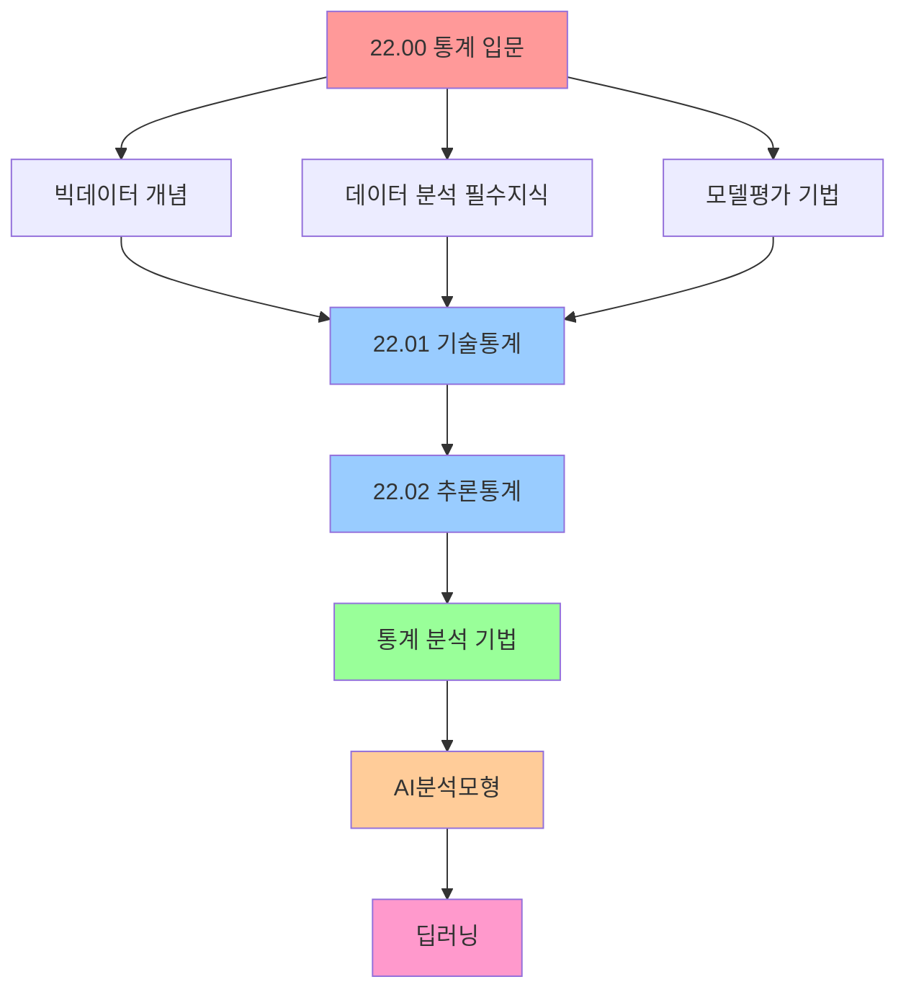

# 22.00 통계 입문 - 데이터 분석과 AI의 기초

> **📋 출처**: 건강보험심사평가원, "파이썬을 활용한 데이터·AI 분석 사례"  
> **🌐 웹사이트**: www.hira.or.kr  
> **📝 편집**: 학습 목적으로 재구성 및 확장

## 🎯 전체 개요
**통계학은 데이터 사이언스와 AI의 근간이 되는 학문입니다.** 빅데이터 시대에서 데이터를 수집하고, 분석하고, 해석하여 가치 있는 인사이트를 도출하는 모든 과정의 기초가 바로 통계학입니다.

> **"표본 통계량을 구해서 모집단이 그러할 거다라고 추론하는 겁니다. 이게 추론 통계입니다."**

---

## 📚 통계 학습 로드맵

### 🗺️ **학습 단계별 구성**



---

## 📖 **I. 빅데이터란?(What is Big Data?)**

### 🔍 **빅데이터의 정의**

빅데이터는 단순히 데이터가 많다는 의미를 넘어서, **기존의 관리 및 분석 체계로는 감당할 수 없을 정도의 거대한 데이터와 이를 처리하는 모든 기술을 포괄**하는 개념입니다.

#### **가트너의 빅데이터 5V**
```python
bigdata_5v = {
    "Volume (규모)": "대용량의 데이터",
    "Velocity (속도)": "실시간 처리 요구",
    "Variety (다양성)": "정형/비정형 데이터 혼재",
    "Veracity (정확성)": "데이터의 신뢰성과 품질",
    "Value (가치)": "분석을 통한 실질적 가치 창출"
}

for v, description in bigdata_5v.items():
    print(f"📊 {v}: {description}")
```

### 📈 **DIKW 피라미드 - 데이터에서 지혜까지**

```python
def dikw_pyramid():
    """데이터 → 정보 → 지식 → 지혜의 변환 과정"""
    
    dikw = {
        "데이터(Data)": {
            "정의": "가공되지 않은 순수한 수치나 기호",
            "예시": "A마트는 100원, B마트는 200원에 연필 판매",
            "특징": "타 데이터와 상관관계 없는 원시 자료"
        },
        
        "정보(Information)": {
            "정의": "의미 있고 유용한 형태로 가공된 데이터",
            "예시": "A마트의 연필이 더 싸다",
            "특징": "데이터 간 상관관계 이해를 통한 패턴 인식"
        },
        
        "지식(Knowledge)": {
            "정의": "상호 연결된 정보 패턴을 이해한 예측 결과물",
            "예시": "상대적으로 저렴한 A마트에서 연필을 사야겠다",
            "특징": "정보 패턴 기반의 의사결정 능력"
        },
        
        "지혜(Wisdom)": {
            "정의": "근본 원리 이해를 바탕으로 한 창의적 아이디어",
            "예시": "A마트의 다른 상품들도 B마트보다 쌀 것이라 판단",
            "특징": "깊은 이해와 통찰력 기반의 일반화"
        }
    }
    
    print("🏛️ DIKW 피라미드 - 데이터 가치 창출 과정")
    print("=" * 60)
    
    for level, info in dikw.items():
        print(f"\n📊 {level}")
        print(f"   정의: {info['정의']}")
        print(f"   예시: {info['예시']}")
        print(f"   특징: {info['특징']}")

dikw_pyramid()
```

### 🔄 **빅데이터가 만들어내는 본질적 변화**

#### **분석 패러다임의 전환**
| 구분 | 과거 방식 | 빅데이터 방식 |
|------|----------|---------------|
| **데이터 처리** | 사전처리 → 필요한 것만 | 사후처리 → 모든 데이터 수집 |
| **조사 방법** | 표본조사 (Sampling) | 전수조사 (Population) |
| **품질 중심** | 질(Quality) 우선 | 양(Quantity) 우선 |
| **분석 관점** | 인과관계 (Causation) | 상관관계 (Correlation) |

---

## 📊 **II. 데이터 분석 필수지식(Data Analysis Knowledge)**

### 📈 **기술통계 vs 추론통계**

```python
def statistics_comparison():
    """기술통계와 추론통계의 차이점 정리"""
    
    comparison = {
        "기술통계(Descriptive)": {
            "목적": "현재 데이터 자체를 설명",
            "방법": "평균, 분산, 표준편차, 최빈값, 중앙값",
            "특징": "'이렇다' (현황 파악)",
            "결과": "데이터의 계량화된 요약",
            "예시": "야구선수의 타율, 투수의 방어율"
        },
        
        "추론통계(Inferential)": {
            "목적": "표본으로 모집단을 추론",
            "방법": "가설검정, 회귀분석, 예측 모델링",
            "특징": "'이럴 것이다' (미래 예측)",
            "결과": "통계적 결론 및 의사결정",
            "예시": "출구조사로 선거 결과 예측"
        }
    }
    
    print("📊 기술통계 vs 추론통계 완전 비교")
    print("=" * 50)
    
    for stat_type, details in comparison.items():
        print(f"\n🔍 {stat_type}")
        for key, value in details.items():
            print(f"   {key}: {value}")

statistics_comparison()
```

### 📊 **주요 통계량 정리**

#### **1️⃣ 중심경향치 (Central Tendency)**
```python
import numpy as np
import pandas as pd

def central_tendency_examples():
    """중심경향치 계산 예제"""
    
    # 예제 데이터: 학생들의 시험 점수
    scores = [85, 90, 78, 92, 88, 76, 95, 82, 89, 91]
    
    # 산술평균
    mean_score = np.mean(scores)
    
    # 중앙값
    median_score = np.median(scores)
    
    # 최빈값 (pandas 사용)
    df = pd.DataFrame({'scores': scores})
    mode_score = df['scores'].mode().iloc[0]
    
    print("📊 중심경향치 계산 결과")
    print(f"데이터: {scores}")
    print(f"평균(Mean): {mean_score:.2f}점")
    print(f"중앙값(Median): {median_score:.2f}점")
    print(f"최빈값(Mode): {mode_score}점")
    
    return mean_score, median_score, mode_score

central_tendency_examples()
```

#### **2️⃣ 산포도 (Dispersion)**
```python
def dispersion_measures():
    """산포도 측정 예제"""
    
    scores = [85, 90, 78, 92, 88, 76, 95, 82, 89, 91]
    
    # 분산 (표본분산)
    variance = np.var(scores, ddof=1)
    
    # 표준편차
    std_dev = np.std(scores, ddof=1)
    
    # 범위
    data_range = max(scores) - min(scores)
    
    # 사분위범위 (IQR)
    q1 = np.percentile(scores, 25)
    q3 = np.percentile(scores, 75)
    iqr = q3 - q1
    
    print("\n📊 산포도 측정 결과")
    print(f"분산(Variance): {variance:.2f}")
    print(f"표준편차(Std Dev): {std_dev:.2f}")
    print(f"범위(Range): {data_range}")
    print(f"사분위범위(IQR): {iqr:.2f}")
    
    return variance, std_dev, iqr

dispersion_measures()
```

### 🎲 **확률분포와 표본추출**

#### **표본추출의 종류**
```python
def sampling_methods():
    """다양한 표본추출 방법 시연"""
    
    # 모집단 생성 (1000명의 학생 성적)
    np.random.seed(42)
    population = np.random.normal(75, 15, 1000)  # 평균 75, 표준편차 15
    
    sampling_methods = {
        "단순임의추출": {
            "방법": "무작위로 추출",
            "코드": "np.random.choice(population, 100, replace=False)"
        },
        
        "층화임의추출": {
            "방법": "계층별로 나누어 각각에서 추출", 
            "설명": "성별, 학년 등으로 나누어 추출"
        },
        
        "체계적추출": {
            "방법": "일정한 간격으로 추출",
            "설명": "첫 번째는 임의, 이후는 동일 간격"
        },
        
        "집락추출": {
            "방법": "클러스터 전체를 선택",
            "설명": "특정 학교, 지역 전체 선택"
        }
    }
    
    print("🎯 표본추출 방법론")
    print("=" * 40)
    
    for method, details in sampling_methods.items():
        print(f"\n📊 {method}")
        print(f"   방법: {details['방법']}")
        if '코드' in details:
            print(f"   코드: {details['코드']}")
        if '설명' in details:
            print(f"   설명: {details['설명']}")

sampling_methods()
```

---

## 📊 **III. 데이터 분석 모델평가(Data Analysis Model Assessment)**

### 🔍 **분류성능평가 - 오차행렬(Confusion Matrix)**

```python
def confusion_matrix_example():
    """오차행렬과 성능지표 계산 예제"""
    
    # 예제: 스팸 메일 분류 결과
    # TP: 스팸을 스팸으로 정확히 분류
    # TN: 정상을 정상으로 정확히 분류  
    # FP: 정상을 스팸으로 잘못 분류
    # FN: 스팸을 정상으로 잘못 분류
    
    TP = 85  # 진양성
    TN = 90  # 진음성
    FP = 5   # 위양성 (1종 오류)
    FN = 10  # 위음성 (2종 오류)
    
    # 성능지표 계산
    precision = TP / (TP + FP)      # 정밀도
    recall = TP / (TP + FN)         # 민감도(재현율)
    specificity = TN / (TN + FP)    # 특이도
    accuracy = (TP + TN) / (TP + TN + FP + FN)  # 정확도
    f1_score = 2 * (precision * recall) / (precision + recall)  # F1 점수
    
    print("📊 분류성능평가 결과")
    print("=" * 30)
    print(f"정밀도(Precision): {precision:.3f}")
    print(f"재현율(Recall/민감도): {recall:.3f}")
    print(f"특이도(Specificity): {specificity:.3f}")
    print(f"정확도(Accuracy): {accuracy:.3f}")
    print(f"F1 점수: {f1_score:.3f}")
    
    # 오차행렬 시각화
    import matplotlib.pyplot as plt
    import seaborn as sns
    
    confusion_matrix = np.array([[TN, FP], [FN, TP]])
    
    plt.figure(figsize=(8, 6))
    sns.heatmap(confusion_matrix, annot=True, fmt='d', cmap='Blues',
                xticklabels=['예측 음성', '예측 양성'],
                yticklabels=['실제 음성', '실제 양성'])
    plt.title('오차행렬 (Confusion Matrix)')
    plt.ylabel('실제값')
    plt.xlabel('예측값')
    plt.show()
    
    return precision, recall, accuracy, f1_score

confusion_matrix_example()
```

### 📈 **ROC 곡선과 AUC**

```python
def roc_curve_explanation():
    """ROC 곡선의 의미와 해석"""
    
    roc_interpretation = {
        "AUC 0.9-1.0": "매우 좋은 성능",
        "AUC 0.8-0.9": "좋은 성능", 
        "AUC 0.7-0.8": "보통 성능",
        "AUC 0.6-0.7": "나쁜 성능",
        "AUC 0.5": "무작위 분류 수준"
    }
    
    print("📊 ROC-AUC 성능 해석 기준")
    print("=" * 35)
    
    for auc_range, performance in roc_interpretation.items():
        print(f"{auc_range}: {performance}")
    
    print("\n💡 ROC 곡선 핵심 포인트:")
    print("   • X축: 위양성률 (1-특이도)")
    print("   • Y축: 진양성률 (민감도)")
    print("   • 왼쪽 위로 갈수록 좋은 성능")
    print("   • 대각선은 무작위 분류기")

roc_curve_explanation()
```

---

## 🔧 **IV. 데이터 분석 도구 소개: Python**

### 📚 **필수 라이브러리 생태계**

```python
def python_datascience_ecosystem():
    """데이터 사이언스를 위한 파이썬 라이브러리"""
    
    libraries = {
        "기본 도구": {
            "NumPy": "수치 계산의 기반",
            "Pandas": "데이터 조작 및 분석",
            "Matplotlib": "기본 시각화",
            "Seaborn": "통계 시각화"
        },
        
        "통계 분석": {
            "SciPy": "과학 계산 및 통계",
            "Statsmodels": "통계 모델링",
            "Pingouin": "사용하기 쉬운 통계"
        },
        
        "머신러닝": {
            "Scikit-learn": "머신러닝 알고리즘",
            "XGBoost": "부스팅 알고리즘",
            "LightGBM": "경량 부스팅"
        },
        
        "딥러닝": {
            "TensorFlow": "구글 딥러닝 프레임워크",
            "PyTorch": "페이스북 딥러닝 프레임워크",
            "Keras": "고수준 딥러닝 API"
        }
    }
    
    print("🐍 파이썬 데이터 사이언스 생태계")
    print("=" * 45)
    
    for category, libs in libraries.items():
        print(f"\n📦 {category}:")
        for lib, description in libs.items():
            print(f"   • {lib}: {description}")

python_datascience_ecosystem()
```

---

## 📈 **V. 통계 분석 기법**

### 🔗 **연관규칙분석 (Association Rule Analysis)**

```python
def association_rules_intro():
    """연관규칙분석 개념과 지표"""
    
    print("🛒 연관규칙분석 - 장바구니 분석")
    print("=" * 35)
    
    concepts = {
        "지지도(Support)": {
            "정의": "전체 거래 중 특정 상품조합이 나타나는 비율",
            "공식": "P(A ∩ B)",
            "예시": "빵과 우유를 함께 산 거래 / 전체 거래"
        },
        
        "신뢰도(Confidence)": {
            "정의": "A를 산 사람 중 B도 산 사람의 비율",
            "공식": "P(B|A) = P(A ∩ B) / P(A)",
            "예시": "빵을 산 사람 중 우유도 산 비율"
        },
        
        "향상도(Lift)": {
            "정의": "A와 B의 연관성 강도",
            "공식": "P(B|A) / P(B)",
            "해석": "1보다 크면 양의 상관관계"
        }
    }
    
    for metric, details in concepts.items():
        print(f"\n📊 {metric}")
        for key, value in details.items():
            print(f"   {key}: {value}")

association_rules_intro()
```

### 📊 **교차분석 (Cross-tabulation Analysis)**

```python
def crosstab_analysis_example():
    """교차분석 예제와 카이제곱 검정"""
    
    # 예제 데이터: 성별과 제품 선호도
    data = {
        '성별': ['남', '남', '여', '여', '남', '여', '남', '여'] * 25,
        '선호도': ['A', 'B', 'A', 'A', 'B', 'A', 'A', 'B'] * 25
    }
    
    df = pd.DataFrame(data)
    
    # 교차표 생성
    crosstab = pd.crosstab(df['성별'], df['선호도'], margins=True)
    
    print("📊 교차분석 예제")
    print("=" * 25)
    print("교차표:")
    print(crosstab)
    
    # 카이제곱 검정
    from scipy.stats import chi2_contingency
    
    chi2, p_value, dof, expected = chi2_contingency(crosstab.iloc[:-1, :-1])
    
    print(f"\n📈 카이제곱 검정 결과:")
    print(f"카이제곱 통계량: {chi2:.4f}")
    print(f"P-value: {p_value:.4f}")
    print(f"자유도: {dof}")
    
    if p_value < 0.05:
        print("✅ 유의수준 5%에서 성별과 선호도는 관련이 있습니다.")
    else:
        print("❌ 유의수준 5%에서 성별과 선호도는 관련이 없습니다.")

crosstab_analysis_example()
```

### 📊 **분산분석 (ANOVA)**

```python
def anova_example():
    """일원분산분석 예제"""
    
    from scipy import stats
    
    # 예제: 3개 반의 시험 점수
    class_a = [85, 87, 83, 89, 86, 84, 88, 85]
    class_b = [78, 82, 80, 79, 81, 83, 77, 80]
    class_c = [92, 94, 91, 93, 95, 90, 89, 92]
    
    # 일원분산분석
    f_stat, p_value = stats.f_oneway(class_a, class_b, class_c)
    
    print("📊 일원분산분석 (One-way ANOVA)")
    print("=" * 40)
    print(f"A반 평균: {np.mean(class_a):.2f}")
    print(f"B반 평균: {np.mean(class_b):.2f}")
    print(f"C반 평균: {np.mean(class_c):.2f}")
    print(f"\nF-통계량: {f_stat:.4f}")
    print(f"P-value: {p_value:.4f}")
    
    if p_value < 0.05:
        print("✅ 세 반 간에 유의한 차이가 있습니다.")
    else:
        print("❌ 세 반 간에 유의한 차이가 없습니다.")

anova_example()
```

---

## 🤖 **VI. AI분석모형**

### 🔍 **최근접 이웃 (K-Nearest Neighbors)**

```python
def knn_explanation():
    """KNN 알고리즘 설명"""
    
    print("🎯 K-최근접 이웃 (KNN) 알고리즘")
    print("=" * 35)
    
    knn_concepts = {
        "핵심 아이디어": "비슷한 것끼리 모여있다는 가정",
        "작동 원리": "새로운 데이터와 가장 가까운 K개 이웃의 다수결",
        "거리 측정": "유클리드, 맨하탄, 코사인 거리 등",
        "장점": "직관적이고 구현이 간단",
        "단점": "계산 비용이 높고 차원의 저주에 민감"
    }
    
    for concept, description in knn_concepts.items():
        print(f"📊 {concept}: {description}")
    
    print(f"\n💡 K값 선택 가이드:")
    print(f"   • K가 작으면: 노이즈에 민감, 복잡한 결정경계")
    print(f"   • K가 크면: 부드러운 결정경계, 과소적합 위험")
    print(f"   • 일반적으로 홀수 선택 (동점 방지)")

knn_explanation()
```

### 🌳 **의사결정나무 (Decision Tree)**

```python
def decision_tree_explanation():
    """의사결정나무 알고리즘 설명"""
    
    print("🌳 의사결정나무 (Decision Tree)")
    print("=" * 35)
    
    dt_concepts = {
        "핵심 아이디어": "if-then 규칙의 계층적 구조",
        "분할 기준": "정보 이득, 지니 불순도, 엔트로피",
        "장점": "해석이 쉽고 비선형 관계 학습 가능",
        "단점": "과적합 경향, 불안정성"
    }
    
    for concept, description in dt_concepts.items():
        print(f"📊 {concept}: {description}")
    
    print(f"\n🔧 과적합 방지 방법:")
    print(f"   • 가지치기 (Pruning)")
    print(f"   • 최대 깊이 제한")
    print(f"   • 최소 샘플 수 설정")

decision_tree_explanation()
```

---

## 🧠 **VII. 딥러닝**

### 🔗 **인공신경망 (Artificial Neural Network)**

```python
def ann_basics():
    """인공신경망 기초 개념"""
    
    print("🧠 인공신경망 (ANN) 기초")
    print("=" * 30)
    
    ann_concepts = {
        "뉴런 모델": "입력 → 가중합 → 활성화함수 → 출력",
        "학습 과정": "순전파 → 오차계산 → 역전파 → 가중치 업데이트",
        "활성화함수": "ReLU, Sigmoid, Tanh 등",
        "손실함수": "MSE(회귀), Cross-entropy(분류)"
    }
    
    for concept, description in ann_concepts.items():
        print(f"📊 {concept}: {description}")
    
    print(f"\n🔧 신경망 구조:")
    print(f"   • 입력층: 데이터가 들어오는 층")
    print(f"   • 은닉층: 특징을 학습하는 층")
    print(f"   • 출력층: 최종 결과를 출력하는 층")

ann_basics()
```

### 🏞️ **합성곱신경망 (CNN)**

```python
def cnn_explanation():
    """CNN 핵심 개념"""
    
    print("🏞️ 합성곱신경망 (CNN)")
    print("=" * 25)
    
    cnn_concepts = {
        "주요 용도": "이미지 인식, 컴퓨터 비전",
        "핵심 연산": "합성곱(Convolution), 풀링(Pooling)",
        "특징": "지역적 패턴 학습, 매개변수 공유",
        "대표 모델": "LeNet, AlexNet, VGG, ResNet"
    }
    
    for concept, description in cnn_concepts.items():
        print(f"📊 {concept}: {description}")
    
    print(f"\n🔧 CNN 구조:")
    print(f"   • 합성곱층: 특징 추출")
    print(f"   • 풀링층: 차원 축소")
    print(f"   • 완전연결층: 최종 분류")

cnn_explanation()
```

---

## 📚 **학습에 도움이 되는 사이트 모음**

### 🌐 **온라인 학습 플랫폼**

```python
def learning_resources():
    """통계와 데이터 사이언스 학습 자료"""
    
    resources = {
        "📊 통계 기초": {
            "Khan Academy": "https://ko.khanacademy.org/math/statistics-probability",
            "KMOOC": "한국형 온라인 공개강좌",
            "Coursera Statistics": "듀크대학교 통계 과정"
        },
        
        "🐍 파이썬 데이터 사이언스": {
            "Kaggle Learn": "https://www.kaggle.com/learn",
            "DataCamp": "인터랙티브 데이터 사이언스 학습",
            "Jupyter Notebook": "실습 환경"
        },
        
        "🤖 머신러닝/딥러닝": {
            "Fast.ai": "https://www.fast.ai/",
            "Andrew Ng Coursera": "머신러닝 입문 강의",
            "Papers With Code": "최신 논문과 코드"
        },
        
        "📖 책과 문서": {
            "Think Stats": "무료 통계학 교재",
            "Scikit-learn Documentation": "머신러닝 라이브러리 공식 문서",
            "Pandas Documentation": "데이터 분석 라이브러리 공식 문서"
        }
    }
    
    print("📚 통계·데이터 사이언스 학습 자료")
    print("=" * 45)
    
    for category, sites in resources.items():
        print(f"\n{category}:")
        for site, description in sites.items():
            print(f"   • {site}: {description}")

learning_resources()
```

---

## 🎯 **학습 로드맵과 다음 단계**

### 📈 **단계별 학습 계획**

```python
def learning_roadmap():
    """통계에서 AI까지 학습 로드맵"""
    
    roadmap = {
        "1단계 (기초 통계)": {
            "기간": "2-4주",
            "내용": ["기술통계", "추론통계", "가설검정"],
            "목표": "통계적 사고 기반 구축"
        },
        
        "2단계 (데이터 분석)": {
            "기간": "4-6주", 
            "내용": ["Python/Pandas", "데이터 전처리", "EDA"],
            "목표": "실무 데이터 분석 능력"
        },
        
        "3단계 (통계 모델링)": {
            "기간": "6-8주",
            "내용": ["회귀분석", "분산분석", "시계열분석"],
            "목표": "통계 모델링 마스터"
        },
        
        "4단계 (머신러닝)": {
            "기간": "8-12주",
            "내용": ["지도학습", "비지도학습", "모델 평가"],
            "목표": "머신러닝 실무 적용"
        },
        
        "5단계 (딥러닝)": {
            "기간": "12-16주",
            "내용": ["신경망", "CNN", "RNN", "Transformer"],
            "목표": "딥러닝 전문가"
        }
    }
    
    print("🗺️ 통계 → AI 학습 로드맵")
    print("=" * 35)
    
    for stage, details in roadmap.items():
        print(f"\n📈 {stage}")
        print(f"   기간: {details['기간']}")
        print(f"   내용: {', '.join(details['내용'])}")
        print(f"   목표: {details['목표']}")

learning_roadmap()
```

### 🎯 **실무 프로젝트 제안**

```python
def project_suggestions():
    """단계별 실무 프로젝트"""
    
    projects = {
        "초급 프로젝트": [
            "공공데이터를 활용한 기술통계 분석",
            "설문조사 데이터 교차분석",
            "주식 데이터 시계열 시각화"
        ],
        
        "중급 프로젝트": [
            "A/B 테스트 설계 및 분석",
            "고객 세그멘테이션 분석",
            "판매 예측 모델 구축"
        ],
        
        "고급 프로젝트": [
            "추천 시스템 개발",
            "자연어 감성 분석",
            "이미지 분류 모델 구축"
        ]
    }
    
    print("🚀 단계별 실무 프로젝트")
    print("=" * 30)
    
    for level, project_list in projects.items():
        print(f"\n📊 {level}:")
        for i, project in enumerate(project_list, 1):
            print(f"   {i}. {project}")

project_suggestions()
```

---

## 💡 **마무리: 통계학의 가치와 미래**

### 🎯 **왜 통계를 배워야 할까?**

통계학은 단순한 숫자 놀음이 아닙니다. **데이터 기반 의사결정**의 핵심이며, **불확실성을 정량화**하여 합리적 판단을 내리는 도구입니다.

```python
def statistics_value():
    """통계학의 가치와 미래 전망"""
    
    value_props = {
        "🔍 과학적 사고": "가설 설정 → 데이터 수집 → 검증 → 결론",
        "📊 의사결정 지원": "감이 아닌 데이터 기반 판단",
        "🎯 리스크 관리": "불확실성 정량화 및 대응",
        "🚀 혁신 도구": "AI/ML의 수학적 기초",
        "💼 경쟁력": "모든 산업에서 요구되는 핵심 역량"
    }
    
    print("💎 통계학이 주는 가치")
    print("=" * 25)
    
    for value, description in value_props.items():
        print(f"{value}: {description}")
    
    print(f"\n🔮 미래 전망:")
    print(f"   • 빅데이터 시대의 핵심 역량")
    print(f"   • AI 윤리와 해석 가능성")
    print(f"   • 자동화된 의사결정 시스템")
    print(f"   • 개인화된 서비스 설계")

statistics_value()
```

---

## 🏁 **다음 학습 단계**

이제 **22.01 기술통계**와 **22.02 추론통계**로 넘어가서 더 깊이 있는 통계 학습을 시작해보세요!

```python
def next_steps():
    """다음 학습 단계 안내"""
    
    next_learning = [
        "📊 22.01 기술통계 - 데이터 요약과 시각화",
        "🔍 22.02 추론통계 - 가설검정과 신뢰구간", 
        "📈 통계 분석 기법 - 실무 적용",
        "🤖 AI분석모형 - 머신러닝 입문",
        "🧠 딥러닝 - 신경망과 최신 기법"
    ]
    
    print("🎯 다음 학습 단계")
    print("=" * 20)
    
    for i, step in enumerate(next_learning, 1):
        print(f"{i}. {step}")
    
    print(f"\n💪 화이팅! 통계 마스터의 여정이 시작됩니다! 🚀")

next_steps()
```

**통계학은 데이터 사이언스의 언어입니다. 이 언어를 마스터하면 데이터가 말하는 이야기를 듣고, 미래를 예측하며, 현명한 결정을 내릴 수 있게 됩니다!** 🎓✨