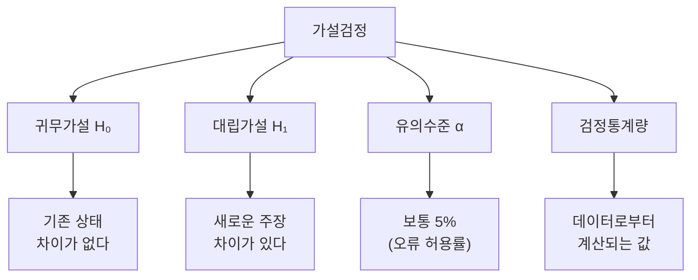
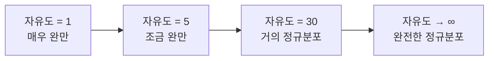
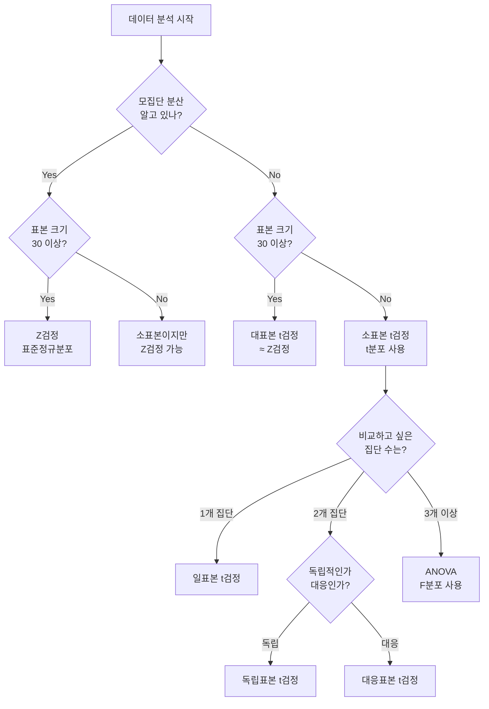
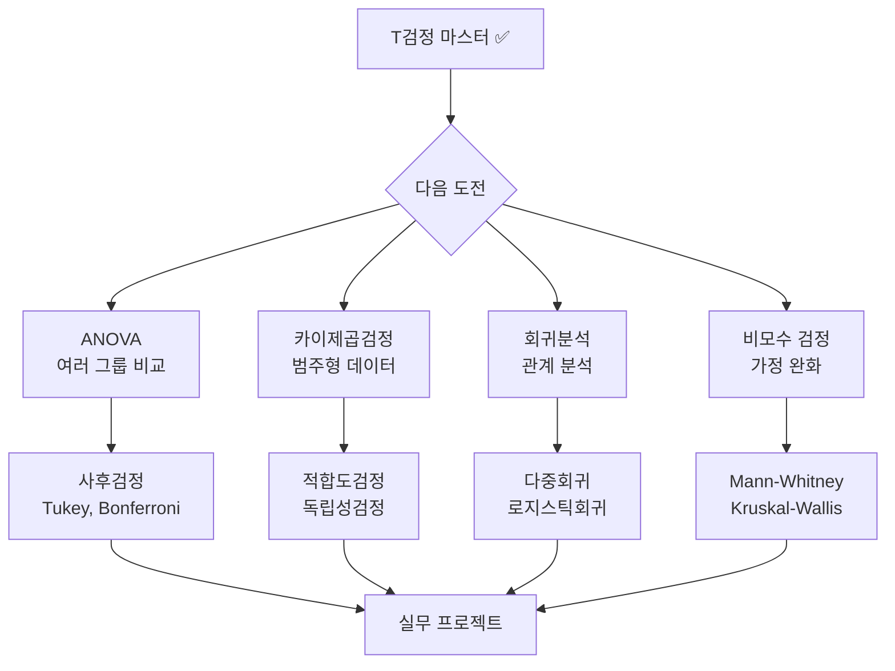

# 🎯 T검정 완전 마스터 가이드
*From 기초 개념 to 실무 활용까지*

---

## 📊 가설검정이란?

**가설검정(Hypothesis Testing)**은 표본 데이터를 통해 모집단에 대한 주장을 통계적으로 검증하는 과학적 방법입니다.

### 🔍 핵심 구성요소



### 💡 가설검정의 핵심 아이디어

> **"우연의 범위(5%) 내 차이인가? 진짜 의미있는 차이인가?"**

- **귀무가설(H₀)**: "이 약은 효과가 없다", "두 그룹의 평균은 같다"
- **대립가설(H₁)**: "이 약은 효과가 있다", "두 그룹의 평균은 다르다"
- **결정**: p-value < 0.05 → 귀무가설 기각 (통계적으로 유의함)

---

## 🔬 T검정의 정체성

### 🎯 T검정이란?

**T검정**은 **평균값의 차이**와 **데이터의 변동성**을 함께 고려하여 두 집단을 비교하는 통계적 방법입니다.

### 🧮 T검정의 핵심 공식

```
t = (집단 간 평균 차이) / (표준오차)
```

- **분자**: 얼마나 다른가? (효과 크기)
- **분모**: 얼마나 확실한가? (측정 정확도)

### 🤔 왜 평균만으로는 안 될까?

#### 시나리오: 두 학급의 시험 성적

| 구분 | A반 평균 | B반 평균 | 표준편차 | 의미 |
|------|---------|---------|----------|------|
| **상황 1** | 80점 | 85점 | A반: 2점, B반: 3점 | **유의한 차이!** |
| **상황 2** | 80점 | 85점 | A반: 15점, B반: 20점 | 그냥 우연의 차이 |

→ **같은 평균 차이(5점)도 변동성에 따라 의미가 완전히 달라집니다!**

---

## 📈 T분포의 특별함

### 🎯 T분포 vs 정규분포

| 특징 | 정규분포(Z분포) | t분포 |
|------|---------------|-------|
| **언제 사용?** | 모표준편차(σ) 알 때 | 모표준편차(σ) 모를 때 |
| **표본 크기** | 대표본(n≥30) | 소표본(n<30) |
| **분포 모양** | 항상 동일 | 자유도에 따라 변함 |
| **꼬리 부분** | 얇음 | 두꺼움 (더 보수적) |

### 📊 T분포의 진화



### 🔄 자유도(Degree of Freedom)의 의미

> **자유도 = 표본 크기 - 1 = n - 1**

- **물리학적 의미**: 움직일 수 있는 독립적인 방향의 수
- **통계학적 의미**: 자유롭게 변할 수 있는 값의 개수
- **실무적 의미**: 표본 크기가 클수록 더 정확한 추정

---

## 🌟 표준정규분포(Z분포) 복습

### 🎯 표준화의 필요성

무수히 많은 정규분포들을 하나의 **표준** 정규분포로 통일!

```
Z = (관측값 - 평균) / 표준편차 = (X - μ) / σ
```

### 📊 표준정규분포의 특징

- **평균**: 0, **표준편차**: 1
- **68-95-99.7 규칙**: 
  - 68%의 데이터가 ±1σ 범위
  - 95%의 데이터가 ±2σ 범위
  - 99.7%의 데이터가 ±3σ 범위

---

## 🔥 F분포 - 분산들의 전쟁

### 🎯 F분포의 용도

**"두 집단의 분산이 정말 같을까?"**를 판별하는 분포

```
F = (큰 분산) / (작은 분산)
```

### 📈 주요 활용 분야

1. **분산분석(ANOVA)**: 여러 그룹 간 평균 비교
2. **회귀분석**: 모델의 전체적 유의성 검정
3. **등분산 검정**: t검정 전 전제 조건 확인

---

## 🧭 실무에서 어떤 검정을 선택할까?

### 📋 검정 선택 플로우차트



### 🎯 황금 규칙

| 상황 | 검정 방법 | 분포 | 핵심 조건 |
|------|----------|------|----------|
| **모분산 알고 대표본** | Z검정 | 표준정규분포 | σ 알고 n≥30 |
| **모분산 모르고 소표본** | t검정 | t분포 | σ 모르고 n<30 |
| **분산 비교** | F검정 | F분포 | 등분산성 검정 |
| **여러 그룹 평균 비교** | ANOVA | F분포 | 3개 이상 그룹 |

---

## 💻 Python으로 T검정 실습

### 🔧 기본 라이브러리 설정

```python
import numpy as np
import pandas as pd
import matplotlib.pyplot as plt
import seaborn as sns
from scipy import stats
import warnings
warnings.filterwarnings('ignore')

# 한글 폰트 설정
plt.rcParams['font.family'] = 'DejaVu Sans'
plt.rcParams['figure.figsize'] = (12, 8)
plt.rcParams['font.size'] = 10
```

### 📊 1. 일표본 t검정 (One-sample t-test)

**문제**: "우리 제품의 평균 무게가 정말 500g일까?"

```python
def one_sample_t_test_demo():
    """일표본 t검정 실습"""
    
    # 가상 데이터 생성 (실제 평균 505g)
    np.random.seed(42)
    product_weights = np.random.normal(505, 15, 50)
    
    print("🎯 일표본 t검정: 제품 무게 검증")
    print("="*50)
    
    # 기본 통계량
    n = len(product_weights)
    sample_mean = np.mean(product_weights)
    sample_std = np.std(product_weights, ddof=1)
    
    print(f"표본 크기: {n}")
    print(f"표본 평균: {sample_mean:.2f}g")
    print(f"표본 표준편차: {sample_std:.2f}g")
    
    # 가설 설정
    print(f"\n📝 가설 설정:")
    print(f"H₀: μ = 500g (제품 무게는 500g이다)")
    print(f"H₁: μ ≠ 500g (제품 무게는 500g이 아니다)")
    
    # t검정 실행
    t_stat, p_value = stats.ttest_1samp(product_weights, 500)
    
    print(f"\n📊 검정 결과:")
    print(f"t 통계량: {t_stat:.4f}")
    print(f"p-value: {p_value:.6f}")
    print(f"자유도: {n-1}")
    
    # 결과 해석
    alpha = 0.05
    if p_value < alpha:
        print(f"\n✅ 결론: p({p_value:.6f}) < α({alpha})")
        print("→ H₀ 기각, H₁ 채택")
        print("→ 제품 무게가 500g과 통계적으로 유의한 차이가 있음")
    else:
        print(f"\n❌ 결론: p({p_value:.6f}) ≥ α({alpha})")
        print("→ H₀ 채택, H₁ 기각")
        print("→ 제품 무게가 500g와 통계적으로 유의한 차이가 없음")
    
    # 시각화
    fig, (ax1, ax2) = plt.subplots(1, 2, figsize=(15, 6))
    
    # 히스토그램
    ax1.hist(product_weights, bins=12, alpha=0.7, color='skyblue', 
             edgecolor='black', density=True)
    ax1.axvline(500, color='red', linestyle='--', linewidth=2, 
                label=f'H₀: μ = 500g')
    ax1.axvline(sample_mean, color='green', linestyle='-', linewidth=2,
                label=f'표본평균: {sample_mean:.1f}g')
    ax1.set_xlabel('무게 (g)')
    ax1.set_ylabel('밀도')
    ax1.set_title('제품 무게 분포')
    ax1.legend()
    ax1.grid(True, alpha=0.3)
    
    # t분포와 검정통계량
    df = n - 1
    x = np.linspace(-4, 4, 1000)
    y = stats.t.pdf(x, df)
    
    ax2.plot(x, y, 'b-', linewidth=2, label=f't분포 (df={df})')
    ax2.axvline(t_stat, color='red', linestyle='-', linewidth=2,
                label=f't통계량 = {t_stat:.3f}')
    
    # 임계값 표시
    critical_value = stats.t.ppf(0.975, df)  # 양측검정
    ax2.axvline(critical_value, color='orange', linestyle='--',
                label=f'임계값 = ±{critical_value:.3f}')
    ax2.axvline(-critical_value, color='orange', linestyle='--')
    
    # 기각영역 색칠
    x_reject_right = x[x >= critical_value]
    y_reject_right = stats.t.pdf(x_reject_right, df)
    x_reject_left = x[x <= -critical_value]
    y_reject_left = stats.t.pdf(x_reject_left, df)
    
    ax2.fill_between(x_reject_right, y_reject_right, alpha=0.3, 
                     color='red', label='기각영역')
    ax2.fill_between(x_reject_left, y_reject_left, alpha=0.3, color='red')
    
    ax2.set_xlabel('t 값')
    ax2.set_ylabel('확률밀도')
    ax2.set_title('t분포와 검정통계량')
    ax2.legend()
    ax2.grid(True, alpha=0.3)
    
    plt.tight_layout()
    plt.show()
    
    return t_stat, p_value

# 실행
one_sample_result = one_sample_t_test_demo()
```

### 📊 2. 독립표본 t검정 (Independent samples t-test)

**문제**: "남성과 여성의 평균 쇼핑 금액에 차이가 있을까?"

```python
def independent_t_test_demo():
    """독립표본 t검정 실습"""
    
    # 가상 데이터 생성
    np.random.seed(42)
    male_spending = np.random.normal(45000, 12000, 80)    # 남성: 평균 45,000원
    female_spending = np.random.normal(52000, 15000, 90)  # 여성: 평균 52,000원
    
    print("🎯 독립표본 t검정: 성별 쇼핑 금액 비교")
    print("="*50)
    
    # 기본 통계량
    male_stats = {
        'n': len(male_spending),
        'mean': np.mean(male_spending),
        'std': np.std(male_spending, ddof=1)
    }
    
    female_stats = {
        'n': len(female_spending),
        'mean': np.mean(female_spending),
        'std': np.std(female_spending, ddof=1)
    }
    
    print(f"👨 남성 그룹:")
    print(f"   표본 크기: {male_stats['n']}")
    print(f"   평균: {male_stats['mean']:,.0f}원")
    print(f"   표준편차: {male_stats['std']:,.0f}원")
    
    print(f"\n👩 여성 그룹:")
    print(f"   표본 크기: {female_stats['n']}")
    print(f"   평균: {female_stats['mean']:,.0f}원")
    print(f"   표준편차: {female_stats['std']:,.0f}원")
    
    # 가설 설정
    print(f"\n📝 가설 설정:")
    print(f"H₀: μ₁ = μ₂ (남성과 여성의 평균 쇼핑 금액이 같다)")
    print(f"H₁: μ₁ ≠ μ₂ (남성과 여성의 평균 쇼핑 금액이 다르다)")
    
    # 등분산성 검정 (Levene test)
    levene_stat, levene_p = stats.levene(male_spending, female_spending)
    print(f"\n🔍 등분산성 검정 (Levene test):")
    print(f"통계량: {levene_stat:.4f}, p-value: {levene_p:.6f}")
    
    equal_var = levene_p >= 0.05
    if equal_var:
        print("→ 등분산 가정 만족 (Student's t-test 사용)")
    else:
        print("→ 등분산 가정 위반 (Welch's t-test 사용)")
    
    # t검정 실행
    t_stat, p_value = stats.ttest_ind(male_spending, female_spending, 
                                      equal_var=equal_var)
    
    print(f"\n📊 독립표본 t검정 결과:")
    print(f"t 통계량: {t_stat:.4f}")
    print(f"p-value: {p_value:.6f}")
    
    # 효과크기 (Cohen's d) 계산
    pooled_std = np.sqrt(((male_stats['n']-1)*male_stats['std']**2 + 
                         (female_stats['n']-1)*female_stats['std']**2) / 
                        (male_stats['n'] + female_stats['n'] - 2))
    
    cohens_d = (female_stats['mean'] - male_stats['mean']) / pooled_std
    
    print(f"Cohen's d (효과크기): {cohens_d:.3f}")
    
    # 효과크기 해석
    if abs(cohens_d) < 0.2:
        effect_size = "작음"
    elif abs(cohens_d) < 0.5:
        effect_size = "중간"
    elif abs(cohens_d) < 0.8:
        effect_size = "큼"
    else:
        effect_size = "매우 큼"
    
    print(f"효과크기 해석: {effect_size}")
    
    # 결과 해석
    alpha = 0.05
    if p_value < alpha:
        print(f"\n✅ 결론: p({p_value:.6f}) < α({alpha})")
        print("→ H₀ 기각, H₁ 채택")
        print("→ 남성과 여성의 쇼핑 금액에 통계적으로 유의한 차이가 있음")
    else:
        print(f"\n❌ 결론: p({p_value:.6f}) ≥ α({alpha})")
        print("→ H₀ 채택, H₁ 기각")  
        print("→ 남성과 여성의 쇼핑 금액에 통계적으로 유의한 차이가 없음")
    
    # 시각화
    fig, ((ax1, ax2), (ax3, ax4)) = plt.subplots(2, 2, figsize=(16, 12))
    
    # 1. 히스토그램 비교
    ax1.hist(male_spending, bins=20, alpha=0.7, label='남성', 
             color='lightblue', density=True)
    ax1.hist(female_spending, bins=20, alpha=0.7, label='여성', 
             color='lightpink', density=True)
    ax1.axvline(male_stats['mean'], color='blue', linestyle='--', linewidth=2)
    ax1.axvline(female_stats['mean'], color='red', linestyle='--', linewidth=2)
    ax1.set_xlabel('쇼핑 금액 (원)')
    ax1.set_ylabel('밀도')
    ax1.set_title('성별 쇼핑 금액 분포 비교')
    ax1.legend()
    ax1.grid(True, alpha=0.3)
    
    # 2. 박스플롯
    data_to_plot = [male_spending, female_spending]
    labels = ['남성', '여성']
    box_plot = ax2.boxplot(data_to_plot, labels=labels, patch_artist=True)
    box_plot['boxes'][0].set_facecolor('lightblue')
    box_plot['boxes'][1].set_facecolor('lightpink')
    ax2.set_ylabel('쇼핑 금액 (원)')
    ax2.set_title('성별 쇼핑 금액 박스플롯')
    ax2.grid(True, alpha=0.3)
    
    # 3. 평균과 신뢰구간
    means = [male_stats['mean'], female_stats['mean']]
    stds = [male_stats['std'], female_stats['std']]
    ns = [male_stats['n'], female_stats['n']]
    
    # 95% 신뢰구간 계산
    confidence_intervals = []
    for i in range(2):
        se = stds[i] / np.sqrt(ns[i])
        margin_error = stats.t.ppf(0.975, ns[i]-1) * se
        confidence_intervals.append(margin_error)
    
    x_pos = [0, 1]
    ax3.bar(x_pos, means, yerr=confidence_intervals, capsize=5,
            color=['lightblue', 'lightpink'], alpha=0.7, 
            error_kw={'linewidth': 2, 'ecolor': 'black'})
    ax3.set_xticks(x_pos)
    ax3.set_xticklabels(['남성', '여성'])
    ax3.set_ylabel('평균 쇼핑 금액 (원)')
    ax3.set_title('성별 평균 쇼핑 금액 (95% 신뢰구간)')
    ax3.grid(True, alpha=0.3)
    
    # 평균값 텍스트 추가
    for i, (x, y) in enumerate(zip(x_pos, means)):
        ax3.text(x, y + confidence_intervals[i] + 1000, 
                f'{y:,.0f}원', ha='center', va='bottom', fontweight='bold')
    
    # 4. t분포와 검정통계량
    df = male_stats['n'] + female_stats['n'] - 2
    x = np.linspace(-5, 5, 1000)
    y = stats.t.pdf(x, df)
    
    ax4.plot(x, y, 'b-', linewidth=2, label=f't분포 (df={df})')
    ax4.axvline(t_stat, color='red', linestyle='-', linewidth=2,
                label=f't통계량 = {t_stat:.3f}')
    
    # 임계값과 기각영역
    critical_value = stats.t.ppf(0.975, df)
    ax4.axvline(critical_value, color='orange', linestyle='--',
                label=f'임계값 = ±{critical_value:.3f}')
    ax4.axvline(-critical_value, color='orange', linestyle='--')
    
    # 기각영역 색칠
    x_reject_right = x[x >= critical_value]
    y_reject_right = stats.t.pdf(x_reject_right, df)
    x_reject_left = x[x <= -critical_value]
    y_reject_left = stats.t.pdf(x_reject_left, df)
    
    ax4.fill_between(x_reject_right, y_reject_right, alpha=0.3, 
                     color='red', label='기각영역')
    ax4.fill_between(x_reject_left, y_reject_left, alpha=0.3, color='red')
    
    ax4.set_xlabel('t 값')
    ax4.set_ylabel('확률밀도')
    ax4.set_title('t분포와 검정통계량')
    ax4.legend()
    ax4.grid(True, alpha=0.3)
    
    plt.tight_layout()
    plt.show()
    
    return t_stat, p_value, cohens_d

# 실행
independent_result = independent_t_test_demo()
```

### 📊 3. 대응표본 t검정 (Paired samples t-test)

**문제**: "다이어트 프로그램 전후 체중 변화가 있을까?"

```python
def paired_t_test_demo():
    """대응표본 t검정 실습"""
    
    # 가상 데이터 생성 (30명의 다이어트 프로그램 참가자)
    np.random.seed(42)
    n_participants = 30
    
    # 프로그램 전 체중 (kg)
    before_weight = np.random.normal(75, 8, n_participants)
    
    # 프로그램 후 체중 (평균 3kg 감소, 개인차 있음)
    weight_loss = np.random.normal(3, 2, n_participants)
    after_weight = before_weight - weight_loss
    
    # 체중 변화량 계산
    weight_change = after_weight - before_weight
    
    print("🎯 대응표본 t검정: 다이어트 프로그램 효과 검증")
    print("="*55)
    
    # 기본 통계량
    print(f"참가자 수: {n_participants}명")
    print(f"\n📊 프로그램 전 체중:")
    print(f"   평균: {np.mean(before_weight):.2f}kg")
    print(f"   표준편차: {np.std(before_weight, ddof=1):.2f}kg")
    
    print(f"\n📊 프로그램 후 체중:")
    print(f"   평균: {np.mean(after_weight):.2f}kg")
    print(f"   표준편차: {np.std(after_weight, ddof=1):.2f}kg")
    
    print(f"\n📊 체중 변화량 (후 - 전):")
    print(f"   평균: {np.mean(weight_change):.2f}kg")
    print(f"   표준편차: {np.std(weight_change, ddof=1):.2f}kg")
    
    # 가설 설정
    print(f"\n📝 가설 설정:")
    print(f"H₀: μd = 0 (다이어트 프로그램 전후 체중 변화가 없다)")
    print(f"H₁: μd < 0 (다이어트 프로그램으로 체중이 감소했다)")
    print(f"    μd: 체중 변화량의 모평균 (후 - 전)")
    
    # 대응표본 t검정 실행
    t_stat, p_value_two_tailed = stats.ttest_rel(after_weight, before_weight)
    
    # 단측검정 p-value (체중 감소 방향)
    p_value_one_tailed = p_value_two_tailed / 2 if t_stat < 0 else 1 - p_value_two_tailed / 2
    
    print(f"\n📊 대응표본 t검정 결과:")
    print(f"t 통계량: {t_stat:.4f}")
    print(f"자유도: {n_participants - 1}")
    print(f"p-value (양측): {p_value_two_tailed:.6f}")
    print(f"p-value (단측): {p_value_one_tailed:.6f}")
    
    # 효과크기 계산
    cohens_d = np.mean(weight_change) / np.std(weight_change, ddof=1)
    print(f"Cohen's d (효과크기): {cohens_d:.3f}")
    
    # 결과 해석
    alpha = 0.05
    if p_value_one_tailed < alpha:
        print(f"\n✅ 결론: p({p_value_one_tailed:.6f}) < α({alpha})")
        print("→ H₀ 기각, H₁ 채택")
        print("→ 다이어트 프로그램으로 통계적으로 유의한 체중 감소가 있음")
    else:
        print(f"\n❌ 결론: p({p_value_one_tailed:.6f}) ≥ α({alpha})")
        print("→ H₀ 채택, H₁ 기각")
        print("→ 다이어트 프로그램의 체중 감소 효과가 통계적으로 유의하지 않음")
    
    # 시각화
    fig, ((ax1, ax2), (ax3, ax4)) = plt.subplots(2, 2, figsize=(16, 12))
    
    # 1. 전후 체중 비교 (연결선)
    for i in range(n_participants):
        ax1.plot([0, 1], [before_weight[i], after_weight[i]], 
                'o-', alpha=0.6, linewidth=1, markersize=4)
    
    # 평균선 강조
    ax1.plot([0, 1], [np.mean(before_weight), np.mean(after_weight)], 
             'ro-', linewidth=3, markersize=8, label='평균')
    
    ax1.set_xticks([0, 1])
    ax1.set_xticklabels(['프로그램 전', '프로그램 후'])
    ax1.set_ylabel('체중 (kg)')
    ax1.set_title('개별 참가자 체중 변화')
    ax1.legend()
    ax1.grid(True, alpha=0.3)
    
    # 2. 체중 변화량 히스토그램
    ax2.hist(weight_change, bins=10, alpha=0.7, color='lightgreen', 
             edgecolor='black', density=True)
    ax2.axvline(0, color='red', linestyle='--', linewidth=2, 
                label='변화 없음 (H₀)')
    ax2.axvline(np.mean(weight_change), color='blue', linestyle='-', linewidth=2,
                label=f'평균 변화: {np.mean(weight_change):.2f}kg')
    ax2.set_xlabel('체중 변화량 (kg)')
    ax2.set_ylabel('밀도')
    ax2.set_title('체중 변화량 분포')
    ax2.legend()
    ax2.grid(True, alpha=0.3)
    
    # 3. 박스플롯 비교
    data_to_plot = [before_weight, after_weight]
    labels = ['프로그램 전', '프로그램 후']
    box_plot = ax3.boxplot(data_to_plot, labels=labels, patch_artist=True)
    box_plot['boxes'][0].set_facecolor('lightcoral')
    box_plot['boxes'][1].set_facecolor('lightgreen')
    ax3.set_ylabel('체중 (kg)')
    ax3.set_title('프로그램 전후 체중 분포 비교')
    ax3.grid(True, alpha=0.3)
    
    # 4. t분포와 검정통계량
    df = n_participants - 1
    x = np.linspace(-4, 4, 1000)
    y = stats.t.pdf(x, df)
    
    ax4.plot(x, y, 'b-', linewidth=2, label=f't분포 (df={df})')
    ax4.axvline(t_stat, color='red', linestyle='-', linewidth=2,
                label=f't통계량 = {t_stat:.3f}')
    
    # 단측검정 임계값 (왼쪽 꼬리)
    critical_value = stats.t.ppf(0.05, df)
    ax4.axvline(critical_value, color='orange', linestyle='--',
                label=f'임계값 = {critical_value:.3f}')
    
    # 기각영역 색칠 (왼쪽 꼬리)
    x_reject = x[x <= critical_value]
    y_reject = stats.t.pdf(x_reject, df)
    ax4.fill_between(x_reject, y_reject, alpha=0.3, 
                     color='red', label='기각영역 (α=0.05)')
    
    ax4.set_xlabel('t 값')
    ax4.set_ylabel('확률밀도')
    ax4.set_title('t분포와 검정통계량 (단측검정)')
    ax4.legend()
    ax4.grid(True, alpha=0.3)
    
    plt.tight_layout()
    plt.show()
    
    # 추가 정보: 개별 변화량 요약
    print(f"\n📈 추가 분석:")
    improved_count = np.sum(weight_change < 0)
    no_change_count = np.sum(weight_change == 0)
    worse_count = np.sum(weight_change > 0)
    
    print(f"체중 감소한 참가자: {improved_count}명 ({improved_count/n_participants*100:.1f}%)")
    print(f"체중 변화 없는 참가자: {no_change_count}명 ({no_change_count/n_participants*100:.1f}%)")
    print(f"체중 증가한 참가자: {worse_count}명 ({worse_count/n_participants*100:.1f}%)")
    
    return t_stat, p_value_one_tailed, cohens_d

# 실행
paired_result = paired_t_test_demo()
```

---

## 🎯 핵심 개념 정리

### 💡 T검정의 3가지 유형

| 검정 유형 | 언제 사용? | 핵심 가정 | Python 함수 |
|----------|----------|----------|-------------|
| **일표본** | 하나의 집단 평균을 특정 값과 비교 | 정규성 | `ttest_1samp()` |
| **독립표본** | 두 독립적인 집단의 평균 비교 | 정규성, 독립성 | `ttest_ind()` |
| **대응표본** | 같은 대상의 전후 측정값 비교 | 정규성, 차이값의 독립성 | `ttest_rel()` |

### 🔍 검정력(Power) 분석

검정력 = 실제 차이가 있을 때 이를 올바르게 탐지할 확률

```python
def power_analysis_visualization():
    """검정력 분석 시각화"""
    
    fig, ((ax1, ax2), (ax3, ax4)) = plt.subplots(2, 2, figsize=(16, 12))
    
    # 1. 표본 크기와 검정력의 관계
    sample_sizes = np.arange(10, 201, 10)
    effect_size = 0.5  # 중간 효과크기
    alpha = 0.05
    
    # 검정력 계산 (근사치)
    powers = []
    for n in sample_sizes:
        se = np.sqrt(2/n)  # 독립표본 t검정의 표준오차
        t_critical = stats.t.ppf(1-alpha/2, 2*n-2)
        delta = effect_size / se
        power = 1 - stats.t.cdf(t_critical - delta, 2*n-2) + stats.t.cdf(-t_critical - delta, 2*n-2)
        powers.append(power)
    
    ax1.plot(sample_sizes, powers, 'b-', linewidth=2)
    ax1.axhline(y=0.8, color='r', linestyle='--', label='권장 검정력 (0.8)')
    ax1.set_xlabel('표본 크기 (각 집단)')
    ax1.set_ylabel('검정력')
    ax1.set_title('표본 크기 vs 검정력')
    ax1.legend()
    ax1.grid(True, alpha=0.3)
    
    # 2. 효과크기와 검정력의 관계
    effect_sizes = np.linspace(0.1, 1.5, 50)
    n = 50  # 고정된 표본 크기
    powers_effect = []
    
    for es in effect_sizes:
        se = np.sqrt(2/n)
        t_critical = stats.t.ppf(1-alpha/2, 2*n-2)
        delta = es / se
        power = 1 - stats.t.cdf(t_critical - delta, 2*n-2) + stats.t.cdf(-t_critical - delta, 2*n-2)
        powers_effect.append(power)
    
    ax2.plot(effect_sizes, powers_effect, 'g-', linewidth=2)
    ax2.axhline(y=0.8, color='r', linestyle='--', label='권장 검정력 (0.8)')
    ax2.axvline(x=0.5, color='orange', linestyle='--', label='중간 효과크기')
    ax2.set_xlabel('효과크기 (Cohen\\'s d)')
    ax2.set_ylabel('검정력')
    ax2.set_title('효과크기 vs 검정력')
    ax2.legend()
    ax2.grid(True, alpha=0.3)
    
    # 3. 유의수준과 검정력의 관계
    alphas = np.linspace(0.01, 0.20, 50)
    powers_alpha = []
    
    for a in alphas:
        se = np.sqrt(2/n)
        t_critical = stats.t.ppf(1-a/2, 2*n-2)
        delta = effect_size / se
        power = 1 - stats.t.cdf(t_critical - delta, 2*n-2) + stats.t.cdf(-t_critical - delta, 2*n-2)
        powers_alpha.append(power)
    
    ax3.plot(alphas, powers_alpha, 'purple', linewidth=2)
    ax3.axvline(x=0.05, color='r', linestyle='--', label='일반적 α (0.05)')
    ax3.set_xlabel('유의수준 (α)')
    ax3.set_ylabel('검정력')
    ax3.set_title('유의수준 vs 검정력')
    ax3.legend()
    ax3.grid(True, alpha=0.3)
    
    # 4. 제1종 vs 제2종 오류 트레이드오프
    alphas_roc = np.linspace(0.001, 0.5, 100)
    type1_errors = alphas_roc
    type2_errors = []
    
    for a in alphas_roc:
        se = np.sqrt(2/n)
        t_critical = stats.t.ppf(1-a/2, 2*n-2)
        delta = effect_size / se
        power = 1 - stats.t.cdf(t_critical - delta, 2*n-2) + stats.t.cdf(-t_critical - delta, 2*n-2)
        type2_error = 1 - power
        type2_errors.append(type2_error)
    
    ax4.plot(type1_errors, type2_errors, 'red', linewidth=2)
    ax4.plot([0, 1], [0, 1], 'k--', alpha=0.5, label='무작위 선택')
    ax4.set_xlabel('제1종 오류 확률 (α)')
    ax4.set_ylabel('제2종 오류 확률 (β)')
    ax4.set_title('제1종 vs 제2종 오류 트레이드오프')
    ax4.legend()
    ax4.grid(True, alpha=0.3)
    
    plt.tight_layout()
    plt.show()
    
    print("📊 검정력 분석 포인트:")
    print("1. 표본 크기가 클수록 검정력이 증가")
    print("2. 효과크기가 클수록 검정력이 증가")
    print("3. 유의수준이 클수록 검정력이 증가 (하지만 제1종 오류 위험 증가)")
    print("4. 제1종 오류와 제2종 오류는 트레이드오프 관계")

# 실행
power_analysis_visualization()
```

---

## 🚨 T검정 사용 시 주의사항

### ⚠️ 가정 확인

```python
def check_assumptions():
    """T검정 가정 확인 방법"""
    
    print("🔍 T검정 가정 확인 체크리스트")
    print("="*40)
    
    assumptions = {
        "1. 정규성": {
            "설명": "데이터가 정규분포를 따라야 함",
            "확인방법": ["Shapiro-Wilk test", "QQ-plot", "히스토그램 시각화"],
            "Python": "stats.shapiro(), stats.probplot()",
            "해결책": "비모수 검정 사용 (Mann-Whitney U, Wilcoxon)"
        },
        
        "2. 독립성": {
            "설명": "관측값들이 서로 독립적이어야 함",
            "확인방법": ["연구 설계 검토", "잔차 분석"],
            "Python": "무작위 추출 확인",
            "해결책": "클러스터 표본추출 시 혼합효과모델 사용"
        },
        
        "3. 등분산성": {
            "설명": "두 집단의 분산이 같아야 함 (독립표본 t검정)",
            "확인방법": ["Levene test", "Bartlett test", "F-test"],
            "Python": "stats.levene(), stats.bartlett()",
            "해결책": "Welch's t-test 사용 (equal_var=False)"
        }
    }
    
    for assumption, details in assumptions.items():
        print(f"\n{assumption}: {details['설명']}")
        print(f"   확인방법: {', '.join(details['확인방법'])}")
        print(f"   Python: {details['Python']}")
        print(f"   해결책: {details['해결책']}")

# 실행
check_assumptions()
```

### 🎯 효과크기의 중요성

```python
def effect_size_guide():
    """효과크기 해석 가이드"""
    
    print("📏 Cohen's d 효과크기 해석 기준")
    print("="*35)
    
    effect_size_interpretation = {
        "작은 효과": {
            "Cohen's d": "0.2",
            "의미": "실용적으로 미미한 차이",
            "예시": "키 차이 1-2cm"
        },
        "중간 효과": {
            "Cohen's d": "0.5", 
            "의미": "육안으로 구별 가능한 차이",
            "예시": "키 차이 5cm"
        },
        "큰 효과": {
            "Cohen's d": "0.8",
            "의미": "명백하고 실용적인 차이",
            "예시": "키 차이 8-10cm"
        }
    }
    
    for size, details in effect_size_interpretation.items():
        print(f"\n{size}:")
        print(f"   Cohen's d: {details['Cohen\\'s d']}")
        print(f"   의미: {details['의미']}")
        print(f"   예시: {details['예시']}")
    
    print(f"\n💡 핵심 포인트:")
    print("- p-value < 0.05라도 효과크기가 작으면 실용적 의미 제한")
    print("- 표본이 매우 클 때는 미미한 차이도 유의할 수 있음")
    print("- 효과크기와 함께 신뢰구간도 보고하는 것이 바람직")

# 실행
effect_size_guide()
```

---

## 🏆 마무리: T검정 마스터 체크리스트

### ✅ 완전 정복 체크리스트

```python
def t_test_mastery_checklist():
    """T검정 마스터 체크리스트"""
    
    checklist = {
        "🎯 개념 이해": [
            "T검정의 기본 원리 (평균 차이 / 표준오차)",
            "t분포 vs 정규분포의 차이점",
            "자유도의 의미와 계산법",
            "일표본, 독립표본, 대응표본 t검정의 구분"
        ],
        
        "🔧 실무 적용": [
            "가설 설정 (H₀, H₁) 능숙하게 수행",
            "적절한 t검정 유형 선택",
            "Python으로 t검정 구현 및 해석",
            "검정 결과의 비즈니스 의미 파악"
        ],
        
        "📊 고급 기법": [
            "검정력 분석과 표본크기 계산",
            "효과크기 계산 및 해석",
            "가정 확인 및 위반 시 대안 방법",
            "다중비교 문제 인식 및 해결"
        ],
        
        "⚠️ 주의사항": [
            "통계적 유의성 ≠ 실무적 중요성",
            "p-hacking 방지",
            "가정 위반 시 비모수 방법 고려",
            "신뢰구간과 함께 결과 해석"
        ]
    }
    
    print("🏆 T검정 마스터 체크리스트")
    print("="*35)
    
    for category, items in checklist.items():
        print(f"\n{category}:")
        for item in items:
            print(f"   ✓ {item}")
    
    print(f"\n🎉 모든 항목을 체크했다면...")
    print("🚀 T검정 완전 마스터! 축하합니다!")

# 실행
t_test_mastery_checklist()
```

---

## 📚 다음 학습 단계

### 🗺️ 통계 학습 로드맵



### 🎯 최종 메시지

> **🏆 축하합니다!** 
> 
> T검정의 기초부터 고급 활용까지 완벽하게 마스터했습니다!
> 
> **이제 여러분은:**
> - 📊 어떤 상황에서 어떤 t검정을 사용할지 판단할 수 있습니다
> - 🔧 Python으로 전문적인 통계 분석을 수행할 수 있습니다  
> - 📈 결과를 올바르게 해석하고 의사결정에 활용할 수 있습니다
> - ⚠️ 함정과 한계를 인식하고 적절히 대응할 수 있습니다
> 
> **다음 목표: 더 복잡한 통계 기법들을 정복하여 데이터 사이언스 전문가가 되기!** 🚀

---

*"통계는 거짓말을 하지 않지만, 거짓말쟁이가 통계를 사용한다"* - 마크 트웨인

**올바른 T검정 사용으로 진실을 밝혀내는 데이터 탐정이 되어보세요!** 🕵️‍♂️📊