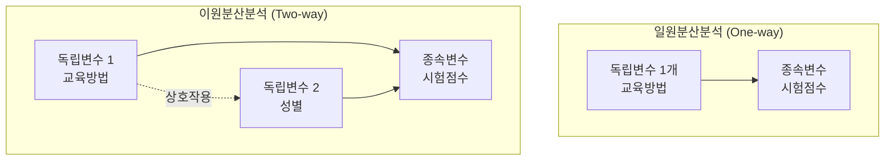
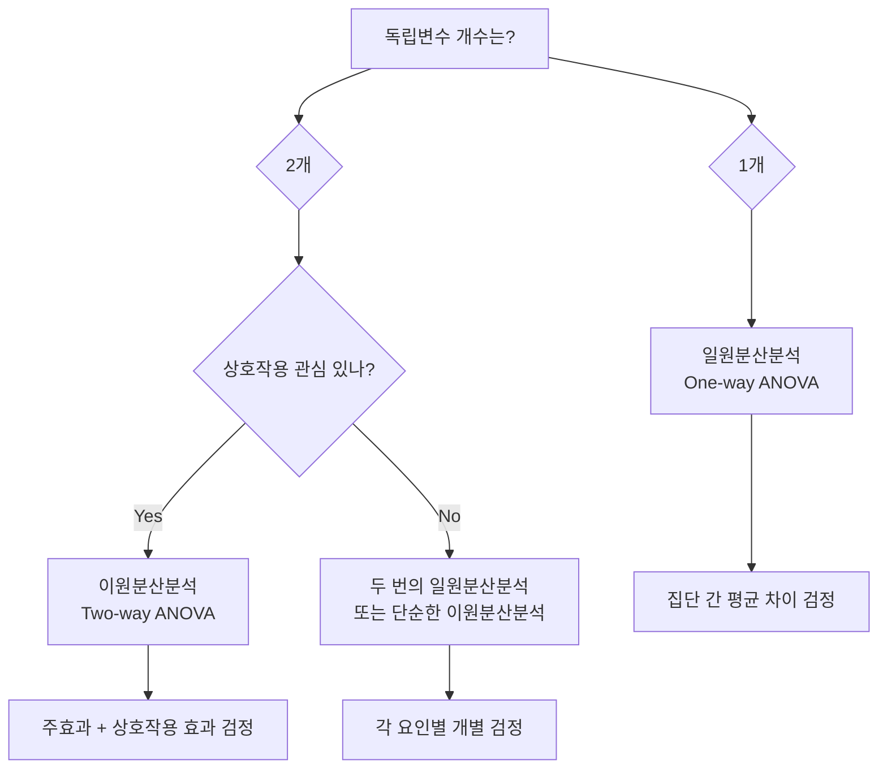

# 22.07.02 일원분산분석 vs 이원분산분석 완전 비교 가이드
*One-way ANOVA와 Two-way ANOVA의 모든 차이점*

---

## 🎯 핵심 개념 비교

### 📊 기본 정의

| 구분 | 일원분산분석 (One-way ANOVA) | 이원분산분석 (Two-way ANOVA) |
|------|---------------------------|---------------------------|
| **독립변수 개수** | **1개** 범주형 변수 | **2개** 범주형 변수 |
| **분석 목적** | 한 요인이 종속변수에 미치는 영향 | 두 요인의 개별 효과 + 상호작용 효과 |
| **검정 가설** | 1개 (집단 간 평균 차이) | 3개 (요인1, 요인2, 상호작용) |

### 🔍 시각적 차이



---

## 📚 실제 연구 예시 비교

### 🎓 교육 연구 사례

#### **일원분산분석 예시**
**연구 주제**: "교육방법이 학습효과에 미치는 영향"

```python
# 데이터 구조 (One-way ANOVA)
import pandas as pd

data_oneway = pd.DataFrame({
    'method': ['강의', '토론', '실습', '강의', '토론', '실습', ...],
    'score': [85, 78, 92, 87, 80, 89, ...]
})

print("=== 일원분산분석 데이터 구조 ===")
print(data_oneway.head())
#   method  score
# 0     강의     85
# 1     토론     78
# 2     실습     92
```

**분석 질문**: 
- 교육방법(강의/토론/실습)에 따라 점수가 다른가?

#### **이원분산분석 예시**  
**연구 주제**: "교육방법과 성별이 학습효과에 미치는 영향"

```python
# 데이터 구조 (Two-way ANOVA)
data_twoway = pd.DataFrame({
    'method': ['강의', '토론', '실습', '강의', '토론', '실습', ...],
    'gender': ['남', '여', '남', '여', '남', '여', ...],
    'score': [85, 78, 92, 87, 80, 89, ...]
})

print("=== 이원분산분석 데이터 구조 ===")
print(data_twoway.head())
#   method gender  score
# 0     강의      남     85
# 1     토론      여     78
# 2     실습      남     92
```

**분석 질문**:
- 교육방법에 따라 점수가 다른가? (주효과 1)
- 성별에 따라 점수가 다른가? (주효과 2)  
- 교육방법과 성별의 조합에 따라 점수가 달라지는가? (상호작용)

---

## 💻 Python 코드 비교

### 🔬 일원분산분석 코드

```python
from scipy import stats
from statsmodels.formula.api import ols
import statsmodels.api as sm

# === 방법 1: scipy 사용 ===
group1 = data_oneway[data_oneway['method'] == '강의']['score']
group2 = data_oneway[data_oneway['method'] == '토론']['score'] 
group3 = data_oneway[data_oneway['method'] == '실습']['score']

f_stat, p_value = stats.f_oneway(group1, group2, group3)
print(f"F-통계량: {f_stat:.4f}, p-value: {p_value:.4f}")

# === 방법 2: statsmodels 사용 ===
model_oneway = ols('score ~ C(method)', data=data_oneway).fit()
anova_oneway = sm.stats.anova_lm(model_oneway, type=2)
print("=== 일원분산분석 결과 ===")
print(anova_oneway)
```

### 🔬 이원분산분석 코드

```python
# === 이원분산분석 (상호작용 포함) ===
model_twoway = ols('score ~ C(method) + C(gender) + C(method):C(gender)', 
                   data=data_twoway).fit()
anova_twoway = sm.stats.anova_lm(model_twoway, type=2)
print("=== 이원분산분석 결과 ===")
print(anova_twoway)

# === 상호작용 없는 모델 (참고) ===
model_no_interaction = ols('score ~ C(method) + C(gender)', 
                          data=data_twoway).fit()
```

---

## 📊 결과표 해석 비교

### 📋 일원분산분석 결과표

```
                df    sum_sq   mean_sq         F    PR(>F)
C(method)      2.0    245.67   122.835    5.234   0.0089
Residual      87.0   2041.33    23.463      NaN      NaN
```

**해석**:
- **1개의 검정**: 교육방법 효과만 확인
- **p = 0.0089 < 0.05**: 교육방법에 따른 유의한 차이 존재

### 📋 이원분산분석 결과표

```
                      df    sum_sq   mean_sq         F    PR(>F)
C(method)            2.0    245.67   122.835    5.234   0.0089
C(gender)            1.0     98.45    98.450    4.195   0.0442
C(method):C(gender)  2.0     15.23     7.615    0.324   0.7234
Residual            84.0   1971.65    23.472      NaN      NaN
```

**해석**:
- **3개의 검정**: 
  1. 교육방법 주효과: p = 0.0089 < 0.05 ✅ **유의**
  2. 성별 주효과: p = 0.0442 < 0.05 ✅ **유의**
  3. 상호작용 효과: p = 0.7234 > 0.05 ❌ **비유의**

---

## 🎯 가설 설정 비교

### 🔍 일원분산분석 가설

```
H₀: μ₁ = μ₂ = μ₃ (모든 집단의 평균이 같다)
H₁: 적어도 하나의 집단 평균이 다르다

여기서:
μ₁ = 강의 집단의 모평균
μ₂ = 토론 집단의 모평균  
μ₃ = 실습 집단의 모평균
```

### 🔍 이원분산분석 가설 (3개 동시 검정)

#### 📊 주효과 1 (교육방법)
```
H₀₁: 교육방법에 따른 평균 차이가 없다
H₁₁: 교육방법에 따른 평균 차이가 있다
```

#### 📊 주효과 2 (성별)  
```
H₀₂: 성별에 따른 평균 차이가 없다
H₁₂: 성별에 따른 평균 차이가 있다
```

#### 📊 상호작용 효과
```
H₀₃: 교육방법과 성별의 상호작용 효과가 없다
H₁₃: 교육방법과 성별의 상호작용 효과가 있다
```

---

## 🎨 시각화 비교

### 📊 일원분산분석 시각화

```python
import matplotlib.pyplot as plt
import seaborn as sns

# 1. 집단별 박스플롯
plt.figure(figsize=(15, 5))

plt.subplot(1, 3, 1)
sns.boxplot(x='method', y='score', data=data_oneway)
plt.title('교육방법별 점수 분포')

plt.subplot(1, 3, 2)  
sns.barplot(x='method', y='score', data=data_oneway, ci=95)
plt.title('교육방법별 평균 점수')

plt.subplot(1, 3, 3)
sns.violinplot(x='method', y='score', data=data_oneway)
plt.title('교육방법별 점수 분포 (상세)')

plt.tight_layout()
plt.show()
```

### 📊 이원분산분석 시각화

```python
plt.figure(figsize=(15, 10))

# 1. 요인별 주효과
plt.subplot(2, 3, 1)
sns.boxplot(x='method', y='score', data=data_twoway)
plt.title('교육방법 주효과')

plt.subplot(2, 3, 2)
sns.boxplot(x='gender', y='score', data=data_twoway)  
plt.title('성별 주효과')

# 2. 상호작용 효과 시각화
plt.subplot(2, 3, 3)
sns.pointplot(x='method', y='score', hue='gender', data=data_twoway)
plt.title('상호작용 효과 (선이 평행하면 상호작용 없음)')

# 3. 히트맵
plt.subplot(2, 3, 4)
pivot_table = data_twoway.pivot_table(values='score', index='gender', columns='method')
sns.heatmap(pivot_table, annot=True, cmap='YlOrRd')
plt.title('교육방법 × 성별 평균점수')

# 4. 집단별 상세 비교
plt.subplot(2, 3, 5)
sns.boxplot(x='method', y='score', hue='gender', data=data_twoway)
plt.title('모든 조합별 점수 분포')

# 5. 상호작용 분해
plt.subplot(2, 3, 6)
sns.barplot(x='method', y='score', hue='gender', data=data_twoway)
plt.title('집단별 평균 비교')

plt.tight_layout()
plt.show()
```

---

## 🔬 상호작용 효과 완전 이해

### 🎯 상호작용이 없는 경우

```
         남성    여성
강의     80      82    (성별 차이: +2점)
토론     75      77    (성별 차이: +2점)  
실습     85      87    (성별 차이: +2점)
```

→ **모든 교육방법에서 성별 차이가 일정함** (평행선)

### 🔥 상호작용이 있는 경우

```
         남성    여성
강의     80      85    (성별 차이: +5점)
토론     75      72    (성별 차이: -3점)
실습     85      88    (성별 차이: +3점)
```

→ **교육방법에 따라 성별 차이가 다름** (교차하는 선)

### 📊 상호작용 해석 가이드

```python
# 상호작용 그래프 해석법
def interpret_interaction_plot():
    """
    상호작용 플롯 해석 가이드:
    
    1. 평행선 → 상호작용 없음
       - 한 요인의 효과가 다른 요인 수준과 무관하게 일정
       
    2. 교차하는 선 → 상호작용 있음  
       - 한 요인의 효과가 다른 요인 수준에 따라 달라짐
       - 더 복잡한 해석 필요
       
    3. 수렴/발산하는 선 → 부분적 상호작용
       - 효과 크기는 다르지만 방향은 같음
    """
    pass
```

---

## 📈 언제 어떤 분석을 사용할까?

### 🎯 일원분산분석 선택 기준

✅ **다음 상황에서 사용**:
- 독립변수가 **1개**만 있을 때
- 단순한 집단 비교가 목적일 때  
- 다른 요인의 영향을 고려하지 않아도 될 때
- 초기 탐색적 분석 단계

**예시**:
- 브랜드별 만족도 비교
- 치료법별 효과 비교
- 학과별 성적 비교

### 🎯 이원분산분석 선택 기준

✅ **다음 상황에서 사용**:
- 독립변수가 **2개** 있을 때
- **상호작용 효과**를 확인하고 싶을 때
- 더 정교한 분석이 필요할 때
- 통제 변수를 포함하고 싶을 때

**예시**:
- 교육방법 × 성별이 학습에 미치는 영향
- 약물 × 용량이 치료에 미치는 영향  
- 마케팅 채널 × 지역이 매출에 미치는 영향

### 🚨 주의사항

#### 일원분산분석의 한계
- **숨겨진 요인** 무시 위험
- **Simpson's Paradox** 가능성
- 단순한 결론만 가능

#### 이원분산분석의 복잡성
- **해석 복잡성** 증가  
- **표본 크기** 더 많이 필요
- **균형 설계** 중요

---

## 📊 실무 적용 체크리스트

### ✅ 분석 전 확인사항

| 항목 | 일원분산분석 | 이원분산분석 |
|------|-------------|-------------|
| **최소 표본 크기** | 각 집단 15개 이상 | 각 조합 10개 이상 |
| **정규성** | 각 집단별 확인 | 각 조합별 확인 |
| **등분산성** | Levene 검정 | Levene 검정 |
| **독립성** | 관측치 독립성 | 관측치 독립성 |
| **균형 설계** | 권장 (필수 아님) | 권장 (상호작용 해석 위해) |

### 🎯 결과 해석 순서

#### 일원분산분석
1. **F-통계량과 p-value** 확인
2. **유의하면** 사후검정 실시  
3. **효과크기** 계산 및 해석
4. **실무적 의미** 부여

#### 이원분산분석  
1. **상호작용 효과** 먼저 확인
2. **상호작용이 유의하면** → 세부 분석 (단순 주효과)
3. **상호작용이 비유의하면** → 주효과 해석
4. **사후검정** 및 **효과크기** 계산
5. **종합적 해석** 및 **실무 제안**

---

## 🚀 실전 예제 비교

### 🏥 의료 연구 사례

#### **일원분산분석 버전**
**연구**: "치료법이 회복시간에 미치는 영향"

```python
# 데이터 예시
medical_oneway = pd.DataFrame({
    'treatment': ['약물A', '약물B', '약물C'] * 30,
    'recovery_time': [12, 15, 10, 13, 16, 9, ...]  # 회복시간(일)
})

# 분석
model = ols('recovery_time ~ C(treatment)', data=medical_oneway).fit()
result = sm.stats.anova_lm(model, type=2)
```

**결론**: "약물 종류에 따라 회복시간에 차이가 있다"

#### **이원분산분석 버전**  
**연구**: "치료법과 성별이 회복시간에 미치는 영향"

```python
# 데이터 예시  
medical_twoway = pd.DataFrame({
    'treatment': ['약물A', '약물B', '약물C'] * 20,
    'gender': ['남', '여'] * 30, 
    'recovery_time': [12, 15, 10, 13, 16, 9, ...]
})

# 분석
model = ols('recovery_time ~ C(treatment) + C(gender) + C(treatment):C(gender)', 
           data=medical_twoway).fit()
result = sm.stats.anova_lm(model, type=2)
```

**결론**: 
- "약물 종류가 회복시간에 영향을 준다"
- "성별이 회복시간에 영향을 준다"  
- "약물 효과는 성별에 관계없이 일정하다 (상호작용 없음)"

---

## 🎓 핵심 요약

### 📊 차이점 한눈에 보기

| 구분 | 일원분산분석 | 이원분산분석 |
|------|-------------|-------------|
| **복잡도** | ⭐⭐ 단순 | ⭐⭐⭐⭐ 복잡 |
| **정보량** | ⭐⭐⭐ 기본 | ⭐⭐⭐⭐⭐ 풍부 |
| **해석 난이도** | ⭐⭐ 쉬움 | ⭐⭐⭐⭐ 어려움 |
| **실무 활용도** | ⭐⭐⭐ 기초 분석 | ⭐⭐⭐⭐⭐ 정교한 분석 |

### 🎯 선택 기준 요약



### 💡 실무 팁

1. **시작은 일원분산분석으로**: 간단한 것부터 시작해서 점진적 복잡화
2. **상호작용을 의심하라**: 실무에서는 대부분 여러 요인이 복합적으로 작용
3. **균형 설계를 추구하라**: 각 조합별 동일한 표본 크기가 이상적
4. **시각화는 필수**: 특히 이원분산분석에서 상호작용 패턴 확인
5. **효과크기도 보고하라**: 통계적 유의성과 실무적 중요성은 다름

---

**다음 22.07.03에서는 ANOVA의 가정 위반 시 대처법과 비모수 대안을 다뤄보겠습니다!** 🚀