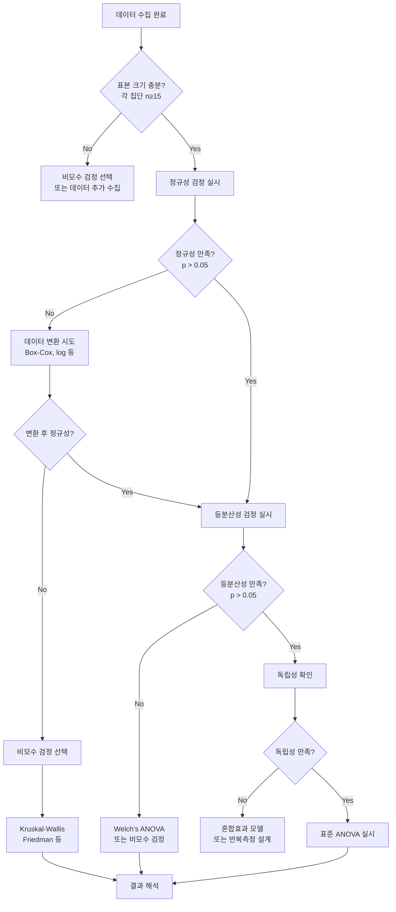

# 22.07.03 ANOVA 가정 위반 시 대처법과 비모수 대안
*현실 데이터는 완벽하지 않다 - 실무에서 마주치는 문제들과 해결책*

---

## 🚨 현실의 벽: ANOVA 가정들이 깨질 때

실무에서 데이터를 분석하다 보면 **"교과서적인 완벽한 데이터"**는 거의 없습니다. 대부분의 실제 데이터는 ANOVA의 기본 가정을 위반하는 경우가 많죠.

### 🎯 ANOVA의 3대 핵심 가정

| 가정 | 의미 | 위반 시 문제점 |
|------|------|-------------|
| **정규성** | 각 집단 데이터가 정규분포를 따름 | 잘못된 p-value, 신뢰구간 왜곡 |
| **등분산성** | 모든 집단의 분산이 동일함 | 제1종/제2종 오류율 증가 |
| **독립성** | 관측값들이 서로 독립적임 | 자유도 오해석, 검정력 문제 |

---

## 🔍 가정 위반 진단법

### 📊 1. 정규성 검정

#### 🧪 통계적 검정법

```python
import pandas as pd
import numpy as np
from scipy import stats
import matplotlib.pyplot as plt
import seaborn as sns

def check_normality(data, group_col, value_col):
    """정규성 검정 종합 함수"""
    
    print("=== 정규성 검정 결과 ===")
    
    groups = data[group_col].unique()
    results = {}
    
    for group in groups:
        group_data = data[data[group_col] == group][value_col]
        
        # 1. Shapiro-Wilk 검정 (n < 50 권장)
        shapiro_stat, shapiro_p = stats.shapiro(group_data)
        
        # 2. Anderson-Darling 검정 (더 강력함)
        anderson_result = stats.anderson(group_data, dist='norm')
        
        # 3. Kolmogorov-Smirnov 검정
        ks_stat, ks_p = stats.kstest(group_data, 'norm',
                                    args=(group_data.mean(), group_data.std()))
        
        results[group] = {
            'shapiro_p': shapiro_p,
            'anderson_stat': anderson_result.statistic,
            'ks_p': ks_p,
            'sample_size': len(group_data)
        }
        
        print(f"\n--- {group} 집단 (n={len(group_data)}) ---")
        print(f"Shapiro-Wilk: p = {shapiro_p:.4f}")
        print(f"Anderson-Darling: 통계량 = {anderson_result.statistic:.4f}")
        print(f"KS 검정: p = {ks_p:.4f}")
        
        # 판정
        if shapiro_p > 0.05:
            print("✅ 정규성 가정 만족")
        else:
            print("❌ 정규성 가정 위반")
    
    return results

# 사용 예시
# normality_results = check_normality(data, 'treatment', 'score')
```

#### 📈 시각적 진단법

```python
def plot_normality_diagnostics(data, group_col, value_col):
    """정규성 시각적 진단"""
    
    groups = data[group_col].unique()
    n_groups = len(groups)
    
    fig, axes = plt.subplots(2, n_groups, figsize=(4*n_groups, 8))
    
    for i, group in enumerate(groups):
        group_data = data[data[group_col] == group][value_col]
        
        # 1. Q-Q Plot (가장 중요!)
        stats.probplot(group_data, dist="norm", plot=axes[0, i])
        axes[0, i].set_title(f'{group} - Q-Q Plot')
        axes[0, i].grid(True)
        
        # 2. 히스토그램 + 정규분포 곡선
        axes[1, i].hist(group_data, bins=15, density=True, alpha=0.7, 
                       color='skyblue', edgecolor='black')
        
        # 정규분포 곡선 그리기
        x = np.linspace(group_data.min(), group_data.max(), 100)
        normal_curve = stats.norm.pdf(x, group_data.mean(), group_data.std())
        axes[1, i].plot(x, normal_curve, 'r-', linewidth=2, label='정규분포')
        
        axes[1, i].set_title(f'{group} - 분포 비교')
        axes[1, i].legend()
        axes[1, i].grid(True, alpha=0.3)
    
    plt.tight_layout()
    plt.show()

# Q-Q Plot 해석법
print("""
📊 Q-Q Plot 해석 가이드:
✅ 점들이 직선 위에 위치 → 정규분포
❌ S자 곡선 → 치우침(skewness)
❌ 곡선 형태 → 첨도(kurtosis) 문제  
❌ 끝부분 벗어남 → 이상치 존재
""")
```

### ⚖️ 2. 등분산성 검정

```python
def check_homogeneity(data, group_col, value_col):
    """등분산성 검정 종합 함수"""
    
    print("=== 등분산성 검정 결과 ===")
    
    groups = [data[data[group_col] == group][value_col] 
              for group in data[group_col].unique()]
    
    # 1. Levene 검정 (가장 일반적, 정규성 가정 약함)
    levene_stat, levene_p = stats.levene(*groups)
    
    # 2. Bartlett 검정 (정규성 가정 강함, 더 민감)
    bartlett_stat, bartlett_p = stats.bartlett(*groups)
    
    # 3. Fligner-Killeen 검정 (비모수적, 가장 강건함)
    fligner_stat, fligner_p = stats.fligner(*groups)
    
    print(f"Levene 검정: F = {levene_stat:.4f}, p = {levene_p:.4f}")
    print(f"Bartlett 검정: χ² = {bartlett_stat:.4f}, p = {bartlett_p:.4f}")
    print(f"Fligner 검정: χ² = {fligner_stat:.4f}, p = {fligner_p:.4f}")
    
    # 종합 판정
    tests_passed = sum([levene_p > 0.05, bartlett_p > 0.05, fligner_p > 0.05])
    
    if tests_passed >= 2:
        print("✅ 등분산성 가정 대체로 만족")
    else:
        print("❌ 등분산성 가정 위반 의심")
        print("💡 Welch's ANOVA 또는 비모수 검정 고려")
    
    return {
        'levene_p': levene_p,
        'bartlett_p': bartlett_p, 
        'fligner_p': fligner_p
    }

# 시각적 등분산성 진단
def plot_homogeneity_diagnostics(data, group_col, value_col):
    """등분산성 시각적 진단"""
    
    plt.figure(figsize=(15, 5))
    
    # 1. 박스플롯 (분산 차이 확인)
    plt.subplot(1, 3, 1)
    sns.boxplot(x=group_col, y=value_col, data=data)
    plt.title('집단별 분산 비교 (박스플롯)')
    plt.xticks(rotation=45)
    
    # 2. 표준편차 비교
    plt.subplot(1, 3, 2)
    group_stats = data.groupby(group_col)[value_col].agg(['mean', 'std'])
    plt.bar(group_stats.index, group_stats['std'], alpha=0.7)
    plt.title('집단별 표준편차')
    plt.ylabel('표준편차')
    plt.xticks(rotation=45)
    
    # 3. 잔차 산점도 (Residual Plot)
    plt.subplot(1, 3, 3)
    for group in data[group_col].unique():
        group_data = data[data[group_col] == group]
        group_mean = group_data[value_col].mean()
        residuals = group_data[value_col] - group_mean
        fitted = [group_mean] * len(residuals)
        plt.scatter(fitted, residuals, alpha=0.6, label=group)
    
    plt.axhline(y=0, color='red', linestyle='--')
    plt.xlabel('적합값')
    plt.ylabel('잔차')
    plt.title('잔차 산점도')
    plt.legend()
    
    plt.tight_layout()
    plt.show()
```

### 🔗 3. 독립성 검정

```python
def check_independence(data, group_col, value_col, id_col=None):
    """독립성 진단"""
    
    print("=== 독립성 진단 ===")
    
    # 1. 데이터 수집 방법 확인
    print("🔍 다음 사항들을 확인하세요:")
    print("   • 무작위 표집인가?")
    print("   • 같은 대상의 반복 측정인가?")
    print("   • 시간순 데이터인가?")
    print("   • 공간적 군집이 있는가?")
    
    # 2. 자기상관 검정 (시계열 데이터인 경우)
    if id_col:
        from statsmodels.stats.diagnostic import acorr_ljungbox
        
        # 각 집단별로 자기상관 검정
        for group in data[group_col].unique():
            group_data = data[data[group_col] == group].sort_values(id_col)
            
            if len(group_data) > 10:  # 충분한 데이터가 있을 때만
                lb_stat, lb_p = acorr_ljungbox(group_data[value_col], 
                                               lags=1, return_df=False)
                print(f"{group}: Ljung-Box p-value = {lb_p[0]:.4f}")
                
                if lb_p[0] < 0.05:
                    print(f"   ❌ {group}에서 자기상관 의심")
                else:
                    print(f"   ✅ {group}에서 독립성 만족")
    
    # 3. 클러스터링 효과 확인
    print(f"\n📊 데이터 분포 확인:")
    print(f"   총 관측치 수: {len(data)}")
    print(f"   집단별 관측치 수:")
    print(data[group_col].value_counts())
```

---

## 🛠️ 가정 위반 시 대처법

### 📈 1. 정규성 위반 대처법

#### 🔄 데이터 변환법

```python
def data_transformation_options(data, value_col):
    """데이터 변환 옵션들"""
    
    original_data = data[value_col]
    
    transformations = {
        'log': np.log(original_data + 1),  # +1: 0값 처리
        'sqrt': np.sqrt(original_data),
        'reciprocal': 1 / (original_data + 1),
        'square': original_data ** 2,
        'cube_root': np.cbrt(original_data)
    }
    
    plt.figure(figsize=(15, 10))
    
    # 원본 데이터
    plt.subplot(2, 3, 1)
    plt.hist(original_data, bins=20, alpha=0.7, color='blue')
    plt.title('원본 데이터')
    
    # 변환된 데이터들
    for i, (name, transformed) in enumerate(transformations.items(), 2):
        plt.subplot(2, 3, i)
        plt.hist(transformed, bins=20, alpha=0.7, color='red')
        plt.title(f'{name.title()} 변환')
    
    plt.tight_layout()
    plt.show()
    
    # 각 변환에 대해 정규성 검정
    print("=== 변환 후 정규성 검정 ===")
    for name, transformed in transformations.items():
        if not np.isnan(transformed).any() and not np.isinf(transformed).any():
            _, p_value = stats.shapiro(transformed[:5000])  # 표본 크기 제한
            print(f"{name.title()} 변환: p = {p_value:.4f}")

# Box-Cox 변환 (자동 최적화)
def boxcox_transformation(data, value_col):
    """Box-Cox 변환 (자동으로 최적 람다 찾기)"""
    
    from scipy.stats import boxcox
    
    # 양수만 가능하므로 조정
    original_data = data[value_col]
    if original_data.min() <= 0:
        adjusted_data = original_data - original_data.min() + 1
    else:
        adjusted_data = original_data
    
    # Box-Cox 변환
    transformed_data, optimal_lambda = boxcox(adjusted_data)
    
    print(f"최적 람다 값: {optimal_lambda:.4f}")
    
    # 변환 전후 비교
    plt.figure(figsize=(12, 4))
    
    plt.subplot(1, 2, 1)
    plt.hist(adjusted_data, bins=20, alpha=0.7, color='blue')
    plt.title('변환 전')
    
    plt.subplot(1, 2, 2)
    plt.hist(transformed_data, bins=20, alpha=0.7, color='red')
    plt.title(f'Box-Cox 변환 후 (λ={optimal_lambda:.3f})')
    
    plt.tight_layout()
    plt.show()
    
    # 정규성 검정
    _, p_before = stats.shapiro(adjusted_data[:5000])
    _, p_after = stats.shapiro(transformed_data[:5000])
    
    print(f"변환 전 정규성: p = {p_before:.4f}")
    print(f"변환 후 정규성: p = {p_after:.4f}")
    
    return transformed_data, optimal_lambda
```

#### 🎯 변환 선택 가이드

| 데이터 특성 | 추천 변환 | 설명 |
|------------|----------|------|
| **오른쪽 치우침** | log, sqrt | 큰 값들을 압축 |
| **왼쪽 치우침** | square | 작은 값들을 확장 |
| **양극단 이상치** | reciprocal | 극값들을 중앙으로 |
| **모든 양수 데이터** | Box-Cox | 자동으로 최적 변환 찾기 |

### ⚖️ 2. 등분산성 위반 대처법

#### 🔧 Welch's ANOVA (수정된 F-검정)

```python
def welch_anova(data, group_col, value_col):
    """Welch's ANOVA (등분산 가정 없음)"""
    
    from scipy.stats import f_oneway
    
    groups = [data[data[group_col] == group][value_col] 
              for group in data[group_col].unique()]
    
    # 일반 ANOVA (등분산 가정)
    f_stat_regular, p_regular = f_oneway(*groups)
    
    # Welch's ANOVA (등분산 가정 없음)
    # scipy에는 직접 구현이 없어서 수동 계산
    def welch_f_statistic(groups):
        k = len(groups)  # 집단 수
        n_total = sum(len(group) for group in groups)
        
        # 각 집단의 통계량
        means = [np.mean(group) for group in groups]
        vars = [np.var(group, ddof=1) for group in groups]
        ns = [len(group) for group in groups]
        
        # 가중 평균
        weights = [n/var for n, var in zip(ns, vars)]
        weighted_mean = sum(w*m for w, m in zip(weights, means)) / sum(weights)
        
        # Welch F-통계량
        numerator = sum(w * (m - weighted_mean)**2 for w, m in zip(weights, means)) / (k - 1)
        
        # 수정된 분모
        denominator_parts = [(1 - w/sum(weights))**2 / (n-1) 
                           for w, n in zip(weights, ns)]
        denominator = 1 + (2 * (k-2) / (k**2 - 1)) * sum(denominator_parts)
        
        welch_f = numerator / denominator
        
        # 자유도 계산
        df1 = k - 1
        df2 = (k**2 - 1) / (3 * sum(denominator_parts))
        
        return welch_f, df1, df2
    
    welch_f, df1, df2 = welch_f_statistic(groups)
    p_welch = 1 - stats.f.cdf(welch_f, df1, df2)
    
    print("=== ANOVA 결과 비교 ===")
    print(f"일반 ANOVA:  F = {f_stat_regular:.4f}, p = {p_regular:.4f}")
    print(f"Welch ANOVA: F = {welch_f:.4f}, p = {p_welch:.4f}")
    
    if abs(p_regular - p_welch) > 0.01:
        print("⚠️  두 결과가 다릅니다. Welch 결과를 신뢰하세요.")
    
    return {
        'regular_f': f_stat_regular,
        'regular_p': p_regular,
        'welch_f': welch_f,
        'welch_p': p_welch
    }
```

#### 🎨 분산 안정화 변환

```python
def variance_stabilizing_transforms(data, value_col):
    """분산 안정화 변환들"""
    
    original = data[value_col]
    
    transforms = {
        'sqrt': np.sqrt(original),
        'arcsine': np.arcsin(np.sqrt(original / original.max())),  # 비율 데이터용
        'log': np.log(original + 1)
    }
    
    # 변환별 분산 비교
    print("=== 변환별 분산 비교 ===")
    print(f"원본 데이터 분산: {original.var():.4f}")
    
    for name, transformed in transforms.items():
        if not np.isnan(transformed).any():
            print(f"{name.title()} 변환 후 분산: {transformed.var():.4f}")
```

---

## 🔄 비모수 대안들

정규성이나 등분산성 가정이 심각하게 위반된 경우, **비모수 검정**을 사용합니다.

### 🎯 1. 일원분산분석 → Kruskal-Wallis 검정

```python
def kruskal_wallis_test(data, group_col, value_col):
    """Kruskal-Wallis 검정 (비모수 일원분산분석)"""
    
    from scipy.stats import kruskal
    
    groups = [data[data[group_col] == group][value_col] 
              for group in data[group_col].unique()]
    
    # Kruskal-Wallis 검정
    h_stat, p_value = kruskal(*groups)
    
    print("=== Kruskal-Wallis 검정 결과 ===")
    print(f"H-통계량: {h_stat:.4f}")
    print(f"p-value: {p_value:.4f}")
    
    if p_value < 0.05:
        print("✅ 집단 간 유의한 차이 존재")
        print("💡 사후검정(Dunn's test) 필요")
    else:
        print("❌ 집단 간 유의한 차이 없음")
    
    # 효과크기 계산 (Eta-squared 근사)
    n = len(data)
    k = len(groups)
    eta_squared = (h_stat - k + 1) / (n - k)
    print(f"효과크기 (η²): {eta_squared:.4f}")
    
    return h_stat, p_value

# Kruskal-Wallis 사후검정 (Dunn's test)
def dunn_test(data, group_col, value_col):
    """Dunn's 사후검정"""
    
    try:
        import scikit_posthocs as sp
        
        # Dunn's test
        dunn_results = sp.posthoc_dunn(data, val_col=value_col, 
                                      group_col=group_col, p_adjust='bonferroni')
        
        print("=== Dunn's 사후검정 결과 ===")
        print("(Bonferroni 보정된 p-values)")
        print(dunn_results)
        
        return dunn_results
        
    except ImportError:
        print("scikit-posthocs 패키지가 필요합니다: pip install scikit-posthocs")
        
        # 수동 구현 (간단 버전)
        from itertools import combinations
        from scipy.stats import rankdata
        
        groups = data[group_col].unique()
        n_comparisons = len(list(combinations(groups, 2)))
        
        print(f"📊 {n_comparisons}개의 쌍별 비교 필요")
        print("💡 각 쌍에 대해 Mann-Whitney U 검정 실시 권장")
```

### 🎯 2. 이원분산분석 → Aligned Rank Transform (ART)

```python
def aligned_rank_transform_anova(data, factor1, factor2, value_col):
    """Aligned Rank Transform ANOVA (비모수 이원분산분석)"""
    
    print("=== Aligned Rank Transform ANOVA ===")
    print("복잡한 절차이므로 R의 ARTool 패키지 사용을 권장합니다.")
    
    # 간단한 대안: 각 요인별로 Kruskal-Wallis 검정
    print("\n🔧 간단한 대안:")
    
    # 요인1 효과
    print(f"--- {factor1} 주효과 ---")
    h1, p1 = kruskal_wallis_test(data, factor1, value_col)
    
    # 요인2 효과  
    print(f"\n--- {factor2} 주효과 ---")
    h2, p2 = kruskal_wallis_test(data, factor2, value_col)
    
    print(f"\n⚠️  상호작용 효과는 별도 분석 필요")
    print(f"💡 Scheirer-Ray-Hare 검정 또는 R의 ARTool 사용 권장")
    
    return {'factor1_p': p1, 'factor2_p': p2}
```

### 🎯 3. 대응표본 → Friedman 검정

```python
def friedman_test(data, subject_col, condition_col, value_col):
    """Friedman 검정 (비모수 반복측정 ANOVA)"""
    
    from scipy.stats import friedmanchisquare
    
    # 데이터를 조건별로 분리
    conditions = data[condition_col].unique()
    condition_data = []
    
    for condition in conditions:
        condition_values = data[data[condition_col] == condition][value_col]
        condition_data.append(condition_values)
    
    # Friedman 검정
    chi2_stat, p_value = friedmanchisquare(*condition_data)
    
    print("=== Friedman 검정 결과 ===")
    print(f"χ² 통계량: {chi2_stat:.4f}")
    print(f"p-value: {p_value:.4f}")
    
    if p_value < 0.05:
        print("✅ 조건 간 유의한 차이 존재")
        print("💡 Wilcoxon 부호순위 검정으로 사후분석 필요")
    else:
        print("❌ 조건 간 유의한 차이 없음")
    
    return chi2_stat, p_value
```

---

## 🎯 비모수 검정 선택 가이드

### 📊 상황별 비모수 대안

| 모수 검정 | 비모수 대안 | 언제 사용? |
|----------|------------|----------|
| **일원 ANOVA** | **Kruskal-Wallis** | 정규성 위반, 서열척도 데이터 |
| **이원 ANOVA** | **ART ANOVA** | 복잡한 설계의 비모수 분석 |
| **대응표본 ANOVA** | **Friedman** | 반복측정, 정규성 위반 |
| **독립표본 t-검정** | **Mann-Whitney U** | 두 집단, 정규성 위반 |
| **대응표본 t-검정** | **Wilcoxon 부호순위** | 쌍체 비교, 정규성 위반 |

### 🔍 비모수 검정의 장단점

#### ✅ 장점
- **분포 가정 없음**: 정규성, 등분산성 불필요
- **이상치에 강건함**: 극값의 영향 최소화
- **서열척도 적용 가능**: 순위 기반 분석
- **해석 직관적**: 중앙값 기반 비교

#### ❌ 단점
- **검정력 손실**: 모수 검정보다 약간 낮음
- **상호작용 분석 어려움**: 복잡한 설계 제한적
- **효과크기 계산 복잡**: 표준화된 지표 부족
- **소프트웨어 지원 제한**: 일부 고급 분석 어려움

---

## 🚀 실무 의사결정 플로우차트

### 📋 ANOVA 가정 검토 → 분석법 선택



---

## 📊 실전 예제: 문제 해결 과정

### 🏥 의료 데이터 분석 사례

```python
# 가상의 의료 데이터
np.random.seed(42)

# 정규성과 등분산성을 위반하는 데이터 생성
treatment_a = np.random.exponential(2, 30)  # 지수분포 (치우침)
treatment_b = np.random.normal(5, 1, 30)    # 정규분포
treatment_c = np.random.lognormal(1, 0.5, 30)  # 로그정규분포 (큰 분산)

medical_data = pd.DataFrame({
    'treatment': ['A']*30 + ['B']*30 + ['C']*30,
    'recovery_time': np.concatenate([treatment_a, treatment_b, treatment_c])
})

print("=== 의료 데이터 분석: 치료법별 회복시간 비교 ===")

# 1단계: 기술통계
print("\n1️⃣ 기술통계")
print(medical_data.groupby('treatment')['recovery_time'].describe())

# 2단계: 가정 검토
print("\n2️⃣ ANOVA 가정 검토")

# 정규성 검정
normality_results = check_normality(medical_data, 'treatment', 'recovery_time')

# 등분산성 검정
homogeneity_results = check_homogeneity(medical_data, 'treatment', 'recovery_time')

# 3단계: 적절한 분석법 선택
print("\n3️⃣ 분석법 선택 및 실시")

if any(result['shapiro_p'] < 0.05 for result in normality_results.values()):
    print("⚠️  정규성 가정 위반 → 비모수 검정 실시")
    
    # Kruskal-Wallis 검정
    kruskal_results = kruskal_wallis_test(medical_data, 'treatment', 'recovery_time')
    
    # 사후검정
    if kruskal_results[1] < 0.05:  # p-value
        print("\n사후검정 실시...")
        dunn_results = dunn_test(medical_data, 'treatment', 'recovery_time')

else:
    print("✅ 정규성 가정 만족")
    
    if homogeneity_results['levene_p'] < 0.05:
        print("⚠️  등분산성 위반 → Welch's ANOVA 실시")
        welch_results = welch_anova(medical_data, 'treatment', 'recovery_time')
    else:
        print("✅ 등분산성 가정 만족 → 표준 ANOVA 실시")
        # 표준 ANOVA 실행...

# 4단계: 결과 시각화
print("\n4️⃣ 결과 시각화")
plot_normality_diagnostics(medical_data, 'treatment', 'recovery_time')
plot_homogeneity_diagnostics(medical_data, 'treatment', 'recovery_time')
```

---

## 💡 실무 팁과 주의사항

### 🎯 자주 하는 실수들

#### ❌ **하지 말아야 할 것들**

1. **가정 검토 생략**: "대충 정규분포겠지"
2. **유의성만 보고 판단**: 효과크기 무시
3. **변환 남발**: 해석이 어려워짐
4. **비모수 만능주의**: 항상 더 좋은 건 아님
5. **소프트웨어 맹신**: 결과의 의미 파악 없이 사용

#### ✅ **해야 할 것들**

1. **항상 탐색적 분석 먼저**: 데이터 분포 확인
2. **여러 가정 검토**: 하나씩 차례대로
3. **변환 전후 비교**: 해석 가능성 고려
4. **효과크기 병기**: 통계적 + 실무적 유의성
5. **결과의 한계 명시**: 가정 위반 시 주의점 언급

### 🔧 소프트웨어별 구현

#### Python 패키지 추천
```python
# 필수 패키지들
import pandas as pd
import numpy as np
from scipy import stats
import matplotlib.pyplot as plt
import seaborn as sns

# 고급 분석용
# pip install scikit-posthocs  # 비모수 사후검정
# pip install pingouin        # 통계분석 특화
# pip install statsmodels     # 고급 통계모델
```

#### R 패키지 (참고용)
```r
# 비모수 분석에 특히 강함
library(ARTool)     # Aligned Rank Transform
library(coin)       # 비모수 검정 모음
library(PMCMRplus)  # 사후검정 모음
library(car)        # ANOVA 진단
```

---

## 🎓 핵심 요약

### 📊 가정별 대처 전략

| 가정 위반 | 1차 대처 | 2차 대처 | 최종 대안 |
|---------|---------|---------|----------|
| **정규성** | 데이터 변환 | 대표본 활용 | 비모수 검정 |
| **등분산성** | 변환/Welch | 강건한 표준오차 | 비모수 검정 |
| **독립성** | 설계 수정 | 혼합효과 모델 | 클러스터링 보정 |

### 🎯 의사결정 우선순위

1. **데이터 품질 확보**: 충분한 표본 크기와 적절한 수집
2. **가정 진단**: 통계적 검정 + 시각적 확인
3. **변환 시도**: 해석 가능성을 해치지 않는 선에서
4. **적절한 대안 선택**: 연구 목적에 맞는 방법
5. **결과 해석 신중**: 한계점과 함께 보고

### 💫 실무자를 위한 황금률

> **"완벽한 데이터는 없다. 하지만 적절한 방법은 항상 있다."**

- 🔍 **진단이 먼저**: 가정 확인 → 방법 선택
- 🎯 **목적에 맞는 선택**: 탐색적 vs 확증적
- 📊 **투명한 보고**: 사용한 방법과 그 이유 명시
- 🚀 **지속적 학습**: 새로운 방법론 업데이트

---

**다음 22.07.04에서는 ANOVA 결과의 효과크기 계산과 실무적 해석에 대해 깊이 다뤄보겠습니다!** 🎯