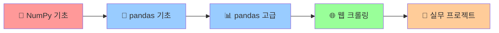

# 📚 데이터 사이언스 학습 로드맵

> **체계적인 학습 경로로 데이터 사이언스 마스터하기**  
> 기초부터 실무 활용까지, 단계별 완벽 가이드

---

## 🗺️ **전체 학습 여정 개요**



---

## 📍 **1단계: NumPy 기초 마스터** `[필수 기간: 1-2주]`

### 🎯 **학습 목표**
- 배열 기본 속성과 연산 완벽 이해
- 벡터화 연산으로 성능 최적화
- 실무 활용을 위한 핵심 개념 습득

### 📖 **핵심 학습 내용**
```python
# ✅ 반드시 익혀야 할 NumPy 핵심
• 배열 속성: shape, dtype, ndim, size
• 배열 생성: array(), zeros(), ones(), arange()
• 인덱싱 & 슬라이싱: [start:end:step]
• 브로드캐스팅: 다른 크기 배열 간 연산
• 유니버셜 함수: np.sin(), np.exp(), np.log()
• 집계 함수: sum(), mean(), std(), max(), min()
```

### 🔥 **실습 미션**
1. **추천 시스템 구현**: 사용자-아이템 유사도 계산
2. **이미지 분류**: 간단한 신경망 순전파
3. **PCA 차원축소**: 고차원 데이터 압축
4. **자연어 처리**: 문서 유사도 벡터 연산

### 📋 **체크포인트**
- [ ] 3차원 이상 배열 자유자재로 다루기
- [ ] 브로드캐스팅 원리 완벽 이해
- [ ] 내적 연산의 실무 활용 이해
- [ ] 10,000개 이상 데이터 빠른 연산 가능

---

## 📍 **2단계: pandas 기초 정착** `[필수 기간: 2-3주]`

### 🎯 **학습 목표**
- DataFrame과 Series 완벽 활용
- 데이터 탐색과 정제 기술 습득
- 그룹 연산과 피벗 테이블 마스터

### 📖 **핵심 학습 내용**
```python
# ✅ pandas 기초 완성 체크리스트
• 데이터 구조: DataFrame vs Series
• 데이터 로딩: read_csv(), read_excel(), read_json()
• 데이터 탐색: info(), describe(), value_counts()
• 인덱싱: loc[], iloc[], boolean indexing
• 데이터 정제: dropna(), fillna(), drop_duplicates()
• 그룹 연산: groupby().agg(), transform()
```

### 🔥 **실습 미션**
1. **판매 데이터 분석**: 월별/지역별 매출 집계
2. **고객 세그먼테이션**: RFM 분석 구현
3. **시계열 분석**: 주가 데이터 트렌드 분석
4. **결측치 처리**: 다양한 imputation 기법

### 📋 **체크포인트**
- [ ] 100MB 이상 CSV 파일 자유자재로 처리
- [ ] 복잡한 그룹 연산 한 번에 수행
- [ ] 데이터 품질 문제 빠르게 발견하고 해결
- [ ] 피벗 테이블로 인사이트 도출

---

## 📍 **3단계: pandas 고급 & 파일 처리** `[필수 기간: 1-2주]`

### 🎯 **학습 목표**
- 대용량 데이터 효율적 처리
- 다양한 파일 형식 완벽 지원
- 메모리 최적화 기술 습득

### 📖 **핵심 학습 내용**
```python
# ✅ 고급 pandas & 파일 처리
• 청크 처리: chunksize 매개변수 활용
• 파일 형식: CSV, Excel, JSON, Parquet, HDF5
• 인코딩: utf-8, cp949, utf-8-sig
• 메모리 최적화: dtype 변경, 카테고리형
• 병합 연산: merge(), join(), concat()
• 시계열: datetime 인덱싱, resampling
```

### 🔥 **실습 미션**
1. **대용량 로그 분석**: 1GB+ 파일 청크 처리
2. **다중 Excel 통합**: 여러 시트 데이터 병합
3. **API 데이터**: JSON 형식 실시간 처리
4. **배치 처리 시스템**: 자동화된 데이터 파이프라인

### 📋 **체크포인트**
- [ ] 1GB+ 데이터를 8GB RAM에서 처리 가능
- [ ] 5개 이상 파일 형식 자유자재로 변환
- [ ] 메모리 사용량 50% 이상 최적화 가능
- [ ] 복잡한 데이터 병합 작업 수행

---

## 📍 **4단계: 웹 크롤링 실전** `[필수 기간: 2-3주]`

### 🎯 **학습 목표**
- 실시간 데이터 수집 시스템 구축
- 웹 데이터와 pandas 완벽 연동
- 대규모 크롤링 프로젝트 수행

### 📖 **핵심 학습 내용**
```python
# ✅ 웹 크롤링 완성 가이드
• 웹 스크래핑: BeautifulSoup + requests
• CSS 선택자: 정확한 요소 선택
• 다중 페이지: 반복 처리 로직
• 데이터 정제: 정규표현식 활용
• 저장 전략: CSV, DB 연동
• 에러 처리: 안정적인 크롤러 구축
```

### 🔥 **실습 미션**
1. **뉴스 수집기**: 다중 언론사 기사 자동 수집
2. **부동산 데이터**: 아파트 시세 실시간 모니터링
3. **쇼핑몰 크롤러**: 가격 비교 서비스 구축
4. **소셜 미디어**: 트렌드 분석용 데이터 수집

### 📋 **체크포인트**
- [ ] 1일 10,000페이지 이상 안정적 수집
- [ ] 다양한 웹사이트 구조 분석 및 대응
- [ ] 수집 데이터의 pandas 자동 연동
- [ ] 에러 상황 처리 및 복구 시스템

---

## 📍 **5단계: 실무 프로젝트 완성** `[목표 기간: 3-4주]`

### 🎯 **최종 목표**
- 실무급 데이터 분석 프로젝트 완성
- 전체 데이터 파이프라인 구축
- 인사이트 도출 및 시각화

### 🚀 **프로젝트 아이디어**

#### **A. E-커머스 분석 대시보드**
```
📊 NumPy: 고객 유사도 계산
📊 pandas: 판매 데이터 분석
📊 크롤링: 경쟁사 가격 수집
📊 결과: 실시간 매출 대시보드
```

#### **B. 부동산 시세 예측 시스템**
```
🏠 NumPy: 가격 예측 모델링
🏠 pandas: 거래 데이터 분석
🏠 크롤링: 실시간 시세 수집
🏠 결과: 지역별 시세 예측
```

#### **C. 소셜 미디어 트렌드 분석**
```
📱 NumPy: 텍스트 벡터화
📱 pandas: 사용자 행동 분석
📱 크롤링: SNS 데이터 수집
📱 결과: 트렌드 예측 서비스
```

---

## ⚡ **빠른 참조 가이드**

### 🔗 **각 단계별 핵심 파일 링크**
| 단계 | 핵심 파일 | 주요 내용 |
|------|-----------|-----------|
| 1단계 | `02. 파이썬과 NumPy.md` | NumPy 기초 + 실무 예제 |
| 2-3단계 | `14. 판다스 파일 저장읽기.md` | pandas 파일 처리 완전정리 |
| 4단계 | `16. 웹 크롤링과 pandas.md` | BeautifulSoup + pandas 연동 |
| 고급 | `15. 청크 처리 알고리즘.md` | 대용량 데이터 처리 전략 |

### 🎓 **단계별 예상 학습 시간**
- **초급자** (프로그래밍 경험 1년 미만): 총 12-16주
- **중급자** (프로그래밍 경험 1-3년): 총 8-12주  
- **고급자** (프로그래밍 경험 3년 이상): 총 6-8주

### 💪 **성공 TIP**
1. **매일 실습**: 이론만으로는 절대 안 됨, 매일 코딩!
2. **실제 데이터**: 교육용이 아닌 실제 데이터로 연습
3. **오픈 소스**: GitHub에서 실제 프로젝트 참고
4. **커뮤니티**: 막힐 때는 Stack Overflow, 카카오톡 오픈 채팅 활용

---

## 🎯 **최종 목표: 데이터 사이언티스트가 되자!**

이 로드맵을 완주하면:
- ✅ **대용량 데이터** 처리 전문가
- ✅ **실시간 데이터 수집** 시스템 구축자  
- ✅ **데이터 기반 의사결정** 지원자
- ✅ **비즈니스 인사이트** 도출 전문가

**지금 바로 시작하세요! 데이터의 세계가 여러분을 기다리고 있습니다! 🚀**

---

*마지막 업데이트: 2025년 8월*  
*다음 업데이트 예정: 딥러닝 & AI 고급 과정 추가*