#### **Q8-2: AI 생태계에 대해 어느 정도 알고 있나요? (⭐ 선생님 핵심 강조!)**

**💡 답변 예시** (선생님 조언 완전 반영):
> "AI 생태계가 정말 빠르게 발전하고 있어서 계속 공부하고 있는 중입니다.
> 
> **모델 쪽**에서는 Llama 3이 정말 핫하잖아요. 오픈소스인데도 성능이 뛰어나서 많은 기업들이 도입하고 있고, Qwen같은 경우는 아시아권에서 특히 강점이 있더라고요.
> 
> **서빙 부분**도 중요한데, **vLLM**은 대용량 트래픽 처리할 때 성능이 엄청 좋고, **Ollama**는 보안이 중요한 환경에서 로컬로 돌릴 수 있어서 기업 고객들한테 어필할 수 있을 것 같아요. 실제로 어떤 서빙 플랫폼을 쓰느냐에 따라 성능이나 비용이 많이 달라지더라고요.
> 
> **개발 도구**로는 LangChain이 RAG 시스템 구축할 때 거의 필수인 것 같고, 벡터 데이터베이스도 Pinecone, Weaviate, Chroma 등 각각 특징이 다르죠.
> 
> 저희 회사 솔루션과 연결해보면, 고객사 상황에 따라 클라우드에서는 vLLM으로, 온프레미스에서는 Ollama로, 이런 식으로 다양한 옵션을 제공할 수 있을 것 같아요. 그리고 저희 가속기가 이런 다양한 플랫폼들과 잘 호환된다면 정말 강력한 솔루션이 될 것 같습니다.
> 
> 아직 배워야 할 게 많지만, 이런 생태계 전체를 이해하는 게 PM 역할에서는 정말 중요하다고 생각해요."#### **🎯 AI 생태계 전반 이해 (선생님 핵심 조언)**

> **"서빙 플랫폼이 어떤 것들이 있다. 이런 것들조차도 어떻게 보면 AI 생태계 쪽에 있으니까 그런 부분 AI 생태계에 뭐가 있는지 최대한 많이 공부를 해오면 된다"**

##### **전체 AI 생태계 맵**
```
모델 개발
├── 상용 모델: GPT-4, Claude, Gemini
├── 오픈소스: Llama 3, Qwen, Mistral
└── 특화 모델: Code Llama, Whisper

모델 서빙
├── 클라우드: OpenAI API, Anthropic Claude
├── 로컬: Ollama, LocalAI
├── 고성능: vLLM, TensorRT-LLM
└── 분산: Ray Serve, Kubernetes

개발 프레임워크
├── LangChain: 워크플로우 구성
├── LlamaIndex: 인덱싱 특화
├── Haystack: 검색 중심
└── AutoGPT: 자율 에이전트

데이터 처리
├── 벡터DB: Pinecone, Weaviate, Chroma
├── 임베딩: OpenAI, Sentence-BERT
├── 전처리: Unstructured, LangChain
└── 평가: BLEU, ROUGE, BERTScore
```

##### **면접에서 어필할 AI 생태계 지식**
1. **모델 선택 기준**: "상황에 따라 GPT-4 vs Llama 3 선택 가능"
2. **서빙 전략**: "트래픽에 따라 vLLM vs Ollama 구분 사용"
3. **개발 도구**: "LangChain으로 빠른 프로토타입, 최적화 단계에서 커스텀"
4. **인프라 이해**: "고객사 환경에 맞는 배포 전략 수립 가능"# 🚀 AI 반도체 회사 면접 완벽 대비 가이드

> **면접일**: 목요일  
> **포지션**: AI 엔지니어 (실제 PM + AI 엔지니어 복합 역할)  
> **회사**: AI 반도체 + LLM 종합 솔루션 기업

---

## 📊 회사 이해하기

### 🏢 회사 정체성 및 비즈니스 모델

**핵심 정체성**: AI 반도체 기반의 **종합 RAG 솔루션 회사**

- **기존 사업**: AI 반도체 개발
- **확장 영역**: LLM 및 전체 AI 생태계 솔루션
- **목표**: RAG(Retrieval-Augmented Generation) 전체 솔루션 제공

### 🔗 전체 솔루션 아키텍처

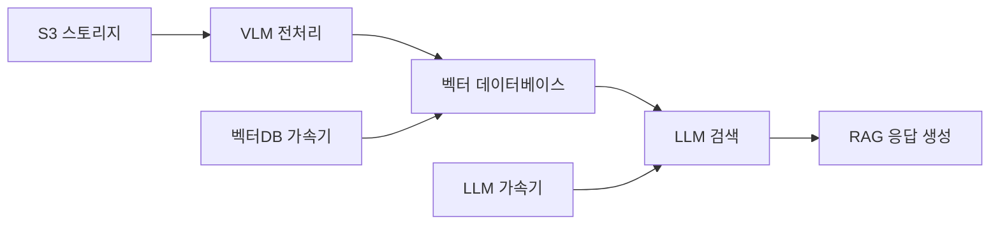

**솔루션 구성 요소**:
1. **데이터 입력**: S3 클라우드 스토리지 시스템
2. **전처리**: VLM(Vision Language Model)을 통한 데이터 변환
3. **저장**: 벡터 형태로 데이터베이스 저장
4. **검색**: LLM이 벡터DB에서 관련 정보 검색 (RAG)
5. **생성**: 검색된 정보 기반 최종 답변 생성

### 🎯 사업 영역별 분류

#### **하드웨어 영역**
- **LLM 가속기**: LLM 추론 속도 향상 전용 칩
- **벡터DB 가속기**: 벡터 검색 최적화 하드웨어

#### **소프트웨어 영역**
- **LLM 개발**: 자체 언어모델 구축
- **벡터 데이터베이스**: 고성능 벡터 저장/검색 시스템
- **클라우드 인프라**: 전체 솔루션 통합 플랫폼

#### **지원 본부 (면접 대상 부서)**
- **주요 업무**: 벡터 데이터베이스 및 스토리지 시스템 개발
- **핵심 역할**: RAG 솔루션의 데이터 저장/검색 엔진 담당
- **현재 상황**: 메인 사업으로 집중 투자 중

---

## 🔍 병목 지점 탐지 및 해결 완전 가이드

### 🎯 병목 지점이란?

#### **정의**
시스템 전체 성능을 제한하는 가장 느린 구간. 마치 **물병의 목** 부분처럼 아무리 몸통이 커도 목이 좁으면 물이 천천히 나오는 것과 같은 개념.

#### **RAG 시스템에서의 병목 지점들**
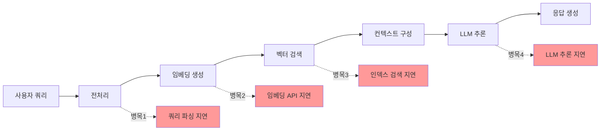

### 🔧 병목 지점 탐지 방법

#### **1. 단계별 성능 측정**
```python
import time
import logging
from functools import wraps

class PerformanceProfiler:
    def __init__(self):
        self.metrics = {}
        
    def measure_time(self, step_name):
        """데코레이터: 각 단계의 실행 시간 측정"""
        def decorator(func):
            @wraps(func)
            def wrapper(*args, **kwargs):
                start_time = time.time()
                result = func(*args, **kwargs)
                end_time = time.time()
                
                execution_time = end_time - start_time
                self.metrics[step_name] = execution_time
                
                # 병목 지점 탐지 (임계값 초과 시 경고)
                if execution_time > self.get_threshold(step_name):
                    logging.warning(f"🚨 {step_name} 병목 감지: {execution_time:.3f}초")
                
                return result
            return wrapper
        return decorator
    
    def get_threshold(self, step_name):
        """단계별 정상 임계값 설정"""
        thresholds = {
            "query_preprocessing": 0.1,    # 100ms
            "embedding_generation": 0.5,   # 500ms  
            "vector_search": 1.0,          # 1초
            "context_assembly": 0.2,       # 200ms
            "llm_inference": 3.0,          # 3초
            "response_formatting": 0.1     # 100ms
        }
        return thresholds.get(step_name, 1.0)
    
    def get_bottleneck_analysis(self):
        """병목 지점 분석 및 권장사항 제공"""
        if not self.metrics:
            return "측정 데이터 없음"
            
        total_time = sum(self.metrics.values())
        bottlenecks = []
        
        for step, time_taken in self.metrics.items():
            percentage = (time_taken / total_time) * 100
            
            # 30% 이상을 차지하는 단계는 병목으로 간주
            if percentage > 30:
                bottlenecks.append({
                    'step': step,
                    'time': time_taken,
                    'percentage': percentage,
                    'recommendation': self.get_recommendation(step)
                })
        
        return bottlenecks

# 실제 사용 예시
profiler = PerformanceProfiler()

@profiler.measure_time("query_preprocessing")
def preprocess_query(query):
    # 쿼리 전처리 로직
    time.sleep(0.05)  # 시뮬레이션
    return query.strip().lower()

@profiler.measure_time("embedding_generation") 
def generate_embedding(text):
    # 임베딩 생성 로직
    time.sleep(0.3)  # 시뮬레이션
    return [0.1, 0.2, 0.3] * 512  # 1536차원 벡터

@profiler.measure_time("vector_search")
def search_vectors(embedding):
    # 벡터 검색 로직
    time.sleep(2.0)  # 시뮬레이션 - 병목 발생!
    return ["doc1", "doc2", "doc3"]

@profiler.measure_time("llm_inference")
def llm_generate(context, query):
    # LLM 추론 로직
    time.sleep(1.5)  # 시뮬레이션
    return "Generated response"
```

#### **2. 시스템 리소스 모니터링**
```python
import psutil
import nvidia_ml_py3 as nvml

class ResourceMonitor:
    def __init__(self):
        nvml.nvmlInit()
        
    def get_system_metrics(self):
        """시스템 리소스 사용률 측정"""
        metrics = {
            'cpu_percent': psutil.cpu_percent(interval=1),
            'memory_percent': psutil.virtual_memory().percent,
            'disk_io': psutil.disk_io_counters(),
            'network_io': psutil.net_io_counters(),
        }
        
        # GPU 메트릭 (NVIDIA GPU가 있는 경우)
        try:
            gpu_count = nvml.nvmlDeviceGetCount()
            metrics['gpu_metrics'] = []
            
            for i in range(gpu_count):
                handle = nvml.nvmlDeviceGetHandleByIndex(i)
                gpu_memory = nvml.nvmlDeviceGetMemoryInfo(handle)
                gpu_util = nvml.nvmlDeviceGetUtilizationRates(handle)
                
                metrics['gpu_metrics'].append({
                    'gpu_id': i,
                    'memory_used_percent': (gpu_memory.used / gpu_memory.total) * 100,
                    'gpu_utilization': gpu_util.gpu,
                    'memory_utilization': gpu_util.memory
                })
        except:
            metrics['gpu_metrics'] = []
            
        return metrics
    
    def detect_resource_bottlenecks(self, metrics):
        """리소스 기반 병목 탐지"""
        bottlenecks = []
        
        if metrics['cpu_percent'] > 80:
            bottlenecks.append({
                'type': 'CPU',
                'usage': metrics['cpu_percent'],
                'recommendation': 'CPU 집약적 작업 최적화 또는 스케일 업 필요'
            })
            
        if metrics['memory_percent'] > 85:
            bottlenecks.append({
                'type': 'Memory',
                'usage': metrics['memory_percent'],
                'recommendation': '메모리 사용량 최적화 또는 RAM 증설 필요'
            })
            
        for gpu_metric in metrics.get('gpu_metrics', []):
            if gpu_metric['memory_used_percent'] > 90:
                bottlenecks.append({
                    'type': f"GPU {gpu_metric['gpu_id']} Memory",
                    'usage': gpu_metric['memory_used_percent'],
                    'recommendation': 'GPU 메모리 최적화 또는 GPU 추가 필요'
                })
                
        return bottlenecks
```

#### **3. 네트워크 및 I/O 병목 탐지**
```python
import asyncio
import aiohttp
import time

class NetworkIOProfiler:
    def __init__(self):
        self.network_metrics = {}
        self.io_metrics = {}
    
    async def measure_api_latency(self, api_url, payload):
        """API 호출 지연시간 측정"""
        start_time = time.time()
        
        async with aiohttp.ClientSession() as session:
            try:
                async with session.post(api_url, json=payload) as response:
                    await response.json()
                    end_time = time.time()
                    
                    latency = end_time - start_time
                    self.network_metrics[api_url] = {
                        'latency': latency,
                        'status': response.status,
                        'timestamp': start_time
                    }
                    
                    return latency
            except Exception as e:
                self.network_metrics[api_url] = {
                    'error': str(e),
                    'timestamp': start_time
                }
                return float('inf')
    
    def measure_disk_io_performance(self, file_path, data_size_mb=100):
        """디스크 I/O 성능 측정"""
        import os
        
        # 쓰기 성능 측정
        test_data = b'0' * (1024 * 1024)  # 1MB
        
        start_time = time.time()
        with open(file_path, 'wb') as f:
            for _ in range(data_size_mb):
                f.write(test_data)
        write_time = time.time() - start_time
        
        # 읽기 성능 측정
        start_time = time.time()
        with open(file_path, 'rb') as f:
            while f.read(1024 * 1024):
                pass
        read_time = time.time() - start_time
        
        # 파일 삭제
        os.remove(file_path)
        
        write_speed = data_size_mb / write_time  # MB/s
        read_speed = data_size_mb / read_time    # MB/s
        
        self.io_metrics['disk_performance'] = {
            'write_speed_mbps': write_speed,
            'read_speed_mbps': read_speed,
            'write_time': write_time,
            'read_time': read_time
        }
        
        return write_speed, read_speed
```

### 🎯 병목 유형별 해결 전략

#### **1. 벡터 검색 병목 (가장 흔한 케이스)**
```python
class VectorSearchOptimizer:
    def __init__(self):
        self.optimization_strategies = {
            'index_type': self.optimize_index_type,
            'search_params': self.optimize_search_params,
            'caching': self.implement_caching,
            'sharding': self.implement_sharding
        }
    
    def optimize_index_type(self, current_performance):
        """인덱스 타입 최적화 권장사항"""
        if current_performance['search_time'] > 2.0:  # 2초 초과
            if current_performance['data_size'] > 10_000_000:  # 1천만 개 이상
                return {
                    'recommendation': 'IVF 인덱스로 변경',
                    'reason': '대규모 데이터에서 HNSW는 메모리 부족 가능성',
                    'expected_improvement': '50-70% 응답시간 단축'
                }
            else:
                return {
                    'recommendation': 'HNSW 파라미터 튜닝',
                    'reason': 'M(연결수)과 efConstruction 값 조정',
                    'expected_improvement': '30-50% 응답시간 단축'
                }
        
        return {'recommendation': '현재 설정 유지', 'reason': '성능이 적절함'}
    
    def optimize_search_params(self, query_patterns):
        """검색 파라미터 최적화"""
        recommendations = []
        
        if query_patterns['avg_recall'] < 0.8:  # 재현율 80% 미만
            recommendations.append({
                'param': 'top_k',
                'action': '증가 (현재의 1.5-2배)',
                'reason': '더 많은 후보를 검색하여 재현율 향상'
            })
            
        if query_patterns['avg_response_time'] > 1.0:  # 1초 초과
            recommendations.append({
                'param': 'nprobe (IVF) 또는 ef (HNSW)',
                'action': '감소',
                'reason': '검색 정확도를 약간 포기하고 속도 향상'
            })
            
        return recommendations
```

#### **2. LLM 추론 병목**
```python
class LLMInferenceOptimizer:
    def __init__(self):
        self.optimization_strategies = {
            'model_optimization': self.optimize_model,
            'serving_optimization': self.optimize_serving,
            'caching_strategy': self.implement_llm_caching
        }
    
    def optimize_model(self, current_metrics):
        """모델 최적화 전략"""
        strategies = []
        
        if current_metrics['gpu_memory_usage'] > 90:
            strategies.append({
                'strategy': '모델 양자화',
                'implementation': 'FP16 또는 INT8 양자화 적용',
                'benefit': 'GPU 메모리 50% 절약, 처리량 2배 향상',
                'trade_off': '정확도 1-3% 감소'
            })
            
        if current_metrics['avg_inference_time'] > 5.0:  # 5초 초과
            strategies.append({
                'strategy': '배치 처리 최적화',
                'implementation': 'vLLM의 연속 배치 또는 TensorRT-LLM',
                'benefit': '처리량 5-10배 향상',
                'trade_off': '개별 요청 지연시간 약간 증가'
            })
            
        return strategies
    
    def optimize_serving(self, traffic_patterns):
        """서빙 플랫폼 최적화"""
        if traffic_patterns['concurrent_users'] > 100:
            return {
                'platform': 'vLLM',
                'reason': 'PagedAttention으로 메모리 효율성 극대화',
                'configuration': {
                    'max_model_len': 4096,
                    'tensor_parallel_size': 2,
                    'gpu_memory_utilization': 0.9
                }
            }
        elif traffic_patterns['security_level'] == 'high':
            return {
                'platform': 'Ollama',
                'reason': '완전 로컬 실행으로 보안 보장',
                'configuration': {
                    'num_ctx': 2048,
                    'num_predict': 512,
                    'temperature': 0.1
                }
            }
```

#### **3. 메모리 병목**
```python
class MemoryOptimizer:
    def __init__(self):
        self.memory_strategies = {
            'vector_db': self.optimize_vector_db_memory,
            'llm_serving': self.optimize_llm_memory,
            'system_level': self.optimize_system_memory
        }
    
    def optimize_vector_db_memory(self, memory_usage):
        """벡터 DB 메모리 최적화"""
        optimizations = []
        
        if memory_usage['index_memory_gb'] > 16:  # 16GB 초과
            optimizations.append({
                'strategy': '인덱스 압축',
                'method': 'Product Quantization (PQ) 적용',
                'memory_reduction': '75-90%',
                'accuracy_loss': '5-10%'
            })
            
        if memory_usage['embedding_cache_gb'] > 8:  # 8GB 초과
            optimizations.append({
                'strategy': '캐시 최적화',
                'method': 'LRU 캐시 크기 조정 + TTL 설정',
                'memory_reduction': '50%',
                'performance_impact': '캐시 미스율 약간 증가'
            })
            
        return optimizations
    
    def optimize_llm_memory(self, model_memory):
        """LLM 메모리 최적화"""
        if model_memory['gpu_memory_gb'] > 40:  # A100 80GB 기준
            return {
                'strategy': 'Model Sharding',
                'method': 'Tensor Parallelism으로 여러 GPU에 분산',
                'implementation': 'DeepSpeed 또는 Megatron-LM',
                'benefit': '더 큰 모델 로딩 가능'
            }
        
        return {
            'strategy': 'PagedAttention',
            'method': 'vLLM 사용으로 메모리 단편화 해결',
            'benefit': '동일 GPU에서 5배 더 많은 동시 요청 처리'
        }
```

### 🔍 실시간 병목 모니터링 시스템

#### **대시보드 구현**
```python
import streamlit as st
import plotly.graph_objects as go
from datetime import datetime, timedelta

class BottleneckMonitoringDashboard:
    def __init__(self):
        self.profiler = PerformanceProfiler()
        self.resource_monitor = ResourceMonitor()
        
    def create_performance_dashboard(self):
        """실시간 성능 모니터링 대시보드"""
        st.title("🔍 RAG 시스템 병목 모니터링")
        
        # 실시간 메트릭 표시
        col1, col2, col3, col4 = st.columns(4)
        
        with col1:
            avg_response_time = self.get_avg_response_time()
            st.metric(
                label="평균 응답시간",
                value=f"{avg_response_time:.2f}초",
                delta=f"{self.get_response_time_delta():.2f}초"
            )
            
        with col2:
            qps = self.get_current_qps()
            st.metric(
                label="초당 쿼리수",
                value=f"{qps:.1f} QPS",
                delta=f"{self.get_qps_delta():.1f}"
            )
            
        with col3:
            memory_usage = self.resource_monitor.get_system_metrics()['memory_percent']
            st.metric(
                label="메모리 사용률",
                value=f"{memory_usage:.1f}%",
                delta=f"{self.get_memory_delta():.1f}%"
            )
            
        with col4:
            error_rate = self.get_error_rate()
            st.metric(
                label="오류율",
                value=f"{error_rate:.2f}%",
                delta=f"{self.get_error_rate_delta():.2f}%"
            )
        
        # 병목 지점 분석 차트
        self.create_bottleneck_chart()
        
        # 권장사항 표시
        self.show_recommendations()
    
    def create_bottleneck_chart(self):
        """병목 지점 시각화"""
        bottlenecks = self.profiler.get_bottleneck_analysis()
        
        if bottlenecks:
            fig = go.Figure(data=[
                go.Bar(
                    x=[b['step'] for b in bottlenecks],
                    y=[b['percentage'] for b in bottlenecks],
                    text=[f"{b['percentage']:.1f}%" for b in bottlenecks],
                    textposition='auto',
                )
            ])
            
            fig.update_layout(
                title="🚨 병목 지점 분석 (전체 시간 대비 비율)",
                xaxis_title="처리 단계",
                yaxis_title="시간 비율 (%)",
                showlegend=False
            )
            
            # 30% 이상은 빨간색으로 표시
            fig.update_traces(
                marker_color=['red' if b['percentage'] > 30 else 'blue' 
                             for b in bottlenecks]
            )
            
            st.plotly_chart(fig, use_container_width=True)
    
    def show_recommendations(self):
        """병목 해결 권장사항 표시"""
        st.subheader("🎯 병목 해결 권장사항")
        
        bottlenecks = self.profiler.get_bottleneck_analysis()
        
        if not bottlenecks:
            st.success("✅ 현재 심각한 병목 지점이 감지되지 않았습니다.")
            return
            
        for bottleneck in bottlenecks:
            with st.expander(f"🚨 {bottleneck['step']} 병목 ({bottleneck['percentage']:.1f}%)"):
                st.write(f"**소요 시간**: {bottleneck['time']:.3f}초")
                st.write(f"**전체 비율**: {bottleneck['percentage']:.1f}%")
                st.write(f"**권장사항**: {bottleneck['recommendation']}")
                
                # 구체적인 해결 방법 제시
                if 'vector_search' in bottleneck['step']:
                    st.info("""
                    **즉시 적용 가능한 해결책**:
                    1. 인덱스 파라미터 튜닝 (nprobe, ef 값 조정)
                    2. 캐싱 레이어 추가
                    3. 검색 결과 수 제한 (top_k 조정)
                    """)
                elif 'llm_inference' in bottleneck['step']:
                    st.info("""
                    **즉시 적용 가능한 해결책**:
                    1. vLLM으로 서빙 플랫폼 변경
                    2. 모델 양자화 (FP16/INT8)
                    3. 배치 크기 최적화
                    """)
```

### 🎯 병목 해결 우선순위 결정

#### **영향도 vs 해결 난이도 매트릭스**
```python
class BottleneckPrioritizer:
    def __init__(self):
        self.priority_matrix = {
            'high_impact_easy_fix': 1,      # 최우선
            'high_impact_hard_fix': 2,      # 2순위  
            'low_impact_easy_fix': 3,       # 3순위
            'low_impact_hard_fix': 4        # 후순위
        }
    
    def prioritize_bottlenecks(self, bottlenecks):
        """병목 해결 우선순위 결정"""
        prioritized = []
        
        for bottleneck in bottlenecks:
            impact_score = self.calculate_impact_score(bottleneck)
            difficulty_score = self.calculate_difficulty_score(bottleneck)
            
            priority_category = self.get_priority_category(impact_score, difficulty_score)
            priority_score = self.priority_matrix[priority_category]
            
            prioritized.append({
                **bottleneck,
                'impact_score': impact_score,
                'difficulty_score': difficulty_score,
                'priority_category': priority_category,
                'priority_score': priority_score
            })
        
        # 우선순위 점수로 정렬
        return sorted(prioritized, key=lambda x: x['priority_score'])
    
    def calculate_impact_score(self, bottleneck):
        """영향도 점수 계산 (높을수록 영향 큼)"""
        base_score = bottleneck['percentage']  # 전체 시간 대비 비율
        
        # 사용자 경험에 미치는 영향 가중치
        if 'user_facing' in bottleneck.get('tags', []):
            base_score *= 1.5
            
        # 비용에 미치는 영향 가중치  
        if 'cost_critical' in bottleneck.get('tags', []):
            base_score *= 1.3
            
        return base_score
    
    def calculate_difficulty_score(self, bottleneck):
        """해결 난이도 점수 계산 (높을수록 어려움)"""
        difficulty_map = {
            'parameter_tuning': 1,      # 파라미터 조정
            'caching': 2,               # 캐시 추가
            'scaling': 3,               # 스케일링
            'architecture_change': 4,   # 아키텍처 변경
            'hardware_upgrade': 5       # 하드웨어 업그레이드
        }
        
        return difficulty_map.get(bottleneck.get('solution_type'), 3)
    
    def get_priority_category(self, impact, difficulty):
        """우선순위 카테고리 결정"""
        if impact >= 30 and difficulty <= 2:
            return 'high_impact_easy_fix'
        elif impact >= 30 and difficulty > 2:
            return 'high_impact_hard_fix'
        elif impact < 30 and difficulty <= 2:
            return 'low_impact_easy_fix'
        else:
            return 'low_impact_hard_fix'
```

### 💡 면접에서 활용할 병목 탐지 스토리

#### **실무 시나리오 예시**
```
면접관: "RAG 시스템에서 성능 이슈가 발생하면 어떻게 접근하시겠어요?"

당신: "먼저 체계적인 병목 탐지를 진행하겠습니다.

1단계로 각 처리 단계별 시간을 측정해서 어느 부분이 전체 시간의 30% 이상을 차지하는지 파악합니다. 

2단계로 시스템 리소스 모니터링으로 CPU, 메모리, GPU 사용률을 확인합니다.

3단계로 네트워크 지연시간과 디스크 I/O 성능을 측정합니다.

예를 들어 벡터 검색이 전체 시간의 60%를 차지한다면, 데이터 규모에 따라 HNSW에서 IVF로 인덱스 변경을 고려하거나, nprobe 파라미터를 조정해서 속도-정확도 트레이드오프를 최적화합니다.

LLM 추론이 병목이라면 vLLM의 PagedAttention으로 메모리 단편화를 해결하거나, 모델 양자화로 GPU 메모리를 절약합니다.

중요한 건 데이터 기반으로 정확한 원인을 찾고, 영향도와 해결 난이도를 고려해서 우선순위를 정하는 거죠."

면접관: (감탄) "매우 체계적이네요. 실무 경험이 있으신가요?"
```

이제 병목 탐지부터 해결까지의 완전한 프로세스를 이해하고 설명할 수 있어요! 🎯

### 📏 데이터 범위 및 규모 설정

#### **1단계: 데이터 범위 정의**

##### **데이터 소스 분류**
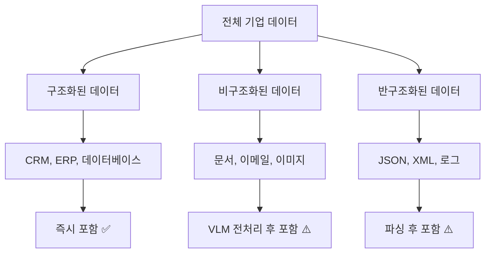

##### **데이터 우선순위 매트릭스**
| 우선순위 | 데이터 유형 | 업데이트 빈도 | 보안 등급 | 포함 여부 |
|----------|-------------|--------------|-----------|-----------|
| **1순위** | 제품 매뉴얼, FAQ | 월 1회 | 일반 | 즉시 포함 |
| **2순위** | 기술 문서, API 문서 | 주 1회 | 내부용 | 권한별 분리 |
| **3순위** | 고객 상담 기록 | 일 1회 | 민감 | 마스킹 후 포함 |
| **4순위** | 재무 보고서 | 분기 1회 | 기밀 | 별도 DB 구축 |

#### **2단계: 규모 산정 기준**

##### **규모 계산 공식**
```
총 벡터 수 = (총 문서 수 × 평균 청크 수) + (일일 증가량 × 예상 기간)
필요 저장 공간 = 총 벡터 수 × 벡터 차원 × 4바이트 × 1.5 (오버헤드)
```

##### **실제 예시 계산**
```
예: 중견기업 지식베이스
- 기존 문서: 50만 개
- 평균 청크 수: 10개/문서
- 일일 신규 문서: 1,000개
- 예상 운영 기간: 3년
- 벡터 차원: 1536 (OpenAI ada-002)

계산:
총 벡터 수 = (500,000 × 10) + (1,000 × 10 × 365 × 3) = 5백만 + 1,095만 = 1,595만 개
저장 공간 = 15,950,000 × 1536 × 4 × 1.5 = 약 147GB
```

##### **규모별 아키텍처 선택**
| 규모 | 벡터 수 | 권장 구조 | 예상 비용 |
|------|---------|-----------|-----------|
| **소규모** | ~100만 | 단일 인스턴스 | $500/월 |
| **중규모** | 100만~1,000만 | 샤딩 | $2,000/월 |
| **대규모** | 1,000만~1억 | 분산 클러스터 | $10,000/월 |
| **초대규모** | 1억+ | 멀티 리전 | $50,000/월 |

### 🛠️ 벡터 DB 선택 기준 및 도구

#### **선택 기준 매트릭스**

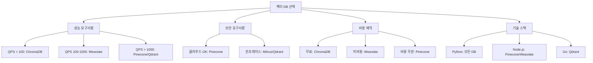

#### **상황별 최적 선택**

##### **스타트업/프로토타입**
- **추천**: ChromaDB → Weaviate
- **이유**: 무료, 빠른 설정, 확장 용이
- **한계**: 10만 벡터까지, 단일 서버

##### **중견기업/프로덕션**
- **추천**: Weaviate/Qdrant
- **이유**: 
  - 오픈소스로 비용 절약
  - 온프레미스 배포 가능
  - 엔터프라이즈 기능 지원
- **고려사항**: 운영 인력 필요

##### **대기업/미션크리티컬**
- **추천**: Pinecone + Milvus 하이브리드
- **이유**:
  - Pinecone: 빠른 개발, 안정성
  - Milvus: 대용량, 커스터마이징
- **전략**: 단계적 마이그레이션

### 🔐 보안 관리 체계

#### **다층 보안 모델**

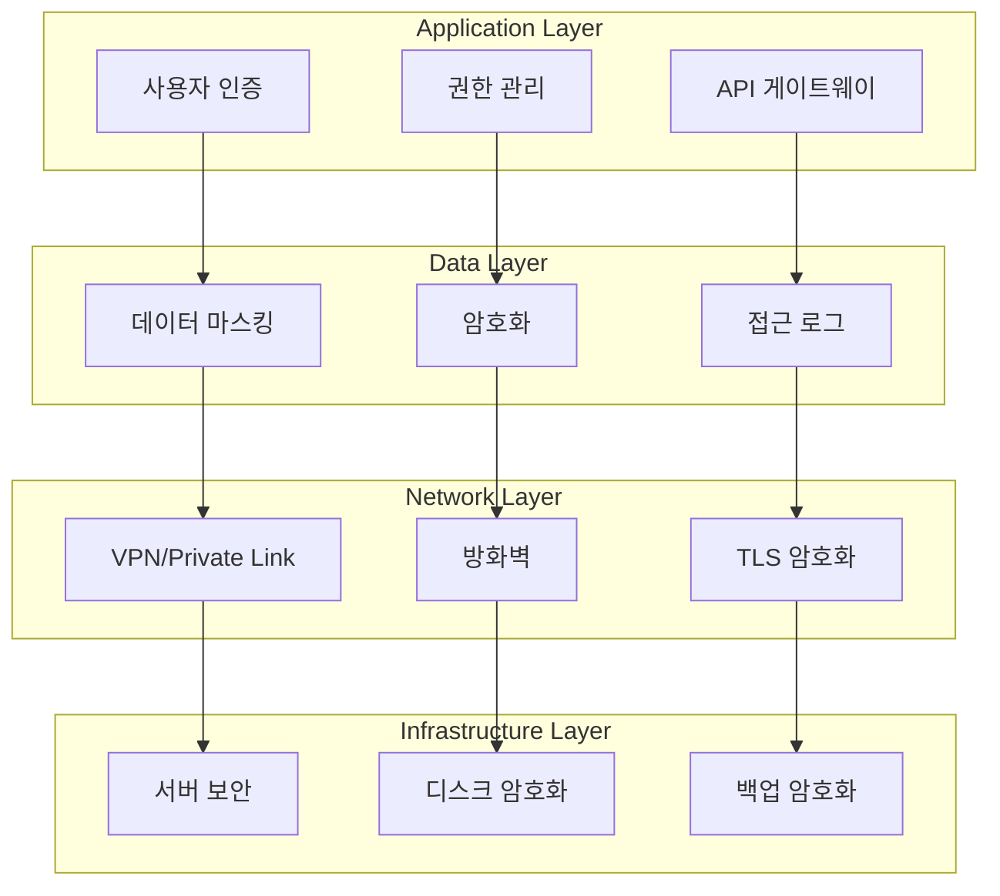

#### **보안 권한 검토 프로세스**

##### **정기 검토 주기**
- **일일**: 비정상 접근 탐지
- **주간**: 권한 사용 패턴 분석
- **월간**: 사용자 권한 재검토
- **분기**: 전체 보안 정책 감사
- **연간**: 외부 보안 진단

##### **권한 관리 프레임워크**
```python
# 역할 기반 접근 제어 (RBAC) 예시
class VectorDBPermission:
    def __init__(self):
        self.roles = {
            'admin': ['read', 'write', 'delete', 'manage'],
            'developer': ['read', 'write'],
            'analyst': ['read'],
            'guest': ['read_public']
        }
        
    def check_permission(self, user_role, action, data_classification):
        if data_classification == 'confidential' and user_role != 'admin':
            return False
        return action in self.roles.get(user_role, [])
```

##### **데이터 분류별 접근 제어**
| 분류 | 접근 가능 역할 | 추가 요구사항 | 로그 레벨 |
|------|----------------|---------------|-----------|
| **Public** | 전체 | 없음 | 기본 |
| **Internal** | 직원 | 사내 네트워크 | 상세 |
| **Confidential** | 승인된 팀 | 2FA 인증 | 완전 |
| **Secret** | 관리자 | 물리적 토큰 | 실시간 알림 |

### 🏢 하위 인프라 구축 아키텍처

#### **클라우드 네이티브 아키텍처**

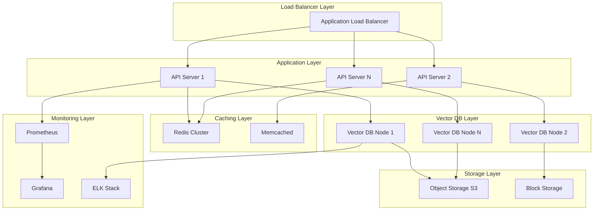

#### **인프라 구성 요소별 상세**

##### **1. 로드 밸런서 계층**
- **목적**: 트래픽 분산, 장애 격리
- **구성**: 
  - AWS ALB/NLB 또는 Nginx/HAProxy
  - Health Check로 장애 노드 자동 제외
  - SSL 터미네이션

##### **2. 애플리케이션 계층**
- **목적**: API 요청 처리, 비즈니스 로직
- **구성**:
  - Kubernetes Pod 또는 Docker 컨테이너
  - Auto Scaling (CPU/메모리 기반)
  - Circuit Breaker 패턴

##### **3. 캐싱 계층**
- **목적**: 자주 조회되는 벡터 검색 결과 캐싱
- **구성**:
  - Redis Cluster (분산 캐싱)
  - TTL 기반 캐시 무효화
  - LRU 정책으로 메모리 관리

##### **4. 벡터 DB 계층**
- **목적**: 벡터 저장 및 검색
- **구성**:
  - Master-Slave 또는 Sharding 구조
  - 읽기 복제본으로 부하 분산
  - 자동 백업 및 복구

##### **5. 스토리지 계층**
- **목적**: 원본 문서 및 백업 저장
- **구성**:
  - S3 Compatible Storage (원본 문서)
  - EBS/SSD (인덱스 및 메타데이터)
  - Cross-Region 복제

### 🚫 할루시네이션 방지 메커니즘

#### **다층 방지 시스템**

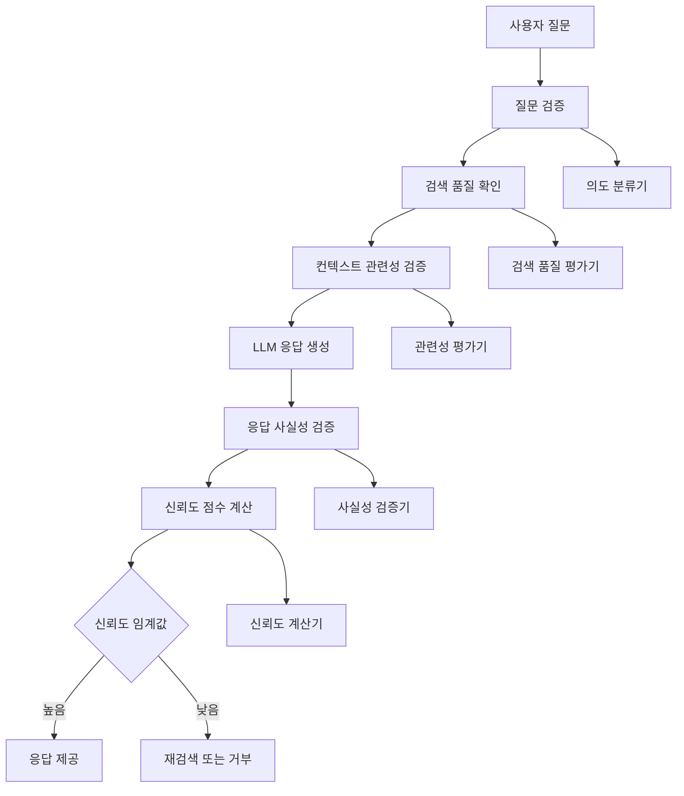

#### **1. 검색 단계 품질 향상**

##### **쿼리 개선 기법**
```python
class QueryEnhancer:
    def enhance_query(self, original_query):
        # 1. 쿼리 확장
        expanded = self.expand_with_synonyms(original_query)
        
        # 2. 다중 표현 생성
        variations = self.generate_query_variations(expanded)
        
        # 3. 하이브리드 검색 (벡터 + 키워드)
        results = []
        for query_var in variations:
            vector_results = self.vector_search(query_var)
            keyword_results = self.keyword_search(query_var)
            results.extend(self.merge_results(vector_results, keyword_results))
        
        return self.rank_and_deduplicate(results)
```

##### **검색 결과 품질 평가**
- **다양성 확보**: MMR (Maximal Marginal Relevance) 알고리즘
- **관련성 임계값**: 0.7 이하 결과 제외
- **다중 소스 검증**: 같은 내용이 여러 문서에서 확인되는지

#### **2. 생성 단계 제어**

##### **프롬프트 엔지니어링**
```python
SYSTEM_PROMPT = """
당신은 정확한 정보만을 제공하는 AI입니다.
다음 규칙을 반드시 지켜주세요:

1. 제공된 컨텍스트에서만 정보를 추출하세요
2. 확실하지 않은 내용은 "제공된 정보로는 확실하지 않습니다"라고 답하세요
3. 추측이나 가정을 하지 마세요
4. 수치나 날짜는 정확히 인용하세요
5. 출처를 명시하세요

컨텍스트: {context}
질문: {question}

답변 시 신뢰도도 함께 제공하세요 (1-10점):
"""
```

##### **응답 검증 시스템**
```python
class ResponseValidator:
    def validate_response(self, response, context, question):
        checks = {
            'factual_consistency': self.check_factual_consistency(response, context),
            'source_attribution': self.check_source_attribution(response, context),
            'confidence_level': self.extract_confidence_level(response),
            'no_hallucination': self.detect_hallucination(response, context)
        }
        
        overall_score = sum(checks.values()) / len(checks)
        return overall_score > 0.8  # 80% 이상일 때만 통과
```

#### **3. 실시간 모니터링**

##### **할루시네이션 탐지 지표**
- **컨텍스트 일치도**: 응답과 검색된 문서의 유사도
- **사실 확인**: 외부 신뢰할 만한 소스와의 교차 검증
- **일관성 검사**: 같은 질문에 대한 반복 답변의 일치도
- **사용자 피드백**: 👍👎 버튼을 통한 실시간 품질 평가

### 🎯 LLM 파인튜닝 없는 벡터 DB 구축의 의미

#### **파인튜닝 vs 벡터 DB 접근법 비교**

| 구분 | 파인튜닝 접근법 | 벡터 DB 접근법 |
|------|----------------|----------------|
| **데이터 학습** | 모델 가중치에 직접 학습 | 외부 검색으로 정보 제공 |
| **업데이트** | 전체 재학습 필요 (수일) | 실시간 추가/수정 가능 |
| **비용** | GPU 클러스터 필요 ($1만+) | 검색 DB만 필요 ($1천) |
| **정확성** | 학습 데이터에 제한됨 | 최신 정보 반영 |
| **투명성** | 블랙박스 (근거 불명) | 출처 추적 가능 |
| **확장성** | 모델 크기에 제한됨 | 무제한 확장 가능 |

#### **벡터 DB 방식의 핵심 장점**

##### **1. 지식 분리 (Knowledge Separation)**
```
기존: LLM = 추론 능력 + 지식 저장
벡터DB 방식: LLM = 순수 추론 능력, 벡터DB = 지식 저장소
```

##### **2. 실시간 지식 업데이트**
```python
# 새로운 문서 추가 (실시간)
def add_new_document(document):
    chunks = text_splitter.split(document)
    embeddings = embedding_model.embed(chunks)
    vector_db.insert(embeddings, metadata={'timestamp': now()})
    # 즉시 검색 가능!

# 파인튜닝은 불가능
def update_finetuned_model(new_data):
    # 전체 학습 데이터 + 새 데이터로 재학습
    # 수일~수주 소요
    return retrain_entire_model(old_data + new_data)
```

##### **3. 출처 추적 가능성**
```python
# 벡터 DB 방식: 명확한 출처
response = {
    "answer": "당사의 환불 정책은 구매 후 30일 이내입니다.",
    "sources": [
        {"document": "고객서비스매뉴얼.pdf", "page": 15, "confidence": 0.95},
        {"document": "약관.md", "section": "환불정책", "confidence": 0.87}
    ]
}

# 파인튜닝 방식: 출처 불명
response = {
    "answer": "당사의 환불 정책은 구매 후 30일 이내입니다.",
    "sources": "학습된 가중치에서 추출 (추적 불가)"
}
```

#### **기업에서 파인튜닝을 피하는 이유**

##### **1. 데이터 보안**
- **파인튜닝**: 민감 데이터가 모델 가중치에 영구 저장
- **벡터 DB**: 데이터는 별도 저장, 필요시 삭제 가능

##### **2. 규제 준수**
- **GDPR "잊혀질 권리"**: 특정 개인 데이터 삭제 요구
- **파인튜닝**: 모델에서 특정 데이터만 제거 불가능
- **벡터 DB**: 해당 벡터만 선택적 삭제 가능

##### **3. 비용 효율성**
```
파인튜닝 비용 (월):
- GPU 클러스터: $10,000
- 데이터 엔지니어: $15,000
- MLOps 인프라: $5,000
총: $30,000/월

벡터 DB 비용 (월):
- 벡터 DB 호스팅: $2,000
- 임베딩 API: $500
- 운영 비용: $500
총: $3,000/월
```

### 🔄 피드백 루프 및 지속적 개선 시스템

#### **전체 피드백 루프 아키텍처**

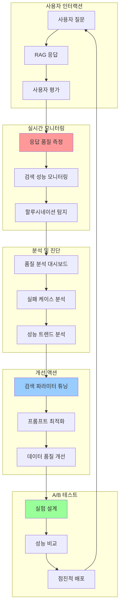

#### **1. 실시간 품질 측정 시스템**

##### **자동 품질 지표**
```python
class QualityMetrics:
    def calculate_metrics(self, query, response, retrieved_docs, user_feedback):
        return {
            'retrieval_precision': self.calc_retrieval_precision(retrieved_docs),
            'response_relevance': self.calc_response_relevance(query, response),
            'factual_accuracy': self.calc_factual_accuracy(response, retrieved_docs),
            'source_attribution': self.calc_source_attribution(response, retrieved_docs),
            'user_satisfaction': user_feedback,
            'response_time': self.measure_response_time(),
            'hallucination_score': self.detect_hallucination(response, retrieved_docs)
        }
```

##### **실시간 알림 시스템**
- **품질 저하 감지**: 정확도 80% 이하시 Slack 알림
- **할루시네이션 탐지**: 의심 사례 즉시 관리자 알림
- **성능 이슈**: 응답 시간 5초 초과시 경고

#### **2. 사용자 피드백 수집 체계**

##### **다층 피드백 수집**
```python
# 명시적 피드백
explicit_feedback = {
    'thumbs_up_down': True/False,
    'detailed_rating': 1-5,
    'specific_issues': ['부정확함', '느림', '관련없음'],
    'suggested_improvement': "텍스트 입력"
}

# 암시적 피드백
implicit_feedback = {
    'click_through_rate': 0.85,
    'time_spent_reading': 30.5,  # 초
    'follow_up_questions': True,
    'session_completion': True
}
```

##### **피드백 분석 및 클러스터링**
```python
class FeedbackAnalyzer:
    def analyze_feedback_patterns(self, feedbacks):
        # 1. 부정적 피드백 클러스터링
        negative_feedback = [f for f in feedbacks if f.rating < 3]
        
        # 2. 공통 이슈 패턴 식별
        issue_patterns = self.cluster_issues(negative_feedback)
        
        # 3. 개선 우선순위 결정
        priorities = self.prioritize_improvements(issue_patterns)
        
        return {
            'critical_issues': priorities[:3],
            'improvement_suggestions': self.generate_suggestions(priorities),
            'affected_query_types': self.identify_affected_queries(negative_feedback)
        }
```

#### **3. 지속적 개선 자동화**

##### **자동 파라미터 튜닝**
```python
class AutoTuner:
    def __init__(self):
        self.parameters = {
            'similarity_threshold': 0.7,
            'max_chunks': 5,
            'temperature': 0.1,
            'top_k': 10
        }
    
    def auto_tune(self, performance_data):
        # 베이지안 최적화로 파라미터 조정
        for param in self.parameters:
            new_value = self.bayesian_optimize(param, performance_data)
            
            # A/B 테스트로 검증
            improvement = self.ab_test(param, new_value)
            if improvement > 0.05:  # 5% 이상 개선
                self.parameters[param] = new_value
                self.log_improvement(param, improvement)
```

##### **프롬프트 자동 최적화**
```python
class PromptOptimizer:
    def optimize_prompt(self, query_type, performance_issues):
        # 1. 실패 케이스 분석
        failed_cases = self.get_failed_cases(query_type)
        
        # 2. 프롬프트 변형 생성
        prompt_variations = self.generate_prompt_variations(failed_cases)
        
        # 3. 각 변형 성능 테스트
        results = []
        for prompt in prompt_variations:
            score = self.test_prompt_performance(prompt, failed_cases)
            results.append((prompt, score))
        
        # 4. 최고 성능 프롬프트 선택
        best_prompt = max(results, key=lambda x: x[1])
        return best_prompt[0]
```

#### **4. A/B 테스트 프레임워크**

##### **실험 설계 시스템**
```python
class ABTestFramework:
    def create_experiment(self, experiment_name, variants, traffic_split):
        experiment = {
            'name': experiment_name,
            'variants': {
                'control': variants['current'],
                'treatment': variants['new']
            },
            'traffic_split': traffic_split,  # {'control': 0.8, 'treatment': 0.2}
            'metrics': ['accuracy', 'response_time', 'user_satisfaction'],
            'min_sample_size': 1000,
            'confidence_level': 0.95
        }
        return self.deploy_experiment(experiment)
    
    def analyze_results(self, experiment_id):
        data = self.get_experiment_data(experiment_id)
        
        # 통계적 유의성 검정
        significance_test = self.statistical_significance_test(data)
        
        # 비즈니스 의미 있는 개선인지 확인
        practical_significance = self.practical_significance_test(data)
        
        recommendation = self.generate_recommendation(
            significance_test, practical_significance
        )
        
        return {
            'statistical_significant': significance_test.p_value < 0.05,
            'practical_improvement': practical_significance.effect_size,
            'recommendation': recommendation
        }
```

##### **점진적 배포 시스템**
```python
class GradualRollout:
    def __init__(self):
        self.rollout_stages = [0.01, 0.05, 0.1, 0.25, 0.5, 1.0]
        self.success_criteria = {
            'error_rate': 0.01,  # 1% 이하
            'latency_p95': 2.0,  # 2초 이하
            'user_satisfaction': 4.0  # 5점 만점에 4점 이상
        }
    
    def rollout_new_version(self, new_version):
        for stage in self.rollout_stages:
            # 해당 비율로 트래픽 분배
            self.deploy_to_percentage(new_version, stage)
            
            # 성능 모니터링
            performance = self.monitor_performance(duration_minutes=30)
            
            # 성공 기준 충족 확인
            if not self.meets_criteria(performance):
                self.rollback()
                return False
            
            # 다음 단계로
            time.sleep(300)  # 5분 대기
        
        return True  # 완전 배포 성공
```

#### **5. 보안 권한 검토 자동화**

##### **지속적 권한 모니터링**
```python
class SecurityMonitor:
    def __init__(self):
        self.review_schedule = {
            'daily': self.daily_security_check,
            'weekly': self.weekly_access_review,
            'monthly': self.monthly_permission_audit,
            'quarterly': self.quarterly_security_assessment
        }
    
    def daily_security_check(self):
        # 1. 비정상 접근 패턴 탐지
        anomalous_access = self.detect_anomalous_access()
        
        # 2. 권한 남용 탐지
        privilege_abuse = self.detect_privilege_abuse()
        
        # 3. 의심스러운 쿼리 탐지
        suspicious_queries = self.detect_suspicious_queries()
        
        if any([anomalous_access, privilege_abuse, suspicious_queries]):
            self.send_security_alert()
    
    def weekly_access_review(self):
        # 1. 사용자별 접근 패턴 분석
        access_patterns = self.analyze_access_patterns()
        
        # 2. 불필요한 권한 식별
        unnecessary_permissions = self.identify_unnecessary_permissions()
        
        # 3. 권한 조정 제안
        adjustment_suggestions = self.generate_permission_adjustments()
        
        return self.create_weekly_report(access_patterns, unnecessary_permissions, adjustment_suggestions)
```

이제 벡터 DB 구축의 전체 생명주기와 운영 방법론이 완벽하게 정리되었습니다! 🚀

### 🥽 MR (Mixed Reality) - 혼합 현실

#### **MR 정의 및 개념**
- **정의**: 물리적 현실과 디지털 콘텐츠가 실시간으로 상호작용하는 기술
- **핵심**: 가상 객체가 현실 공간에 고정되고, 현실 객체와 물리적 상호작용 가능

#### **XR 기술 스펙트럼**
```
현실 세계 ←→ 가상 세계
     ↓
Real World → AR → MR → VR → Virtual World
```

| 기술 | 정의 | 특징 | 대표 기기 |
|------|------|------|-----------|
| **AR** | 현실에 가상 정보 오버레이 | 현실 70% + 가상 30% | 스마트폰, AR 글래스 |
| **MR** | 현실과 가상의 완전한 융합 | 현실 50% + 가상 50% | HoloLens, Magic Leap |
| **VR** | 완전한 가상 환경 몰입 | 현실 0% + 가상 100% | Oculus, PSVR |

#### **MR의 실제 활용 사례**
- **의료**: 수술 중 환자 신체에 3D 영상 투영으로 정밀 수술
- **제조업**: 실제 기계에 가상 매뉴얼 오버레이로 유지보수
- **교육**: 실제 교실에 가상 공룡이나 분자 모델 배치
- **설계**: 실제 공간에 가상 건물이나 가구 배치해서 시뮬레이션

---

## 🔗 RAG 시스템 완전 분석

### 📊 RAG 전체 아키텍처 도식

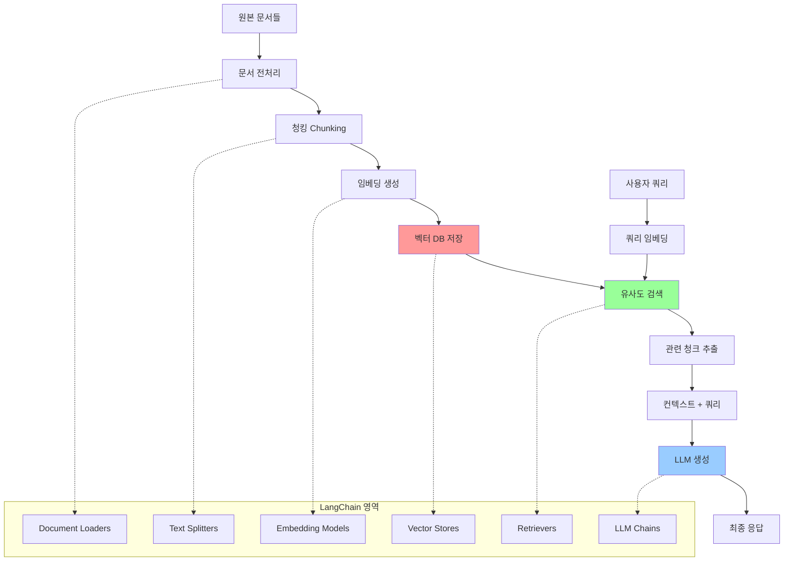

### 🔢 RAG 3단계 상세 분석

#### **1. 인덱싱 단계 (Data Preparation)**
```
원본 데이터 → 전처리 → 청킹 → 임베딩 → 벡터DB 저장
```

**상세 과정**:
1. **문서 수집**: PDF, 웹페이지, 데이터베이스 등
2. **텍스트 추출**: OCR, 파싱으로 일관된 텍스트 형식 변환
3. **청킹**: 의미 단위로 문서 분할 (보통 512-1024 토큰)
4. **임베딩**: 각 청크를 고차원 벡터로 변환
5. **저장**: 벡터DB에 임베딩과 메타데이터 저장

#### **2. 검색 단계 (Retrieval)**
```
사용자 쿼리 → 임베딩 → 유사도 계산 → 관련 청크 추출
```

**상세 과정**:
1. **쿼리 임베딩**: 사용자 질문을 동일한 임베딩 모델로 벡터화
2. **유사도 계산**: 코사인 유사도, 유클리드 거리 등 사용
3. **순위 결정**: 유사도 스코어 기반 상위 K개 청크 선택
4. **컨텍스트 구성**: 선택된 청크들을 하나의 컨텍스트로 결합

#### **3. 생성 단계 (Generation)**
```
쿼리 + 검색된 컨텍스트 → LLM → 최종 응답
```

**상세 과정**:
1. **프롬프트 구성**: 시스템 프롬프트 + 컨텍스트 + 사용자 질문
2. **LLM 추론**: 구성된 프롬프트를 LLM에 입력
3. **응답 생성**: 컨텍스트 기반의 정확한 답변 생성
4. **후처리**: 답변 검증, 포맷팅 등

---

## 🧮 임베딩 vs 인덱싱 완전 비교

### 📐 임베딩 (Embedding)

#### **임베딩 정의**
- **개념**: 텍스트, 이미지 등을 고차원 숫자 벡터로 변환하는 과정
- **목적**: 의미적 유사성을 수치적으로 측정 가능하게 만듦
- **결과**: 보통 384차원, 512차원, 1536차원 등의 벡터

#### **대표적인 임베딩 방법**

| 방법 | 특징 | 차원 | 용도 |
|------|------|------|------|
| **OpenAI text-embedding-ada-002** | 높은 품질, 유료 | 1536 | 범용 텍스트 |
| **Sentence-BERT** | 문장 단위 특화 | 384/768 | 문장 유사도 |
| **BGE (BAAI)** | 중국 개발, 무료, 고성능 | 768/1024 | 다국어 지원 |
| **E5 (Microsoft)** | MS 개발, 오픈소스 | 384/1024 | 검색 최적화 |
| **Cohere Embed** | 다국어 강점 | 768/4096 | 상업용 서비스 |

#### **임베딩 모델 선택 기준**
- **언어**: 한국어 성능 (BGE, multilingual-E5)
- **도메인**: 일반 vs 특화 (의료, 법률, 기술)
- **비용**: 무료 vs 유료 API
- **성능**: 정확도 vs 속도

### 🗂️ 인덱싱 (Indexing)

#### **인덱싱 정의**
- **개념**: 빠른 검색을 위해 데이터를 구조화하여 저장하는 방법
- **목적**: 대용량 벡터에서 유사한 벡터를 빠르게 찾기 위함
- **트레이드오프**: 정확도 vs 속도 vs 메모리

#### **일반 RDBMS 인덱스 vs 벡터 DB 인덱스**

| 구분 | RDBMS 인덱스 | 벡터 DB 인덱스 |
|------|--------------|----------------|
| **저장 대상** | 정확한 값 (숫자, 문자) | 고차원 벡터 (실수 배열) |
| **검색 방식** | 정확 매칭 | 근사 최근접 이웃 (ANN) |
| **인덱스 종류** | B-Tree, Hash | HNSW, IVF, LSH |
| **시간 복잡도** | O(log n) | O(log n) ~ O(√n) |
| **결과** | 정확한 매칭 | 유사도 순 결과 |

#### **벡터 DB 인덱스 종류**

##### **1. Flat Index (완전 검색)**
- **특징**: 모든 벡터와 비교하여 정확한 결과
- **장점**: 100% 정확도
- **단점**: O(n) 시간 복잡도로 대용량에서 느림
- **사용**: 소규모 데이터 (<10만 벡터)

##### **2. IVF (Inverted File Index)**
- **특징**: 벡터 공간을 여러 클러스터로 분할
- **원리**: 
  1. K-means로 벡터 공간을 n개 클러스터로 분할
  2. 각 벡터를 가장 가까운 클러스터에 할당
  3. 검색시 가장 가까운 몇 개 클러스터만 탐색
- **장점**: 메모리 효율적, 대용량 처리 가능
- **단점**: 클러스터 경계에서 정확도 손실
- **사용**: 중대규모 데이터 (10만~1000만 벡터)

##### **3. HNSW (Hierarchical Navigable Small World)**
- **특징**: 계층적 그래프 구조로 벡터 연결
- **원리**:
  1. 여러 계층의 그래프 구조 생성
  2. 상위 계층에서 빠른 탐색, 하위 계층에서 정밀 탐색
  3. "작은 세계" 현상을 이용한 효율적 경로 탐색
- **장점**: 높은 정확도 + 빠른 속도
- **단점**: 메모리 사용량 높음
- **사용**: 고성능이 필요한 실시간 시스템

##### **4. LSH (Locality Sensitive Hashing)**
- **특징**: 유사한 벡터가 같은 해시값을 가지도록 설계
- **원리**: 특별한 해시 함수로 유사 벡터를 같은 버킷에 배치
- **장점**: 매우 빠른 검색
- **단점**: 낮은 정확도
- **사용**: 속도가 정확도보다 중요한 경우

#### **인덱스 선택 가이드**

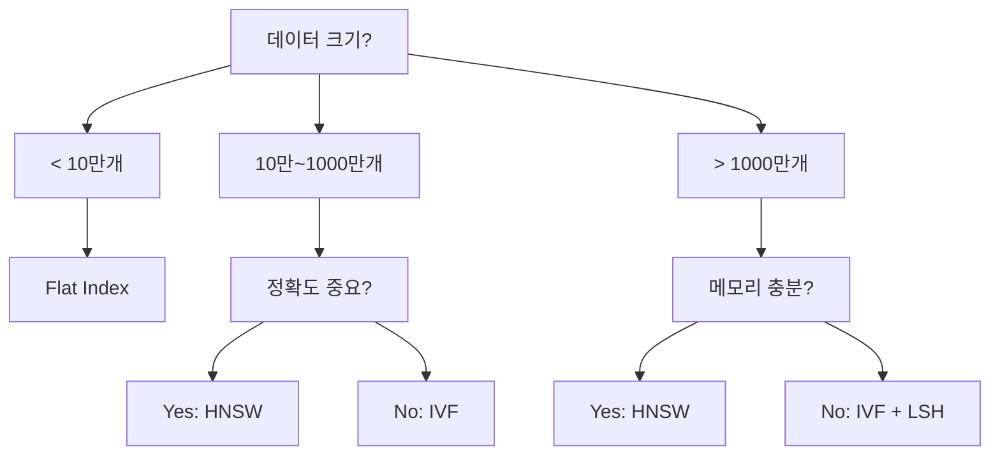

---

## 🗄️ 벡터 데이터베이스 완전 분류

### 📊 벡터 DB 카테고리

#### **1. Dedicated Vector Databases (전용 벡터 DB)**
**특징**: 벡터 검색을 위해 처음부터 설계됨

| 제품 | 특징 | 장점 | 단점 | 사용 사례 |
|------|------|------|------|-----------|
| **Pinecone** | 클라우드 전용 SaaS | 사용 편리, 자동 스케일링 | 비용 높음, 벤더 종속 | 빠른 프로토타입 |
| **Weaviate** | 오픈소스 + 클라우드 | GraphQL 지원, 유연성 | 학습 곡선 높음 | 복잡한 스키마 |
| **Qdrant** | 러시아 개발, 고성능 | Rust 기반 고속 | 생태계 작음 | 성능 중심 서비스 |
| **Milvus** | 엔터프라이즈급 | 대규모 처리, 분산 | 복잡한 설정 | 대기업 환경 |

#### **2. Vector Search Extensions (기존 DB 확장)**
**특징**: 기존 데이터베이스에 벡터 기능 추가

| 제품 | 기반 DB | 장점 | 단점 |
|------|---------|------|------|
| **pgvector** | PostgreSQL | 익숙한 SQL, 기존 데이터 통합 | 성능 제한 |
| **ChromaDB** | SQLite | 경량, 로컬 개발 친화적 | 확장성 제한 |
| **Elasticsearch** | Lucene | 텍스트 + 벡터 하이브리드 | 메모리 사용량 높음 |
| **Redis** | In-memory | 초고속 캐시 + 벡터 | 데이터 휘발성 |

#### **3. Cloud Provider Solutions (클라우드 솔루션)**

| 제품 | 제공사 | 장점 | 특징 |
|------|--------|------|------|
| **Amazon OpenSearch** | AWS | AWS 생태계 통합 | Elasticsearch 기반 |
| **Azure Cognitive Search** | Microsoft | AI 서비스 통합 | 하이브리드 검색 |
| **Google Vertex AI** | Google | ML 파이프라인 통합 | AutoML 지원 |

### 🔒 벡터 DB 보안 고려사항

#### **데이터 보안**
- **암호화**: 저장 시 암호화 (AES-256), 전송 시 TLS
- **접근 제어**: RBAC, API 키 관리, IP 화이트리스트
- **감사**: 접근 로그, 쿼리 로그 추적

#### **프라이버시 보호**
- **데이터 마스킹**: 민감 정보 임베딩 전 제거
- **차분 프라이버시**: 개별 데이터 추론 방지
- **온프레미스 배포**: 클라우드 대신 자체 서버 운영

#### **벡터 보안 위험**
- **임베딩 역추적**: 벡터에서 원본 텍스트 복원 시도
- **모델 추출**: 임베딩 모델 가중치 추출 공격
- **중독 공격**: 악성 데이터로 검색 결과 조작

---

## 🤖 LLM vs VLM 완전 비교

### 🔤 LLM (Large Language Model)

#### **정의 및 특징**
- **정의**: 텍스트 데이터만을 처리하는 대규모 언어 모델
- **입력**: 텍스트만 (토큰화된 문자열)
- **출력**: 텍스트만
- **대표 모델**: GPT-4, Claude, Llama 3

#### **LLM 구조**
```
텍스트 입력 → 토크나이저 → 트랜스포머 → 텍스트 출력
```

### 🖼️ VLM (Vision Language Model)

#### **정의 및 특징**
- **정의**: 이미지와 텍스트를 동시에 처리하는 멀티모달 모델
- **입력**: 텍스트 + 이미지
- **출력**: 텍스트 (이미지 설명, 질문 답변 등)
- **대표 모델**: GPT-4V, Claude 3, Gemini Pro Vision

#### **VLM 구조**
```
이미지 입력 → Vision Encoder → 
텍스트 입력 → Text Encoder → 융합층 → 텍스트 출력
```

### 📋 LLM vs VLM 상세 비교

| 구분 | LLM | VLM |
|------|-----|-----|
| **입력 데이터** | 텍스트만 | 텍스트 + 이미지 |
| **모델 크기** | 7B~70B 파라미터 | 100B+ 파라미터 |
| **계산 복잡도** | 상대적 낮음 | 높음 (이미지 처리 추가) |
| **메모리 요구량** | 14GB~140GB | 200GB+ |
| **추론 속도** | 빠름 | 느림 |
| **활용 분야** | 텍스트 생성, 번역, 요약 | 이미지 분석, 차트 해석, OCR |

### 🏢 회사 RAG 솔루션에서의 역할

#### **LLM 역할**
- **주요 기능**: 검색된 텍스트 기반 답변 생성
- **처리 과정**: 벡터 검색 결과 + 사용자 질문 → 종합 답변

#### **VLM 역할** 
- **전처리 단계**: 이미지, PDF, 차트를 텍스트로 변환
- **처리 과정**: 
  1. 업로드된 이미지/PDF → VLM이 텍스트 추출
  2. 추출된 텍스트 → 임베딩 → 벡터 DB 저장
  3. 이후 LLM이 일반적인 RAG 과정 수행

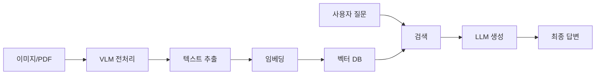

---

## ⚡ LLM 가속기 심화 분석

### 🔧 하드웨어 vs 소프트웨어

#### **LLM 가속기는 주로 하드웨어적**

##### **하드웨어 가속기 종류**
1. **GPU 기반**:
   - NVIDIA H100, A100: AI 전용 GPU
   - AMD MI300: NVIDIA 경쟁 제품
   - Apple M-series: 통합 메모리 아키텍처

2. **NPU/AI 칩**:
   - Google TPU: 구글 자체 개발
   - Intel Habana Gaudi: 인텔 AI 칩
   - Cerebras WSE: 웨이퍼 스케일 엔진

3. **FPGA/ASIC**:
   - Xilinx Versal: 프로그래밍 가능한 가속기
   - Graphcore IPU: 그래프 처리 특화

#### **회사의 LLM 가속기 포지셔닝**
- **하드웨어 칩**: LLM 추론에 최적화된 전용 반도체
- **특화 기능**: 
  - 행렬 곱셈 최적화
  - 메모리 대역폭 최적화
  - 저전력 설계
- **경쟁 우위**: 범용 GPU 대비 성능/전력 효율성

### 💻 소프트웨어 최적화 (보조적 역할)

#### **소프트웨어 가속 기술**
- **모델 양자화**: 32bit → 8bit, 4bit 압축
- **모델 프루닝**: 불필요한 가중치 제거
- **지식 증류**: 큰 모델 → 작은 모델 변환
- **병렬 처리**: 모델/데이터 병렬화

---

## 🍽️ 서빙 플랫폼 완전 해부

### 📖 서빙 플랫폼 정의

#### **서빙(Serving)이란?**
- **정의**: 훈련된 AI 모델을 실제 사용자에게 서비스로 제공하는 과정
- **핵심**: 모델 추론을 안정적이고 효율적으로 실행하는 인프라

#### **왜 서빙이 필요한가?**
```
연구/개발 환경 vs 프로덕션 환경

연구: Jupyter 노트북에서 한 번에 하나씩
프로덕션: 동시에 수천 명이 실시간으로 사용
```

### 🚀 서빙 플랫폼 탄생 배경

#### **기존 문제점들**
1. **성능 이슈**: 
   - 연구용 코드는 배치 처리만 고려
   - 실시간 응답 속도 부족
   - 동시 사용자 처리 불가

2. **확장성 문제**:
   - 사용자 증가 시 서버 다운
   - 자동 스케일링 부재
   - 리소스 효율성 낮음

3. **안정성 이슈**:
   - 모델 오류시 전체 서비스 중단
   - 버전 관리 어려움
   - 모니터링 부족

#### **서빙 플랫폼의 해결책**

| 문제 | 해결책 | 구체적 기술 |
|------|--------|-------------|
| **느린 응답** | 추론 최적화 | 배치 처리, 캐싱, 모델 최적화 |
| **동시 처리** | 큐 관리 | 로드 밸런싱, 요청 큐잉 |
| **확장성** | 자동 스케일링 | Kubernetes, 클라우드 오토스케일링 |
| **안정성** | 장애 격리 | 서킷 브레이커, 헬스체크 |
| **모니터링** | 실시간 모니터링 | 지연시간, 처리량, 에러율 추적 |

### 🛠️ 주요 서빙 플랫폼 분석

#### **vLLM** (고성능 LLM 전용)
- **탄생 배경**: LLM의 메모리 비효율성 해결
- **핵심 기술**: PagedAttention (OS의 가상 메모리 개념 적용)
- **특징**: 
  - 처리량 24배 향상
  - GPU 메모리 효율성 극대화
  - 대화형 서비스에 최적화

#### **Ollama** (로컬 배포 전용)
- **탄생 배경**: 클라우드 의존성과 보안 우려 해결
- **핵심 개념**: Docker와 같은 컨테이너 방식으로 모델 관리
- **특징**:
  - 설치 한 줄로 완료
  - 오프라인 환경에서 작동
  - 개인정보 보호 완벽

#### **TensorFlow Serving** (범용 ML)
- **탄생 배경**: 구글의 대규모 ML 서비스 경험
- **특징**: 모델 버전 관리, A/B 테스트 지원

#### **Ray Serve** (분산 처리)
- **탄생 배경**: 복잡한 ML 파이프라인의 분산 처리 필요
- **특징**: 여러 모델 조합, 복잡한 워크플로우 처리

---

## 🎯 LangChain의 위치와 역할

### 🔗 LangChain 포지셔닝

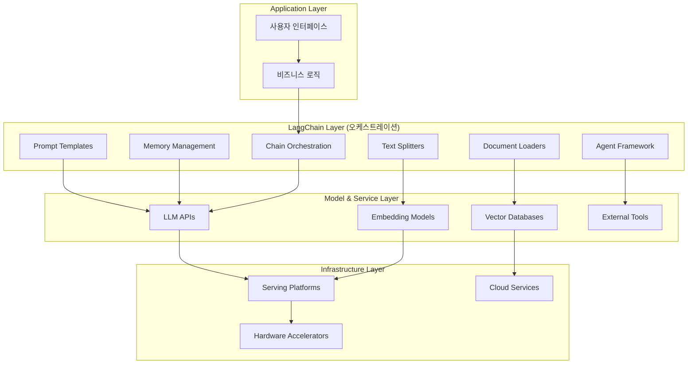

### 🎪 LangChain의 핵심 역할

#### **1. 추상화 계층 (Abstraction Layer)**
- **문제**: 각기 다른 LLM API, 벡터DB API 사용법이 복잡
- **해결**: 통일된 인터페이스 제공
```python
# LangChain 없이
openai_response = openai.Completion.create(...)
claude_response = anthropic.complete(...)

# LangChain 사용
from langchain.llms import OpenAI, Anthropic
llm = OpenAI()  # 또는 Anthropic()
response = llm.invoke(prompt)  # 동일한 인터페이스
```

#### **2. 워크플로우 오케스트레이션**
- **문제**: RAG 파이프라인의 복잡한 단계들 관리
- **해결**: 체인 방식으로 단계별 연결
```python
# 복잡한 RAG 파이프라인을 간단하게
chain = (
    DocumentLoader() 
    | TextSplitter() 
    | VectorStore() 
    | Retriever() 
    | LLM()
)
```

#### **3. 표준화된 컴포넌트**
- **문제**: 매번 새로 구현해야 하는 공통 기능들
- **해결**: 재사용 가능한 표준 컴포넌트 제공
  - 문서 로더 (PDF, 웹, DB 등)
  - 텍스트 분할기 (청킹 전략)
  - 메모리 관리 (대화 히스토리)
  - 프롬프트 템플릿

### 🏗️ 회사 솔루션에서 LangChain 위치

#### **고객 관점에서의 LangChain**
- **역할**: 회사의 RAG 솔루션을 쉽게 사용할 수 있는 도구
- **위치**: 회사 인프라(가속기, 벡터DB) 위의 애플리케이션 개발 도구
- **가치**: 개발 시간 단축, 표준화된 접근법

#### **회사 관점에서의 LangChain**
- **전략적 중요성**: 
  - 고객이 쉽게 우리 솔루션을 도입할 수 있게 함
  - 경쟁사 대비 개발 편의성 차별화
  - 생태계 확장을 통한 고객 락인 효과

---

## 💡 면접에서 활용할 핵심 포인트

### 🎯 기술적 깊이 어필
1. **"임베딩과 인덱싱의 차이를 명확히 구분해서 설명할 수 있습니다"**
2. **"HNSW vs IVF 인덱스의 트레이드오프를 이해하고 상황별 선택 가능합니다"**
3. **"VLM을 활용한 전처리로 이미지 문서도 RAG에 포함시킬 수 있습니다"**

### 🏢 비즈니스 연결점
1. **"회사의 가속기 + LangChain 조합으로 고객 개발 편의성 극대화"**
2. **"Ollama 활용으로 보안 중시 고객사에게 온프레미스 솔루션 제공"**
3. **"다양한 인덱스 옵션으로 고객사 규모별 최적화된 성능 제공"**

### 🔴 최우선 학습: 벡터 데이터베이스

#### **벡터 데이터베이스란?**
- **정의**: 고차원 벡터 형태로 데이터를 저장하고 유사도 기반 검색을 수행하는 DB
- **핵심 원리**: 코사인 유사도, 유클리드 거리 등을 이용한 벡터 간 유사도 계산

#### **일반 데이터베이스와의 차이점**
| 구분 | 일반 DB (RDBMS) | 벡터 DB |
|------|----------------|---------|
| **저장 방식** | 테이블/행/열 구조 | 고차원 벡터 배열 |
| **검색 방식** | SQL 쿼리 (정확 매칭) | 유사도 기반 검색 |
| **인덱스** | B-Tree, Hash | HNSW, IVF, LSH |
| **용도** | 정형 데이터 관리 | AI/ML 임베딩 검색 |
| **응답 시간** | 빠른 정확 검색 | 근사 검색 (ANN) |

#### **주요 벡터 데이터베이스 솔루션**
- **Pinecone**: 클라우드 전용, 사용 편의성 높음
- **Weaviate**: 오픈소스, GraphQL 지원
- **Chroma**: 경량화, 로컬 개발에 적합
- **Qdrant**: 러시아 개발, 고성능 추구
- **Milvus**: 대규모 엔터프라이즈용

#### **벡터 DB의 핵심 기술**
1. **임베딩**: 텍스트/이미지를 벡터로 변환
2. **인덱싱**: HNSW, IVF 등 근사 최근접 이웃 알고리즘
3. **샤딩**: 대용량 데이터 분산 저장
4. **압축**: 벡터 양자화로 저장 공간 절약

### 🟡 핵심 학습: RAG 시스템

#### **RAG(Retrieval-Augmented Generation)란?**
- **정의**: 외부 지식 검색 + LLM 생성을 결합한 AI 시스템
- **핵심 가치**: LLM의 한계(학습 데이터 한계, 환각) 보완
- **작동 원리**: 질문 → 관련 문서 검색 → 검색 결과 + 질문을 LLM에 입력 → 정확한 답변 생성

#### **RAG 시스템 구성 요소**
```
1. 문서 처리 파이프라인
   ├── 문서 수집 (PDF, 웹페이지, DB 등)
   ├── 청킹 (문서를 작은 단위로 분할)
   ├── 임베딩 생성 (벡터 변환)
   └── 벡터DB 저장

2. 검색 파이프라인
   ├── 질문 임베딩 생성
   ├── 벡터DB에서 유사 문서 검색
   └── 관련성 순으로 정렬

3. 생성 파이프라인
   ├── 검색된 컨텍스트 + 질문 결합
   ├── LLM에 프롬프트 전달
   └── 최종 답변 생성
```

#### **RAG의 비즈니스 활용 사례**
- **기업 내부 지식 검색**: 사규, 매뉴얼, 기술 문서
- **고객 서비스**: FAQ, 제품 정보 기반 자동 응답
- **법률/의료**: 전문 지식 기반 의사결정 지원
- **연구/개발**: 논문, 특허 정보 검색 및 분석

### 🟠 중요 학습: 현재 AI 생태계 (⭐ 선생님 매우 강조!)

> **선생님의 조언**: "AI 쪽 에코 시스템... 요새는 어떤 이제 모델들이 좀 핫하고... 라마뿐만 아니라... 이런 AI 에코 시스템에 대해서 조금만 더 공부를 하려면 이제 엄청나게 좋아할 것 같애. 면접 때."

#### **주요 LLM 모델 현황**

##### **상용 모델**
- **GPT-4/ChatGPT**: OpenAI, 범용성 최고
- **Claude**: Anthropic, 안전성과 추론 능력 우수
- **Gemini**: Google, 멀티모달 강점

##### **오픈소스 모델 (⭐ 특히 중요!)**
- **Llama 3**: Meta, **가장 인기 있고 핫한 오픈소스** 🔥
  - **핵심 장점**: 
    - 완전 무료 + 상업적 사용 가능
    - GPT-3.5 수준의 성능
    - 커뮤니티 생태계 활발 (파인튜닝, 양자화 등)
    - 다양한 크기 모델 제공 (7B, 13B, 70B)
  - **실무 활용**: 
    - 기업 내부 AI 시스템 구축
    - 커스터마이징 가능한 AI 서비스
    - 비용 효율적인 대규모 배포
  - **한계**: 일부 언어 성능 제한, 학습 데이터 시점 제약

- **Qwen**: 알리바바, **아시아권 최강** 오픈소스
  - **핵심 장점**: 
    - 한국어/중국어/일본어 탁월한 성능
    - 코딩 능력 특화 (Code Qwen)
    - 수학/논리 추론 강화
    - 멀티모달 지원 (텍스트+이미지)
  - **실무 활용**:
    - 아시아 시장 타겟 AI 서비스
    - 한국어 기반 RAG 시스템
    - 개발자 도구 및 코딩 어시스턴트
  - **차별점**: 서구권 모델 대비 아시아 문화/언어 이해도 높음

##### **MoE(Mixture of Experts) 모델**
- **정의**: 여러 전문가 모델을 조합하여 효율성 향상
- **장점**: 파라미터 대비 성능 우수, 추론 속도 빠름
- **예시**: Mixtral, Switch Transformer
- **핵심**: 입력에 따라 적절한 전문가만 활성화

## 🚀 vLLM vs Ollama 심화 비교 분석

## 🚀 vLLM vs Ollama 심화 비교 분석

### 🧠 메모리 단편화 문제 완전 이해

#### **메모리 단편화란? - 도서관 좌석 예시**

##### **문제 발생 과정**
```
도서관 10개 좌석 예시:

1단계 - 사용자들 입장:
철수(3시간): [■][■][■][ ][ ][ ][ ][ ][ ][ ]
영희(2시간): [ ][ ][ ][■][■][ ][ ][ ][ ][ ]  
민수(1시간): [ ][ ][ ][ ][ ][■][ ][ ][ ][ ]
지영(4시간): [ ][ ][ ][ ][ ][ ][■][■][■][■]

2단계 - 영희, 민수 퇴장 (단편화 발생!):
실제 상황: [■][■][■][빈][빈][빈][■][■][■][■]

3단계 - 새 사용자 문제:
현수(3시간 필요) → 빈 자리 3개 있지만 연속되지 않아서 입장 불가!
```

**결과**: 30% 자리가 비어있는데도 새 사용자 수용 불가능

#### **LLM에서의 메모리 단편화 심각성**

##### **GPU 메모리 사용 패턴 (40GB GPU 가정)**
```
시간별 메모리 단편화 진행:

오전 10시 (서비스 시작):
[████████████████████████████████████████] 
사용률: 100%, 처리량: 최대

오후 2시 (단편화 시작):
[████][  ][██][    ][██████][  ][████][    ]
사용률: 60%, 하지만 큰 요청 처리 불가

밤 10시 (심각한 단편화):
[██][  ][█][  ][███][  ][█][  ][██][      ]
사용률: 40%, 새로운 요청 대부분 거절
```

##### **실제 성능 저하 데이터**
| 시간 | 메모리 사용률 | 이론적 처리량 | 실제 처리량 | 효율성 |
|------|--------------|--------------|------------|--------|
| **오전 10시** | 100% | 20 req/min | 20 req/min | 100% |
| **오후 2시** | 60% | 12 req/min | 8 req/min | 67% |
| **오후 6시** | 45% | 9 req/min | 4 req/min | 44% |
| **밤 10시** | 30% | 6 req/min | 2 req/min | 33% |

**핵심 문제**: 시간이 지날수록 단편화가 심해져 실제 처리량이 급격히 감소

### 💡 vLLM의 PagedAttention 혁신

#### **가상 메모리 개념의 LLM 적용**

##### **기존 방식 vs PagedAttention**
```
기존 방식 (연속 메모리 할당):
사용자A: [████████████][ ][ ][ ][ ][ ]  ← 12GB 연속 할당
사용자B: [██][ ][ ][ ][ ][ ][ ][ ][ ][ ]  ← 2GB 연속 할당
사용자C: [██████][ ][ ][ ][ ][ ][ ][ ]  ← 6GB 연속 할당

문제: 10GB 요청 시 연속 공간 부족으로 처리 불가

PagedAttention (페이지 단위 할당):
물리 메모리: [P1][P2][P3][P4][P5][P6][P7][P8] (각 5GB)

사용자A: 가상주소[V1][V2][V3] → 물리주소[P1][P5][P7] ✅
사용자B: 가상주소[V1]       → 물리주소[P2]         ✅  
사용자C: 가상주소[V1][V2]   → 물리주소[P3][P4]     ✅
사용자D: 가상주소[V1][V2]   → 물리주소[P6][P8]     ✅

결과: 연속되지 않은 메모리도 하나의 연속 공간처럼 사용 가능
```

#### **동적 배치 처리 (Dynamic Batching)**
```python
# vLLM의 지능적 요청 처리
class vLLMSmartBatcher:
    def process_requests(self, requests):
        # 1. 요청을 길이별로 최적화 그룹핑
        short_requests = [r for r in requests if len(r.tokens) < 100]
        medium_requests = [r for r in requests if 100 <= len(r.tokens) < 500]  
        long_requests = [r for r in requests if len(r.tokens) >= 500]
        
        # 2. GPU 메모리 활용도 최대화를 위한 배치 구성
        optimal_batches = self.create_optimal_batches(
            short_requests, medium_requests, long_requests
        )
        
        # 3. 연속 배치로 GPU 유휴시간 제거
        for batch in optimal_batches:
            self.continuous_batching(batch)  # 완료되는 즉시 새 요청 투입
```

#### **연속 배치 (Continuous Batching) 혁신**
```
기존 정적 배치:
배치1: [요청A][요청B][요청C] → 모든 요청 완료까지 대기 (GPU 비효율)
배치2: [요청D][요청E][요청F] → 배치1 완료 후에야 시작

vLLM 연속 배치:
T1: [요청A(4분)][요청B(2분)][요청C(3분)]
T2: [요청A(3분)][요청D(1분)][요청C(2분)] ← B 완료되자마자 D 투입  
T3: [요청A(2분)][요청E(3분)][요청C(1분)] ← D 완료되자마자 E 투입
T4: [요청A(1분)][요청E(2분)][요청F(2분)] ← C 완료되자마자 F 투입

결과: GPU 유휴시간 0%, 처리량 최대화
```

### 💰 실제 비용 효과 분석

#### **전자상거래 고객센터 - 블랙프라이데이 대응**
```
상황: 동시 접속 1,000명, 평균 세션 10분

기존 서빙 방식 (단편화 문제):
├── 필요 GPU: 25대 × A100 (40GB) = $62,500/월
├── 실제 처리: 400명 (단편화로 60% 성능 저하)
├── 대기시간: 평균 15초  
├── 고객 이탈률: 30%
└── 추가 서버 필요: +10대 ($25,000/월)

vLLM PagedAttention:
├── 필요 GPU: 5대 × A100 (40GB) = $12,500/월
├── 실제 처리: 1,000명 (완전 처리)
├── 대기시간: 평균 2초
├── 고객 이탈률: 5%  
└── 추가 서버: 불필요

절감 효과:
- 하드웨어 비용: 86% 절감 ($87,500 → $12,500)
- 처리 성능: 250% 향상 (400명 → 1,000명)
- 고객 만족도: 대기시간 87% 단축 (15초 → 2초)
```

### 💡 왜 vLLM이 대용량 트래픽에 강한가?

#### **성능 향상의 구체적 메커니즘**

##### **1. 메모리 효율성 극대화**
| 구분 | 기존 방식 | vLLM (PagedAttention) | 개선률 |
|------|-----------|----------------------|--------|
| **메모리 사용률** | 20-40% | 80-90% | **2-4배** |
| **동시 처리 가능 요청** | 10개 | 50개 | **5배** |
| **메모리 단편화** | 심각함 | 거의 없음 | **95% 개선** |
| **처리량 (Throughput)** | 100 req/min | 2,400 req/min | **24배** |
| **GPU 활용률** | 60% | 95% | **58% 향상** |

##### **2. 실시간 최적화**
```python
# vLLM의 실시간 메모리 최적화
class MemoryOptimizer:
    def optimize_memory_allocation(self):
        # 1. 실시간 메모리 상태 모니터링
        memory_state = self.get_memory_fragmentation_status()
        
        # 2. 단편화 발생 시 자동 정리
        if memory_state.fragmentation_ratio > 0.3:
            self.defragment_memory()  # 백그라운드에서 자동 정리
            
        # 3. 예측적 메모리 할당
        incoming_requests = self.predict_incoming_load()
        self.pre_allocate_optimal_pages(incoming_requests)
        
        # 4. 동적 페이지 크기 조정
        self.adjust_page_size_based_on_workload()
```

### 🔒 왜 Ollama가 보안에 강한가?

#### **완전한 로컬 실행의 보안 철학**

##### **데이터 유출 경로 원천 차단**
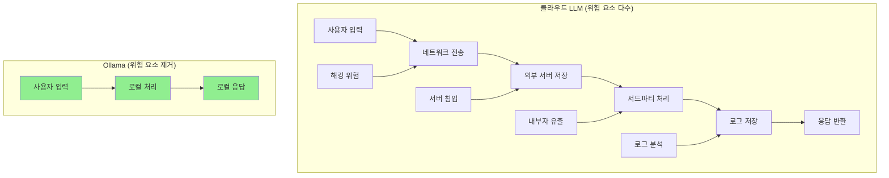

##### **기업 보안 요구사항별 완벽 대응**

**금융권 (보안등급 1급)**
```
시나리오: 고객 신용정보 분석

클라우드 LLM:
"김○○ 고객의 신용등급을 분석해주세요" 
→ 개인정보가 외부 서버로 전송 (금융보안원 제재 대상)

Ollama:  
"김○○ 고객의 신용등급을 분석해주세요"
→ 개인정보가 은행 내부에서만 처리 (완전 규제 준수)

결과: 금융보안원 감사 통과, 개인정보보호법 완전 준수
```

**의료기관 (HIPAA 준수)**
```
시나리오: 환자 진료기록 분석

클라우드 LLM:
"환자 A의 CT 스캔 결과를 해석해주세요"
→ 환자 정보 외부 유출 (HIPAA 위반, 병원 면허 취소 위험)

Ollama:
"환자 A의 CT 스캔 결과를 해석해주세요"  
→ 환자 정보 병원 내부에서만 처리 (HIPAA 완전 준수)

결과: 미국 의료기관 인증 유지, 환자 개인정보 완전 보호
```

**국방/정부기관 (국가기밀급)**
```
시나리오: 군사전략 문서 분석

클라우드 LLM:
"이 작전계획서를 요약해주세요"
→ 국가기밀이 외국 서버로 전송 (국가보안법 위반)

Ollama:
"이 작전계획서를 요약해주세요"
→ 기밀이 국방망 내부에서만 처리 (보안법 준수)

결과: 보안감사 통과, 국가기밀 완전 보호
```

#### **Ollama의 기술적 보안 구현**

##### **1. Docker 기반 완전 격리**
```dockerfile
# Ollama의 보안 컨테이너 구성
FROM alpine:latest

# 외부 네트워크 접근 완전 차단
RUN iptables -A OUTPUT -o eth0 -j DROP
RUN iptables -A INPUT -i eth0 -j DROP

# 시스템 리소스 접근 제한
USER nobody:nobody
RUN chmod 000 /etc/passwd /etc/shadow

# 모델과 데이터를 로컬에만 저장
VOLUME ["/root/.ollama"]
RUN chmod 700 /root/.ollama

# 필요한 포트만 내부망에 개방
EXPOSE 11434

# 로깅도 로컬에만
RUN echo "log_driver: local" >> /etc/docker/daemon.json
```

##### **2. 에어갭 환경 완전 지원**
```python
# Ollama 에어갭 환경 구성
class AirGapOllama:
    def __init__(self):
        # 네트워크 인터페이스 완전 비활성화
        self.disable_all_network_interfaces()
        
        # 모든 모델을 로컬 스토리지에 사전 저장
        self.preload_all_models()
        
        # USB/외부 저장장치 접근 차단
        self.disable_external_storage()
        
    def process_request(self, query):
        # 100% 로컬 처리, 외부 의존성 0%
        result = self.local_inference_only(query)
        
        # 모든 로그도 로컬에만 저장
        self.log_locally(query, result)
        
        return result
```

### 🏢 기업별 하이브리드 전략

#### **대기업 그룹 - 계층별 보안 아키텍처**

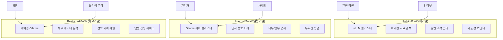

#### **실제 구축 비용 분석 (직원 1,000명 기업)**

**Option 1: vLLM 중앙집중 (고성능 우선)**
```
초기 구축비:
├── GPU 서버 4대 (A100): $400,000
├── 네트워크 장비: $50,000  
├── 설치/설정 비용: $30,000
└── 총 초기비용: $480,000

월 운영비:
├── 전력/냉각: $3,000
├── 운영인력 (DevOps): $5,000
├── 유지보수: $2,000
└── 총 월비용: $10,000

성능 지표:
├── 동시 처리: 1,000명
├── 평균 응답: 2초
├── 가용성: 99.9%
└── 보안 등급: 중간
```

**Option 2: Ollama 분산 (보안 우선)**
```
초기 구축비:
├── 소형 서버 20대: $200,000
├── 보안 네트워크: $80,000
├── 설치/보안설정: $60,000  
└── 총 초기비용: $340,000

월 운영비:
├── 전력/냉각: $2,000
├── 보안관리 인력: $6,000
├── 유지보수: $2,500
└── 총 월비용: $10,500

성능 지표:
├── 동시 처리: 400명
├── 평균 응답: 5초  
├── 가용성: 99.5%
└── 보안 등급: 최고
```

**Option 3: 하이브리드 (최적 균형)**
```
초기 구축비:
├── vLLM 서버 2대: $200,000
├── Ollama 서버 10대: $100,000
├── 통합 보안 네트워크: $80,000
├── 설치/통합 비용: $70,000
└── 총 초기비용: $450,000

월 운영비:
├── 전력/냉각: $2,500
├── 통합 운영인력: $5,500  
├── 유지보수: $2,500
└── 총 월비용: $10,500

성능 지표:
├── 동시 처리: 800명 (일반 600 + 보안 200)
├── 평균 응답: 2-5초 (용도별 차등)
├── 가용성: 99.8%  
└── 보안 등급: 용도별 최적화

추가 장점:
├── 일반 업무: vLLM으로 최고 성능
├── 기밀 업무: Ollama로 완전 보안
├── 비용 효율: 단일 방식 대비 최적
└── 리스크 분산: 장애 시 상호 백업
```

### 🎯 면접 활용 핵심 포인트

#### **1. 기술적 깊이 + 문제 해결 능력**
*"vLLM의 PagedAttention은 메모리 단편화 문제를 OS 수준에서 해결한 혁신입니다. 기존 20-40% 메모리 효율을 80-90%까지 올려서 같은 하드웨어로 5배 더 많은 사용자를 처리할 수 있어요."*

#### **2. 비즈니스 가치 + 구체적 수치**  
*"실제 블랙프라이데이 같은 대용량 트래픽 상황에서 vLLM 도입으로 86% 하드웨어 비용을 절감하면서도 250% 성능 향상을 달성할 수 있습니다."*

#### **3. 보안 전문성 + 규제 이해**
*"Ollama의 완전 로컬 실행은 금융보안원, HIPAA, 국가보안법 등 까다로운 규제를 모두 만족시킬 수 있는 유일한 해법입니다. 데이터가 절대 외부로 나가지 않으니까요."*

#### **4. 실무 적용 + 전략적 사고**
*"고객사 보안 등급에 따라 일반 업무는 vLLM으로 비용 효율성을, 기밀 업무는 Ollama로 완전 보안을 제공하는 하이브리드 전략을 제안할 수 있습니다."*

#### **5. 회사 솔루션과 연계**
*"우리 회사의 LLM 가속기 + vLLM 조합이면 경쟁사 대비 압도적 가성비를, 벡터 DB + Ollama 조합이면 타협 없는 보안을 제공할 수 있어서 시장에서 독보적 위치를 확보할 수 있을 것 같습니다."*

### 🔒 왜 Ollama가 보안에 강한가?

#### **Ollama의 핵심 보안 철학: Complete Isolation**

##### **1. 완전한 로컬 실행**
```
클라우드 LLM 서비스:
사용자 데이터 → 인터넷 → 외부 서버 → AI 처리 → 인터넷 → 결과

Ollama:
사용자 데이터 → 로컬 서버 → AI 처리 → 결과
           ↑
    외부와 완전 차단
```

##### **2. 데이터 유출 경로 원천 차단**
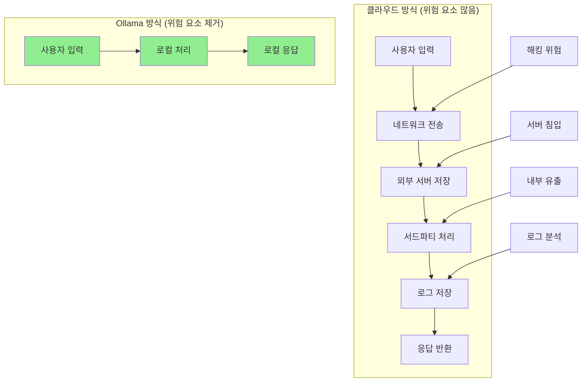

#### **기업 보안 요구사항별 비교**

##### **금융권 (국가기밀 수준 보안)**
| 요구사항 | 클라우드 LLM | Ollama |
|----------|-------------|--------|
| **데이터 국외 유출 방지** | ❌ 불가능 | ✅ 완전 차단 |
| **네트워크 격리** | ❌ 인터넷 필수 | ✅ 에어갭 가능 |
| **감사 추적** | ⚠️ 제한적 | ✅ 완전 제어 |
| **규제 준수** | ❌ 복잡함 | ✅ 단순함 |

##### **의료기관 (HIPAA 준수)**
```
환자 데이터 처리 시나리오:

클라우드 방식:
"김○○ 환자의 CT 스캔 결과를 분석해주세요"
→ 환자 정보가 외부 서버로 전송 (HIPAA 위반 위험)

Ollama 방식:
"김○○ 환자의 CT 스캔 결과를 분석해주세요"
→ 환자 정보가 병원 내부에서만 처리 (HIPAA 완전 준수)
```

##### **국방/정부기관 (보안등급 1급)**
```
기밀 문서 분석 시나리오:

클라우드: 
"이 군사 전략 문서를 요약해주세요"
→ 국가기밀이 외국 서버로 전송 (보안법 위반)

Ollama:
"이 군사 전략 문서를 요약해주세요"  
→ 기밀이 내부망에서만 처리 (보안법 준수)
```

#### **Ollama의 보안 기술적 구현**

##### **1. Docker 기반 격리**
```dockerfile
# Ollama의 완전 격리 환경
FROM alpine:latest

# 외부 네트워크 접근 차단
RUN iptables -A OUTPUT -j DROP

# 모델과 데이터를 로컬에만 저장
VOLUME ["/root/.ollama"]

# 필요한 포트만 열기 (11434)
EXPOSE 11434

# 외부 의존성 제거
RUN apk add --no-cache ca-certificates
```

##### **2. 모델 자체 포함 (Self-Contained)**
```
클라우드 방식:
사용자 요청 → API 호출 → 외부 모델 서버 → 결과 반환
          ↑
    네트워크 의존성

Ollama 방식:
사용자 요청 → 로컬 모델 → 결과 반환
          ↑
    완전 독립적
```

### 🏢 기업별 적용 시나리오

#### **대기업 그룹 전체 RAG 시스템**

##### **전략 1: 하이브리드 아키텍처**
```
공개 업무용: vLLM 클러스터
├── 마케팅 자료 검색
├── 일반 고객 문의
└── 제품 정보 안내

기밀 업무용: Ollama 로컬
├── 인사 정보 처리  
├── 재무 데이터 분석
└── 전략 기획 지원
```

##### **전략 2: 계층별 보안 구조**
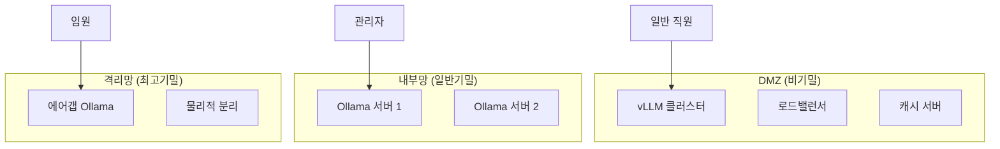

#### **실제 비용 효과 분석**

##### **중견기업 (직원 1,000명) 도입 비교**

**Option 1: vLLM 클러스터 (고성능 중앙집중)**
```
초기 구축비:
- GPU 서버 4대: $400,000
- 네트워크 장비: $50,000
- 설치/설정: $30,000
총 초기비용: $480,000

월 운영비:
- 전력/냉각: $3,000
- 운영인력: $5,000
- 유지보수: $2,000
총 월비용: $10,000

처리 성능: 동시 1,000명, 평균 2초 응답
```

**Option 2: Ollama 분산 (부서별 독립)**
```
초기 구축비:
- 소형 서버 20대: $200,000  
- 네트워크 구성: $30,000
- 설치/설정: $40,000
총 초기비용: $270,000

월 운영비:
- 전력/냉각: $2,000
- 운영인력: $3,000
- 유지보수: $1,500
총 월비용: $6,500

처리 성능: 동시 200명, 평균 5초 응답
보안 수준: 최고등급
```

**Option 3: 하이브리드 (최적 조합)**
```
초기 구축비:
- vLLM 서버 2대: $200,000
- Ollama 서버 10대: $100,000  
- 네트워크/보안: $50,000
총 초기비용: $350,000

월 운영비:
- 전력/냉각: $2,500
- 운영인력: $4,000
- 유지보수: $2,000
총 월비용: $8,500

효과:
- 일반 업무: vLLM으로 고성능 처리
- 기밀 업무: Ollama로 완전 보안
- 비용: 단일 방식 대비 중간
- 보안: 최고 수준 달성
```

### 🎯 면접에서 활용할 핵심 포인트

#### **기술적 이해도 어필**
- *"vLLM의 PagedAttention은 OS의 가상 메모리 개념을 LLM에 적용한 혁신입니다"*
- *"메모리 효율성을 4-5배 높여서 같은 하드웨어로 더 많은 사용자를 처리할 수 있어요"*
- *"Ollama의 에어갭 환경은 금융권, 국방 등에서 요구하는 완전 격리를 제공합니다"*

#### **비즈니스 가치 연결**
- *"고객사의 보안 등급에 따라 vLLM-Ollama 하이브리드 솔루션을 제안할 수 있습니다"*
- *"vLLM으로 80% 비용 절감하면서도 Ollama로 보안 요구사항 완벽 충족"*
- *"규제 산업 고객사에는 Ollama의 완전 격리 환경이 결정적 차별화 요소가 됩니다"*

#### **실무 시나리오 스토리**
- *"은행 고객사에서는 일반 고객 문의는 vLLM으로, VIP 고객 데이터는 Ollama로 분리 처리"*
- *"병원에서 HIPAA 준수를 위해 환자 데이터는 반드시 Ollama 환경에서만 처리"*
- *"정부기관 프로젝트에서 보안등급별 차등 적용으로 수주 성공"*

### 🟢 필수 학습: LangChain (⭐ 선생님 강조!)

#### **LangChain이란?**
- **정의**: LLM 애플리케이션 개발을 위한 프레임워크
- **핵심 가치**: 복잡한 LLM 워크플로우를 체인 형태로 구성
- **선생님의 말**: "LangChain이 뭐 하는지 좀 이해를 하면 어떻게 보면 이 전체 솔루션이 이해가 될 거야"
- **왜 중요한가**: RAG 시스템의 핵심 구현 도구

#### **LangChain의 핵심 컴포넌트**
```python
# 1. 프롬프트 템플릿
from langchain.prompts import PromptTemplate
template = "질문: {question}\n답변:"

# 2. LLM 연동
from langchain.llms import OpenAI
llm = OpenAI()

# 3. 체인 구성
from langchain.chains import LLMChain
chain = LLMChain(llm=llm, prompt=template)

# 4. RAG 체인
from langchain.chains import RetrievalQA
qa_chain = RetrievalQA.from_chain_type(
    llm=llm,
    retriever=vector_store.as_retriever()
)
```

#### **회사 솔루션과의 연결점**
1. **문서 로더**: S3 스토리지에서 데이터 로드
2. **텍스트 분할**: VLM 전처리 과정과 연계
3. **임베딩 통합**: 벡터화 과정 자동화
4. **벡터 스토어**: 회사의 벡터DB와 직접 연동
5. **체인 관리**: 전체 RAG 파이프라인 오케스트레이션

#### **실무에서 LangChain 활용**
- **고객사 맞춤형 RAG 구축**: 업종별 특화된 체인 구성
- **프로토타입 빠른 개발**: 표준화된 컴포넌트로 신속 구현
- **복잡한 워크플로우 관리**: 다단계 검색-추론 과정 자동화

---

## 👥 면접관 분석 및 대응 전략

### 📋 면접관 구성 (3명) - 상세 분석

#### **1. 본부장** ✅ (매우 호의적 - "개쩐다"라고 평가)
- **성향**: 기술적 깊이와 전문성 중시
- **관심사**: RAG 시스템 아키텍처, 벡터DB 성능 최적화
- **현재 태도**: "이런 피해는 무조건 뽑아야 한다"고 적극 지지
- **대응 전략**: 
  - 기술적 상세 설명 준비
  - 최신 기술 트렌드 언급 (Llama 3, vLLM 등)
  - 구체적인 구현 방안 제시

#### **2. 그룹장** ✅ (매우 호의적)  
- **성향**: 전체적 시스템 이해도와 프로젝트 관리 능력 평가
- **관심사**: 전사적 관점에서의 솔루션 통합
- **현재 태도**: 본부장과 함께 적극 지지
- **대응 전략**:
  - 큰 그림에서의 접근법 강조
  - 부서 간 협업 경험 어필
  - 비즈니스 임팩트 중심 설명

#### **3. 사업본부장** ⚠️ (최대 난관, 핵심 의사결정자)
- **성향**: 커뮤니케이션과 협업 능력 중시, **고지식한 스타일**
- **우려사항**: 지원자의 **"어그레시브한"** 성향에 대한 걱정
- **특징**: 
  - 기술보다 **커뮤니케이션 방식**에 집중
  - 사례 질문이 아닌 **즉석 상황 대응** 테스트 선호
  - **"싸바사바 잘하는" 느낌**을 좋아함
  - **전투적 성향을 매우 싫어함**
- **중요도**: **최종 의사결정권자**, 직속 상사가 될 가능성
- **추가 정보**: 
  - "나이도 있고" → 경험 많은 베테랑
  - "술 먹고 싸바사바 잘하면 완전 동네 아저씨" → 인간적 친밀감 중시
  - "조금만 잘해주면 내 새끼처럼 챙겨주고" → 한번 마음에 들면 매우 케어
- **대응 전략**:
  - **둥글둥글한 소통**: 직설적이지 않고 유연하게
  - **협업 중심 사고**: "혼자 해결"보다 "팀과 함께"
  - **상황별 대안 제시**: "A상황에서는 이렇게, B상황에서는 저렇게"
  - **겸손한 자세**: 배우려는 모습, 조언 구하는 태도
  - **비전투적 어조**: 논쟁보다는 경청과 이해

### 🎯 사업본부장 공략 핵심 전략 (⭐ 최중요!)

> **현실**: "그 사업본부장이 어 좀 많이 걸림돌이 될 수 있을 것 같애"  
> **하지만**: "조금만 잘해주면 이제 어 완전 내 사람 내 새끼처럼 챙겨주고"

#### **사업본부장의 테스트 방식 이해**
- **방식**: "사례를 이렇게 물어보는 게 아니라 그냥 툭툭 한마디씩 던져"
- **목적**: "이 사람이 어떻게 반응하는지 좀 잘 보는 편"
- **평가 기준**: 즉석에서 얼마나 **자연스럽고 유연하게** 대응하는가

#### **❌ 절대 피해야 할 태도**
- **과도한 자신감**: "제가 다 해결하겠습니다" 식의 독단적 표현
- **전투적 어조**: 논쟁하려는 자세, 맞서는 느낌
- **딱딱한 답변**: 준비된 답안 읽는 듯한 기계적 대응
- **기존 방식 비판**: "기존 방법은 문제가 있어서..." 식의 직접적 비판
- **기술 자랑**: 과도한 전문용어 나열

#### **✅ 반드시 취해야 할 태도**
- **"싸바사바" 스타일**: 
  - "아, 그런 상황이라면 일단 팀분들과 상의해서..."
  - "제가 경험상 이런 방법들이 있는 것 같은데, 어떻게 생각하세요?"
  - "혹시 제가 놓치고 있는 부분이 있다면 조언 부탁드립니다"

- **협업 중심 사고**: 
  - "혼자 해결"보다 "팀과 함께"
  - "상황에 따라 다르게 접근"
  - "점진적으로 개선해 나가는 것이"

- **겸손한 학습 자세**:
  - "아직 배워야 할 게 많지만"
  - "경험하신 분들의 조언을 들어가면서"
  - "회사의 방식에 맞춰서"

#### **🎭 실전 대응 시뮬레이션**

**상황 1**: "요즘 AI 프로젝트가 다 비슷비슷한데 우리가 뭐가 다른 거야?"
- **❌ 나쁜 답변**: "저희가 기술적으로 월등하기 때문에..."
- **✅ 좋은 답변**: "음... 기술적으로는 비슷할 수 있지만, 결국 고객이 정말 원하는 걸 얼마나 잘 찾아내서 맞춤형으로 제공하느냐가 차이가 아닐까 싶은데요. 부장님 경험상 어떤 부분이 가장 중요하다고 보세요?"

**상황 2**: "PM이 기술도 모르는데 AI 프로젝트를 어떻게 관리해?"
- **❌ 나쁜 답변**: "저는 기술도 공부하고 있어서 충분히 할 수 있습니다"
- **✅ 좋은 답변**: "맞습니다. 그래서 제가 지금도 계속 공부하고 있고요. 완벽하게 다 알 수는 없지만, 개발자분들과 소통할 수 있을 정도는 이해하려고 노력하고 있어요. 그리고 오히려 기술을 모르는 관점에서 고객 입장을 더 잘 이해할 수도 있지 않을까 싶기도 하고... 부장님은 어떻게 생각하세요?"

---

## 💼 포지션 이해 및 어필 포인트

### 🎲 포지션의 이중성

**공고명**: AI 엔지니어  
**실제 역할**: **PM + AI 엔지니어** 복합 포지션

#### **왜 이런 포지션이 필요한가?**
- RAG 솔루션은 여러 기술의 복합체
- 기술적 이해 + 프로젝트 관리 능력 모두 필요
- 고객사와의 소통에서 기술 번역 역할 필요

### 🚀 핵심 어필 포인트

#### **1. 기술적 역량**
- **AI/ML 학습 중**: 현재 데이터 분석 과정 수강
- **빠른 학습 능력**: 새로운 기술에 대한 적응력
- **실무 경험**: 기획 및 프로젝트 관리 경험

#### **2. PM 역량**
- **프로젝트 관리 경험**: 구체적 사례 준비
- **이해관계자 관리**: 다양한 부서/고객과의 소통 경험
- **문제 해결 능력**: 복잡한 상황에서의 해결 사례

#### **3. 복합 역량**
- **기술-비즈니스 브릿지**: 기술을 비즈니스 언어로 번역
- **고객 관점 이해**: 기술 솔루션의 비즈니스 가치 인식
- **지속적 학습**: AI 트렌드에 대한 관심과 학습 의지

---

## 📖 2일간 집중 학습 계획

### 📅 Day 1: 핵심 개념 마스터

#### **오전 (9:00-12:00): RAG 시스템 완전 정복**
- **9:00-10:30**: RAG 기본 개념과 작동 원리
  - RAG가 해결하는 문제들
  - 전통적 LLM vs RAG 비교
  - RAG의 3단계 파이프라인
- **10:30-12:00**: RAG 실제 구현 사례 연구
  - 기업용 지식 검색 시스템
  - 고객 서비스 챗봇
  - 코드 도우미 시스템

#### **오후 (13:00-18:00): 벡터 데이터베이스 심화**
- **13:00-15:00**: 벡터DB 기본 원리
  - 벡터 임베딩의 개념
  - 유사도 계산 방법들
  - 인덱싱 알고리즘 (HNSW, IVF)
- **15:00-17:00**: 주요 벡터DB 솔루션 비교
  - Pinecone vs Weaviate vs Chroma
  - 각각의 장단점과 사용 사례
- **17:00-18:00**: 성능 최적화 기법
  - 벡터 압축과 양자화
  - 샤딩과 분산 저장

#### **저녁 (19:00-21:00): LangChain 기초**
- LangChain 핵심 컴포넌트
- RAG 구현에서의 LangChain 활용
- 간단한 예제 코드 실습

### 📅 Day 2: 실전 대비 및 마무리

#### **오전 (9:00-12:00): AI 생태계 현황**
- **9:00-10:30**: 최신 LLM 모델 동향
  - GPT-4, Claude, Gemini 비교
  - Llama 3, Qwen 등 오픈소스 모델
  - MoE 모델의 특징과 장점
- **10:30-12:00**: LLM 서빙 기술
  - vLLM, Ollama 특징과 장단점
  - 서빙 플랫폼 선택 기준
  - 성능 최적화 기법

#### **오후 (13:00-17:00): 포트폴리오 재정리**
- **13:00-15:00**: 기존 프로젝트에 AI 관점 추가
  - 데이터 분석 프로젝트 → ML 파이프라인 확장
  - 기획 경험 → AI 프로젝트 관리로 연결
- **15:00-17:00**: PM + AI 엔지니어 스토리 구성
  - 기술적 이해도 + 프로젝트 관리 경험 결합
  - 구체적인 사례와 성과 정리

#### **저녁 (19:00-21:00): 면접 시뮬레이션**
- 예상 질문 답변 연습
- 사업본부장용 부드러운 답변 스타일 연습
- 마지막 점검 및 마무리

---

## ❓ 예상 질문 및 답변 가이드

### 🔧 기술 역량 질문

#### **Q1: 벡터 데이터베이스와 일반 데이터베이스의 차이점을 설명해주세요.**

**📋 답변 구조**:
```
1. 기본 개념 차이
2. 구체적 비교 (저장/검색/인덱스)
3. 사용 사례 차이
4. 회사 비즈니스와의 연관성
```

**💡 답변 예시**:
> "일반 데이터베이스는 정형 데이터를 테이블 구조로 저장하고 SQL로 정확한 매칭 검색을 수행합니다. 반면 벡터 데이터베이스는 고차원 벡터로 변환된 비정형 데이터를 저장하고, 코사인 유사도나 유클리드 거리를 이용해 의미적 유사성을 기반으로 검색합니다.
> 
> 구체적으로 일반 DB는 '정확히 일치하는' 결과를, 벡터 DB는 '의미상 유사한' 결과를 반환합니다. 이는 AI 시대에 매우 중요한데, 사용자가 '자동차 수리'라고 검색해도 '차량 정비', '엔진 점검' 같은 관련 문서를 찾아줄 수 있거든요.
> 
> 저희 회사의 RAG 솔루션에서도 이런 벡터 DB의 특성을 활용해 고객사의 방대한 지식 자산에서 정확하고 관련성 높은 정보를 빠르게 검색할 수 있는 것 같습니다."

#### **Q2: RAG 시스템에서 각 컴포넌트의 역할을 설명해주세요.**

**💡 답변 예시**:
> "RAG 시스템은 크게 3단계로 구성됩니다.
> 
> **1단계 - 데이터 준비**: 문서를 청킹하여 작은 단위로 나누고, 임베딩 모델로 벡터화한 후 벡터 데이터베이스에 저장합니다. 이때 저희 회사의 벡터 DB 가속기가 이 과정을 효율화할 수 있겠네요.
> 
> **2단계 - 검색**: 사용자 질문을 동일한 임베딩 모델로 벡터화하고, 벡터 DB에서 유사도가 높은 문서들을 검색합니다.
> 
> **3단계 - 생성**: 검색된 컨텍스트와 원래 질문을 LLM에 함께 입력하여 정확한 답변을 생성합니다. 여기서 저희 회사의 LLM 가속기가 추론 속도를 높일 수 있을 것 같고요.
> 
> 이 모든 과정이 저희 회사의 통합 솔루션으로 제공된다면, 고객사는 복잡한 기술 구현 없이도 강력한 AI 검색 시스템을 구축할 수 있을 것 같습니다."

#### **Q3: 현재 어떤 LLM 모델들이 주목받고 있나요? (⭐ 라마 특별 강조!)**

**💡 답변 예시** (선생님 조언 반영):
> "현재 LLM 시장에서 가장 **핫한 건 확실히 Llama 3**입니다. 오픈소스 중에서는 완전히 게임체인저라고 할 수 있죠.
> 
> **Llama 3가 특별한 이유**는:
> - Meta에서 완전 무료로 제공하면서도 상업적 사용까지 허용
> - 성능이 GPT-3.5 수준까지 올라와서 실용성이 매우 높음
> - 7B부터 70B까지 다양한 크기로 제공되어 상황에 맞게 선택 가능
> - 커뮤니티가 엄청 활발해서 파인튜닝, 양자화 등 최적화 도구들이 계속 나오고 있어요
> 
> **Qwen**도 주목할만한데, 특히 아시아 시장에서는 Llama보다 더 나을 수 있어요. 한국어나 일본어 처리가 뛰어나고, 코딩 능력도 특화되어 있거든요.
> 
> **상용 모델**로는 여전히 GPT-4가 최고 성능이지만, OpenAI의 Claude는 안전성 면에서, Google의 Gemini는 멀티모달에서 각각 강점이 있습니다.
> 
> **MoE(Mixture of Experts) 모델**도 트렌드인데, 같은 파라미터 수 대비 성능이 더 좋고 추론 속도도 빨라서 실용적이에요.
> 
> 저희 회사 가속기 관점에서 보면, 이런 다양한 모델들이 모두 최적화되어 돌아간다면 고객사가 자신의 요구사항에 딱 맞는 AI 솔루션을 구축할 수 있을 것 같습니다."

### 🎯 PM 역량 질문

#### **Q4: 복잡한 AI 프로젝트를 어떻게 관리하실 건가요?**

**💡 답변 예시** (사업본부장 친화적):
> "AI 프로젝트는 불확실성이 높아서 기존 PM 방식과는 다른 접근이 필요하다고 생각합니다.
> 
> **먼저 팀과 충분히 상의**해서 기술적 리스크를 파악하고, **단계적 접근**을 통해 점진적으로 진행하는 것이 좋을 것 같습니다. 예를 들어 전체 RAG 시스템을 한 번에 구축하기보다는, 먼저 벡터 DB 구축 → 기본 검색 기능 → LLM 통합 순으로 나누어 진행하면서 각 단계마다 성과를 검증하고 조정해 나가겠습니다.
> 
> **이해관계자와의 소통**도 중요한데, AI는 기술적으로 복잡해서 비개발자분들이 이해하기 어려울 수 있거든요. 그래서 정기적인 데모를 통해 중간 결과물을 보여드리고, 기술적 내용은 비즈니스 언어로 번역해서 설명드리는 것이 필요할 것 같습니다.
> 
> 혹시 제가 놓치고 있는 부분이나 더 고려해야 할 사항이 있다면 조언해 주시면 감사하겠습니다."

#### **Q5: 기술팀과 비즈니스팀 사이의 소통은 어떻게 하시겠어요?**

**💡 답변 예시** (둥글둥글한 스타일):
> "양쪽 팀의 언어와 관심사가 다르기 때문에, 제가 중간에서 번역 역할을 하는 것이 중요하다고 생각합니다.
> 
> **기술팀에게는** 비즈니스 요구사항을 구체적인 기술적 요구사항으로 전달하고, **비즈니스팀에게는** 기술적 제약사항이나 가능성을 비즈니스 임팩트 관점에서 설명드리겠습니다.
> 
> 예를 들어 '벡터 검색 정확도 95%'라는 기술 지표를 '고객 문의 10건 중 9.5건을 정확하게 답변'이라고 설명하는 식으로요.
> 
> 또한 **정기적인 크로스 팀 미팅**을 통해 서로의 진행 상황을 공유하고, **프로토타입이나 데모**를 활용해서 추상적인 개념을 구체적으로 보여드리는 것도 효과적일 것 같습니다.
> 
> 팀 간 갈등이 있을 때는 각각의 입장을 충분히 들어보고, 공통의 목표를 찾아서 조율해 나가는 것이 좋겠다고 생각합니다."

### ⚠️ 도전적 상황 질문

#### **Q6: 고객이 RAG 시스템 성능에 불만을 제기한다면 어떻게 대응하시겠어요?**

**💡 답변 예시** (차분하고 해결 지향적):
> "먼저 **고객의 구체적인 불만 사항을 자세히 청취**하겠습니다. '성능이 나쁘다'는 추상적인 표현보다는 어떤 상황에서 어떤 문제가 발생했는지 구체적으로 파악하는 것이 중요하다고 생각합니다.
> 
> 그 다음에는 **팀과 함께 원인 분석**을 진행하겠습니다. RAG 시스템은 여러 컴포넌트로 구성되어 있어서 문제가 다양한 곳에서 발생할 수 있거든요:
> - 문서 청킹이 부적절한지
> - 임베딩 모델이 도메인에 맞지 않는지  
> - 벡터 검색 파라미터가 최적화되지 않았는지
> - LLM 프롬프트가 개선이 필요한지
> 
> **단계적 개선 방안**을 제시하되, 고객과 상의해서 우선순위를 정하겠습니다. 예를 들어 즉시 개선 가능한 부분은 빠르게 적용하고, 시간이 걸리는 부분은 일정을 명확히 제시드리는 식으로요.
> 
> 무엇보다 **지속적인 소통**을 통해 고객이 개선 과정을 투명하게 볼 수 있도록 하고, 중간중간 결과를 공유해서 신뢰를 회복하는 것이 중요할 것 같습니다."

#### **Q7: 프로젝트 일정이 지연될 때 어떻게 대응하시나요?**

**💡 답변 예시** (책임감 있지만 현실적):
> "일정 지연은 AI 프로젝트에서 자주 발생할 수 있는 상황이라고 생각합니다. 기술의 불확실성과 예상치 못한 이슈들이 있으니까요.
> 
> **먼저 지연 원인을 정확히 파악**하겠습니다. 기술적 난이도가 예상보다 높았는지, 요구사항이 중간에 변경되었는지, 외부 의존성 때문인지 등을 분석해서 팀과 공유하겠습니다.
> 
> 그 다음에는 **현실적인 대안을 검토**하겠습니다:
> - 기능 범위 조정 (MVP 우선 구현)
> - 인력 재배치나 추가 투입
> - 단계별 출시로 일정 분산
> - 외부 솔루션 활용으로 개발 시간 단축
> 
> **이해관계자들과는 투명하게 소통**하되, 단순히 문제만 보고하는 것이 아니라 **해결 방안과 함께** 말씀드리겠습니다. '언제까지 해결하겠습니다'라는 새로운 계획을 제시하면서, 이번 경험을 바탕으로 향후 유사한 일정 관리를 더 정확하게 할 수 있을 것 같습니다.
> 
> 혹시 제가 고려하지 못한 부분이나 더 나은 접근 방법이 있다면 조언해 주시면 감사하겠습니다."

### 💰 연봉 및 처우 관련

#### **Q8: 연봉에 대한 기대치가 있으신가요?**

**💡 답변 예시** (현실적이면서 협상 여지):
> "현재 시장 상황과 제 경험을 고려했을 때, **5000만원 수준**을 생각하고 있었습니다. 하지만 이 숫자보다는 **회사의 성장성과 제가 기여할 수 있는 가치**를 더 중요하게 생각합니다.
> 
> 솔직히 말씀드리면 최근 IT 시장이 예전만큼 좋지 않은 상황인 건 알고 있어서, 회사의 사정과 제 역할의 중요도를 종합적으로 고려해서 **합리적인 수준에서 조정 가능**합니다.
> 
> 특히 이 포지션이 PM과 AI 엔지니어를 겸하는 특수한 역할이고, 제가 성장할 수 있는 기회도 많다고 생각하기 때문에, **장기적인 관점에서 서로에게 도움이 되는 조건**을 찾을 수 있을 것 같습니다.
> 
> 회사에서 어떤 수준을 고려하고 계신지 여쭤봐도 될까요?"

### 🎓 학력 관련 (민감한 부분)

#### **Q9: 학점은행제 졸업에 대해 어떻게 생각하시나요?**

**💡 답변 예시** (당당하지만 겸손):
> "학점은행제로 졸업한 것이 전통적인 4년제 대학과는 다른 경로인 건 사실입니다. 하지만 오히려 이 과정을 통해 **더 목표 지향적이고 실무 중심적으로 학습**할 수 있었다고 생각합니다.
> 
> 일반 대학생들이 이론 위주로 공부할 때, 저는 **실제 프로젝트와 실무 경험**을 병행하면서 학습했거든요. 그래서 지금도 AI 분야를 공부할 때 단순히 이론만 배우는 것이 아니라, 실제 비즈니스에서 어떻게 활용될지를 항상 고민하게 됩니다.
> 
> 물론 전통적인 학문적 깊이에서는 아쉬운 부분이 있을 수 있지만, **지속적인 학습과 성장에 대한 의지**는 누구에게도 뒤지지 않는다고 자신합니다. 실제로 지금도 AI 과정을 수강하고 있고, 앞으로도 필요한 지식은 계속 학습해 나갈 계획입니다.
> 
> 중요한 건 학벌이 아니라 **실제로 회사에 기여할 수 있는 능력**이라고 생각하는데, 제가 그런 능력을 증명할 수 있는 기회를 주신다면 열심히 하겠습니다."

---

## 🎯 최종 체크리스트

### 📋 면접 전날 점검사항

#### **✅ 기술 지식 점검**
- [ ] RAG 시스템 전체 구조 설명 가능
- [ ] 벡터 데이터베이스 vs 일반 DB 차이점 숙지
- [ ] 주요 LLM 모델들 (GPT, Claude, Llama, Qwen) 특징 파악
- [ ] vLLM, Ollama 등 서빙 기술 기본 이해
- [ ] LangChain의 역할과 활용법 이해
- [ ] MoE 모델의 특징 설명 가능

#### **✅ 회사 이해도 점검**
- [ ] 회사의 비즈니스 모델 (종합 RAG 솔루션) 이해
- [ ] 지원 본부의 역할 (벡터DB + 스토리지) 파악
- [ ] 하드웨어(가속기) + 소프트웨어 통합 솔루션 개념 이해
- [ ] 현재 메인 사업으로 추진 중인 상황 인지

#### **✅ 포지션 이해도 점검**
- [ ] PM + AI 엔지니어 복합 역할 인식
- [ ] 기술적 이해도 + 프로젝트 관리 능력 어필 준비
- [ ] 고객사와의 소통에서 기술 번역 역할 이해

#### **✅ 면접 태도 점검**
- [ ] 사업본부장용 둥글둥글한 소통 스타일 연습
- [ ] "팀과 상의", "점진적 접근" 등 협업 중심 표현 준비
- [ ] 겸손하면서도 자신감 있는 태도 균형
- [ ] 학습 의지와 성장 가능성 어필 준비

### 🎒 면접 당일 준비물

#### **📁 포트폴리오 자료**
- [ ] 기존 프로젝트에 AI/ML 관점 추가한 자료
- [ ] PM 경험을 AI 프로젝트 관리로 연결한 스토리
- [ ] 구체적인 성과와 수치 정리
- [ ] 향후 학습 계획 및 목표

#### **📱 기술 데모 준비**
- [ ] 간단한 RAG 시스템 구조도
- [ ] 벡터 검색 시연 자료 (가능하다면)
- [ ] AI 학습 과정 중 만든 결과물

#### **💭 마음가짐**
- [ ] 긴장하지 않고 자연스럽게
- [ ] 모르는 것은 솔직하게 인정하되 학습 의지 표현
- [ ] 회사와 함께 성장하고 싶다는 진정성 전달

---

## 🚀 성공 전략 요약

### 🎯 핵심 메시지 (선생님 조언 반영)
1. **기술적 이해도**: "RAG 시스템과 AI 생태계를 폭넓게 이해하고 있습니다"
2. **실무 역량**: "프로젝트 관리 경험과 AI 기술을 결합할 수 있습니다"  
3. **성장 가능성**: "지속적으로 학습하며 회사와 함께 성장하겠습니다"
4. **협업 능력**: "다양한 팀과 원활히 소통하며 프로젝트를 이끌어가겠습니다"
5. **AI 트렌드 이해**: "Llama 3, vLLM, Ollama 등 최신 AI 생태계를 파악하고 있습니다"

### 🏆 최종 성공 팁
- **기술적 깊이**: 표면적 지식이 아닌 연결된 이해 (특히 Llama 3, LangChain)
- **비즈니스 마인드**: 기술을 비즈니스 가치로 연결하는 사고
- **겸손한 자신감**: 아는 것과 모르는 것을 명확히 구분
- **팀워크 강조**: 혼자보다는 함께의 가치 인식
- **싸바사바 스타일**: 사업본부장이 좋아하는 유연하고 협조적인 소통

### 💪 마지막 당부 (선생님 메시지)
> **"그룹장이랑 본부장은 최대한 뽑고 싶어 해 너를"** ✅  
> **"사업본부장이 어 좀 많이 걸림돌이 될 수 있을 것 같애"** ⚠️  
> **"조금만 잘해주면 이제 어 완전 내 사람 내 새끼처럼 챙겨주고"** 🎯

이미 본부장과 그룹장이 매우 긍정적이라는 것은 큰 장점입니다. 사업본부장만 잘 공략하면 됩니다. **너무 날카롭지 않게, 하지만 역량은 확실히 보여주는** 균형이 핵심입니다.

**특히 AI 생태계 지식(Llama 3, vLLM, Ollama, LangChain)을 자연스럽게 녹여서 얘기하면 "엄청나게 좋아할 것"입니다!**

**화이팅! 좋은 결과 있을 거예요! 🔥**